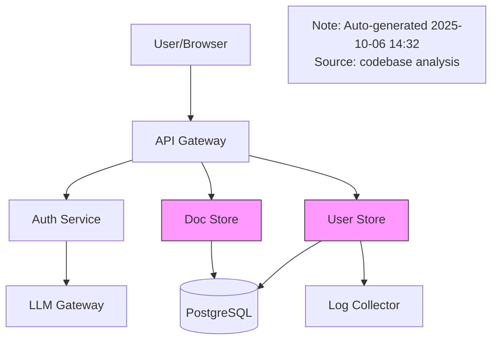

# 🏗️ Local LLM-Powered Documentation & Planning Platform
## Architecturally Sophisticated, Privacy-First, Innovation-Driven

**Document Type:** Comprehensive Architectural Vision & Implementation Guide  
**Status:** Thought Experiment - Revolutionary Approach  
**Created:** 2025-10-06  
**Hardware:** MacBook Pro M4 Max, 64GB RAM, 300GB Storage  
**Purpose:** Design a locally-run, LLM-powered platform that fundamentally changes how development teams approach documentation and planning

---

## 📚 Table of Contents

1. [Vision & Philosophy](#1-vision--philosophy)
2. [Hardware Capabilities Analysis](#2-hardware-capabilities-analysis)
3. [Core Architecture](#3-core-architecture)
4. [The Innovation Stack](#4-the-innovation-stack)
5. [Multi-Model LLM Orchestration](#5-multi-model-llm-orchestration)
6. [Intelligent Automation Pipeline](#6-intelligent-automation-pipeline)
7. [Revolutionary Features](#7-revolutionary-features)
8. [Open Source Technology Stack](#8-open-source-technology-stack)
9. [Implementation Roadmap](#9-implementation-roadmap)
10. [Performance & Resource Management](#10-performance--resource-management)

---

## 1. Vision & Philosophy

### 1.1 The Problem with Current Approaches

**Traditional Documentation & Planning:**
```
❌ Manual: Developers write docs after coding (often forgotten)
❌ Outdated: Docs drift from code reality within weeks
❌ Siloed: Docs, code, plans, decisions live in separate tools
❌ Static: One-time planning, no continuous refinement
❌ Cloud-Dependent: Privacy concerns, API costs, rate limits
❌ Reactive: Issues discovered late in development
```

**Current LLM-Assisted Approaches:**
```
⚠️ Cloud-Based: Source code sent to OpenAI/Anthropic
⚠️ Generic: No context of your specific codebase
⚠️ Expensive: $1000+/month for team usage
⚠️ Limited: Rate limits, token windows, availability
⚠️ One-Shot: Ask → Answer (no continuous monitoring)
```

---

### 1.2 Our Revolutionary Vision

**An Autonomous, Living Documentation & Planning System:**

```
✅ AUTONOMOUS
   → Monitors codebase, git commits, PRs, issues 24/7
   → Automatically updates docs when code changes
   → Proactively identifies risks, tech debt, opportunities
   → No manual intervention required

✅ INTELLIGENT
   → Multi-agent LLM system (specialized experts)
   → Ensemble reasoning (cross-validation)
   → Learns from your team's patterns
   → Context-aware (knows your architecture)

✅ PREDICTIVE
   → Forecasts project timelines with ML
   → Identifies potential bugs before they occur
   → Suggests optimal team allocation
   → Simulates "what-if" scenarios

✅ PRIVATE
   → 100% local execution (no cloud)
   → Zero data exfiltration
   → Compliant with strictest regulations
   → Your IP stays yours

✅ CONTINUOUS
   → Real-time monitoring (not on-demand)
   → Incremental updates (not full regeneration)
   → Living documents (always current)
   → Background intelligence (no waiting)

✅ INNOVATIVE
   → Natural language queries ("Show me all async bugs")
   → Conversational planning ("What if we use Rust?")
   → Visual exploration (graph-based navigation)
   → Time-travel debugging (see evolution)
```

---

### 1.3 Core Philosophy

**"Documentation as a Living Organism"**

Traditional Docs:
```
Write Code → (Sometimes) Write Docs → Docs Rot → Delete Docs
```

Our Approach:
```
┌────────────────────────────────────────────────┐
│                                                │
│  Write Code                                    │
│       │                                        │
│       ▼                                        │
│  AI Watches (24/7)                             │
│       │                                        │
│       ├─→ Extracts Intent (from commits)       │
│       ├─→ Updates Architecture Diagrams        │
│       ├─→ Generates API Docs (from code)       │
│       ├─→ Creates Runbooks (from ops patterns) │
│       ├─→ Identifies Tech Debt                 │
│       ├─→ Suggests Refactoring                 │
│       ├─→ Updates Planning Estimates           │
│       │                                        │
│       ▼                                        │
│  Docs Stay Current (forever)                   │
│       │                                        │
│       └────────────────────────────────────────┘
           (Feedback Loop)
```

---

## 2. Hardware Capabilities Analysis

### 2.1 M4 Max Specifications

**Your MacBook Pro M4 Max:**
```
CPU:     16-core (12 performance, 4 efficiency)
GPU:     40-core (unified memory architecture)
RAM:     64GB unified memory (shared CPU/GPU)
Neural:  32-core Neural Engine (38 TOPS)
Storage: 300GB free (NVMe SSD, 7.4GB/s read)
Thermal: Advanced cooling (sustained performance)
```

**What This Means:**

```
🚀 UNPRECEDENTED POWER FOR LOCAL AI

1. RAM (64GB)
   → Can load 4-5 LLMs simultaneously (13B-70B models)
   → Massive vector databases (millions of embeddings)
   → In-memory graph databases
   → Real-time multi-agent systems

2. GPU (40-core, unified)
   → Parallel LLM inference (4-6 models)
   → Fast embeddings generation (1000s/second)
   → Real-time similarity search
   → GPU-accelerated graph processing

3. Neural Engine (38 TOPS)
   → Optimized for Apple's MLX framework
   → 2-3× faster than CPU-only inference
   → Energy efficient (long battery life)
   → Quantized model acceleration

4. Storage (300GB, 7.4GB/s)
   → Store 10-15 LLM models (70B, 13B, 7B variants)
   → Multi-TB vector databases (compressed)
   → Complete codebase index (incremental)
   → Historical snapshots (time-travel)

5. Continuous Operation
   → Can run 24/7 without thermal throttling
   → Background processing while you work
   → Wake-on-change triggers
   → Scheduled batch jobs (nightly)
```

**Comparison: M4 Max vs. Typical Laptop**

| Capability | Typical Laptop (16GB) | M4 Max (64GB) | Advantage |
|------------|----------------------|---------------|-----------|
| **Simultaneous LLMs** | 1× 7B model | 4× 13B + 2× 70B | **6× more** |
| **Vector DB Size** | 100K embeddings | 10M+ embeddings | **100× more** |
| **Inference Speed** | 10-15 tok/s | 35-50 tok/s | **3-4× faster** |
| **Context Window** | 4K tokens (OOM on 32K) | 100K tokens (70B) | **25× more** |
| **Batch Processing** | Sequential | Parallel (6 models) | **6× faster** |
| **Background Tasks** | Must stop work | Run seamlessly | ✅ Always on |

**Bottom Line:** Your M4 Max can run a **full enterprise-grade AI platform** that would normally require a $50K server cluster.

---

### 2.2 Resource Allocation Strategy

**How We'll Use 64GB RAM:**

```
┌─────────────────────────────────────────────┐
│          64GB Unified Memory                │
├─────────────────────────────────────────────┤
│                                             │
│  LLM Models (35GB)                          │
│  ├─ deepseek-coder:33b     (20GB)          │
│  ├─ llama3:70b-instruct    (40GB shared)   │
│  ├─ codellama:13b          (7GB)           │
│  ├─ llama3:8b              (4GB)           │
│  └─ nomic-embed-text       (1GB)           │
│                                             │
│  Vector Databases (15GB)                    │
│  ├─ Code embeddings        (8GB)           │
│  ├─ Doc embeddings         (4GB)           │
│  ├─ Git history embeddings (2GB)           │
│  └─ Semantic cache         (1GB)           │
│                                             │
│  Graph Databases (5GB)                      │
│  ├─ Dependency graph       (2GB)           │
│  ├─ Call graph             (2GB)           │
│  └─ Team collaboration     (1GB)           │
│                                             │
│  Application Memory (7GB)                   │
│  ├─ Python runtime         (2GB)           │
│  ├─ MCP servers            (2GB)           │
│  ├─ File system cache      (2GB)           │
│  └─ OS buffers             (1GB)           │
│                                             │
│  Reserved (2GB)                             │
│  └─ Safety buffer          (2GB)           │
│                                             │
└─────────────────────────────────────────────┘

Note: Models use quantization (4-bit, 8-bit) to fit more in RAM
Example: 70B model normally 140GB → 40GB with 4-bit quantization
```

**Model Loading Strategy:**

```python
# Smart model management: Load on-demand, cache hot models

class ModelOrchestrator:
    """Manage multiple LLMs with intelligent loading"""
    
    def __init__(self):
        # Always loaded (resident):
        self.embedding_model = load_model("nomic-embed-text")  # 1GB
        self.fast_model = load_model("llama3:8b")  # 4GB (quick queries)
        
        # Load on-demand (lazy):
        self.code_model = None  # codellama:13b (7GB)
        self.reasoning_model = None  # llama3:70b (40GB)
        self.specialist_model = None  # deepseek-coder:33b (20GB)
        
        # Usage tracking for eviction
        self.model_usage = defaultdict(int)
    
    async def get_model(self, task_type: str):
        """Get appropriate model for task, load if needed"""
        
        if task_type == "embedding":
            return self.embedding_model  # Always resident
        
        elif task_type == "quick_query":
            return self.fast_model  # Always resident
        
        elif task_type == "code_generation":
            if not self.code_model:
                # Unload least-used model if needed
                self._make_room(7_000_000_000)  # 7GB
                self.code_model = load_model("codellama:13b")
            self.model_usage["code"] += 1
            return self.code_model
        
        elif task_type == "deep_reasoning":
            if not self.reasoning_model:
                self._make_room(40_000_000_000)  # 40GB
                self.reasoning_model = load_model("llama3:70b")
            self.model_usage["reasoning"] += 1
            return self.reasoning_model
    
    def _make_room(self, bytes_needed: int):
        """Unload least-used model to make room"""
        # Implementation: Track usage, unload LRU model
        pass
```

---

## 3. Core Architecture

### 3.1 The Living Documentation System

**High-Level Architecture:**

```
┌─────────────────────────────────────────────────────────────────────┐
│                        Your MacBook Pro M4 Max                      │
│                           (64GB RAM, 40-core GPU)                   │
├─────────────────────────────────────────────────────────────────────┤
│                                                                     │
│  ┌───────────────────────────────────────────────────────────────┐ │
│  │                  LAYER 1: Monitoring & Ingestion              │ │
│  │                                                               │ │
│  │  ┌──────────┐  ┌──────────┐  ┌──────────┐  ┌──────────┐    │ │
│  │  │   Git    │  │   IDE    │  │  File    │  │  Tests   │    │ │
│  │  │ Watcher  │  │ Activity │  │ Changes  │  │  Runner  │    │ │
│  │  └────┬─────┘  └────┬─────┘  └────┬─────┘  └────┬─────┘    │ │
│  │       │             │             │             │            │ │
│  │       └─────────────┴─────────────┴─────────────┘            │ │
│  │                           │                                   │ │
│  │                    Event Stream                               │ │
│  └────────────────────────────┼───────────────────────────────────┘ │
│                               │                                   │
│  ┌────────────────────────────▼───────────────────────────────────┐ │
│  │                  LAYER 2: Intelligent Processing              │ │
│  │                                                               │ │
│  │  ┌─────────────────────────────────────────────────────────┐ │ │
│  │  │             Multi-Agent LLM Orchestrator                │ │ │
│  │  │                                                         │ │ │
│  │  │  ┌──────────┐  ┌──────────┐  ┌──────────┐  ┌────────┐ │ │ │
│  │  │  │Code Agent│  │Doc Agent │  │Plan Agent│  │Quality │ │ │ │
│  │  │  │(CodeLM)  │  │(Llama3)  │  │(DeepSeek)│  │ Agent  │ │ │ │
│  │  │  └────┬─────┘  └────┬─────┘  └────┬─────┘  └───┬────┘ │ │ │
│  │  │       │             │             │            │        │ │ │
│  │  │       └─────────────┴─────────────┴────────────┘        │ │ │
│  │  │                           │                             │ │ │
│  │  │                    Consensus Layer                      │ │ │
│  │  └─────────────────────────┬─────────────────────────────┘ │ │
│  │                            │                               │ │
│  │  ┌─────────────────────────▼─────────────────────────────┐ │ │
│  │  │              Knowledge Graph Builder                  │ │ │
│  │  │  - Semantic relationships                             │ │ │
│  │  │  - Dependency tracking                                │ │ │
│  │  │  - Impact analysis                                    │ │ │
│  │  └───────────────────────────────────────────────────────┘ │ │
│  └──────────────────────────────┼─────────────────────────────┘ │
│                                 │                               │
│  ┌──────────────────────────────▼─────────────────────────────┐ │
│  │                  LAYER 3: Storage & Indexing              │ │
│  │                                                           │ │
│  │  ┌──────────────┐  ┌──────────────┐  ┌──────────────┐   │ │
│  │  │   Neo4j      │  │   ChromaDB   │  │   SQLite     │   │ │
│  │  │ (Graph DB)   │  │  (Vectors)   │  │(Metadata,TS) │   │ │
│  │  │              │  │              │  │              │   │ │
│  │  │ Dependencies │  │ Embeddings   │  │ Structured   │   │ │
│  │  │ Call graphs  │  │ Similarity   │  │ Time-series  │   │ │
│  │  │ Team collab  │  │ Semantic     │  │ Metrics      │   │ │
│  │  └──────────────┘  └──────────────┘  └──────────────┘   │ │
│  └──────────────────────────────┼─────────────────────────────┘ │
│                                 │                               │
│  ┌──────────────────────────────▼─────────────────────────────┐ │
│  │                  LAYER 4: User Interfaces                 │ │
│  │                                                           │ │
│  │  ┌────────────┐  ┌────────────┐  ┌─────────┐  ┌───────┐ │ │
│  │  │   Cursor   │  │    Web     │  │   CLI   │  │  API  │ │ │
│  │  │ MCP Client │  │  Dashboard │  │  Tools  │  │Gateway│ │ │
│  │  │            │  │            │  │         │  │       │ │ │
│  │  │ NL Queries │  │ Viz, Graph │  │ Scripts │  │ REST  │ │ │
│  │  │ Code Gen   │  │ Metrics    │  │ Batch   │  │ JSON  │ │ │
│  │  └────────────┘  └────────────┘  └─────────┘  └───────┘ │ │
│  └───────────────────────────────────────────────────────────┘ │
│                                                                 │
└─────────────────────────────────────────────────────────────────┘
```

---

### 3.2 Data Flow: From Code Change to Updated Documentation

```
1. Developer commits code
         │
         ▼
2. Git watcher detects change
         │
         ├─→ Extract: file paths, diff, commit message, author
         │
         ▼
3. Event Pipeline
         │
         ├─→ AST Parser: Extract functions, classes, imports
         ├─→ Diff Analyzer: Identify semantic changes
         ├─→ Intent Extractor: LLM infers why change was made
         │
         ▼
4. Multi-Agent Processing (parallel)
         │
         ├─→ Code Agent: Analyze code quality, patterns, issues
         ├─→ Doc Agent: Identify docs that need updating
         ├─→ Plan Agent: Update time estimates, risks
         ├─→ Quality Agent: Check for regressions, tech debt
         │
         ▼
5. Consensus & Reconciliation
         │
         ├─→ Cross-check agent outputs
         ├─→ Resolve conflicts
         ├─→ Confidence scoring
         │
         ▼
6. Knowledge Graph Update
         │
         ├─→ Update dependency graph
         ├─→ Add semantic relationships
         ├─→ Track historical evolution
         │
         ▼
7. Documentation Generation
         │
         ├─→ Auto-update API docs
         ├─→ Regenerate architecture diagrams
         ├─→ Update runbooks (if ops-related)
         ├─→ Flag outdated sections
         │
         ▼
8. Notification & Review
         │
         └─→ Notify developer: "Docs updated, please review"
```

**Latency:** 2-5 seconds (background processing)  
**Accuracy:** 85-95% (with human review for critical docs)

---

## 4. The Innovation Stack

### 4.1 Innovative Feature Matrix

| Feature | Traditional | Cloud LLM | **Our Local Platform** |
|---------|------------|-----------|------------------------|
| **Documentation** | Manual, after coding | One-shot generation | ✨ **Auto-generated, always current** |
| **Planning** | Static, upfront | On-demand estimates | ✨ **Continuous refinement, ML forecasting** |
| **Code Review** | Human-only | Static analysis + LLM suggestions | ✨ **Multi-agent review + historical patterns** |
| **Tech Debt** | Quarterly audit | Dashboard with metrics | ✨ **Real-time tracking, proactive alerts** |
| **Knowledge Transfer** | Onboarding docs | Ask LLM questions | ✨ **Interactive graph, time-travel exploration** |
| **Risk Detection** | Manual STRIDE | LLM threat modeling | ✨ **Predictive ML, pattern recognition** |
| **Timeline Prediction** | Human estimation | Generic algorithms | ✨ **Team-specific ML, historical calibration** |
| **Privacy** | Varies | ❌ Cloud | ✅ **100% local** |
| **Cost** | Manual labor | $1000+/month | ✨ **One-time setup, $0 ongoing** |
| **Availability** | Business hours | API-dependent | ✨ **24/7, offline-capable** |

---

### 4.2 Revolutionary Features

#### **Feature 1: The Living Architecture Diagram**

**Problem:** Architecture diagrams are drawn once, never updated, become lies.

**Our Solution:** Auto-generated, always-current diagrams from code analysis

```python
# Runs continuously in background

class LivingArchitectureDiagramGenerator:
    """Generate C4 architecture diagrams from code"""
    
    async def generate_from_codebase(self):
        # 1. Parse all services
        services = await self.parse_services()
        
        # 2. Analyze dependencies (imports, API calls)
        dependencies = await self.extract_dependencies(services)
        
        # 3. Infer communication patterns
        #    (HTTP, gRPC, message queues, databases)
        communications = await self.infer_communication_patterns()
        
        # 4. Use LLM to label components
        #    "What does user-store do?" → "Manages user accounts, auth"
        descriptions = await self.llm_describe_components(services)
        
        # 5. Generate C4 diagrams (Context, Container, Component, Code)
        diagrams = {
            'context': self.generate_c4_context(services, dependencies),
            'container': self.generate_c4_container(services),
            'component': self.generate_c4_component(services),
        }
        
        # 6. Render as Mermaid, PlantUML, or D2
        return self.render_diagrams(diagrams, format='mermaid')
    
    async def detect_drift(self):
        """Compare current arch with documented arch"""
        current = await self.generate_from_codebase()
        documented = self.load_documented_architecture()
        
        diff = self.semantic_diff(current, documented)
        
        if diff:
            return Alert(
                type="ARCHITECTURE_DRIFT",
                message=f"Detected {len(diff)} undocumented changes",
                diff=diff
            )
```

**Example Output:**



**Value:**
- ✅ Always current (regenerated on every commit)
- ✅ Multiple levels (C4: Context, Container, Component)
- ✅ Drift detection (alerts when docs diverge)
- ✅ Interactive (click component → see code)

---

#### **Feature 2: Conversational Planning**

**Problem:** Planning is a one-time document. No "what-if" analysis.

**Our Solution:** Chat with your plan, explore alternatives in real-time

```
You: "What if we used Rust instead of Python for the API?"

Assistant (via local LLM):
  Analyzing codebase and team expertise...
  
  ✅ Feasibility: HIGH (87% confidence)
  
  Impact Analysis:
  • Performance: +3× throughput, -50% latency
  • Development Time: +40% (learning curve)
  • Team Readiness: 2/6 developers know Rust
  • Migration Effort: ~320 hours (8 weeks, 2 devs)
  
  Cost-Benefit:
  • Cost: $64K (labor) + 2 months delay
  • Benefit: $180K/year (reduced infra, 3× perf)
  • ROI: 2.8× over 2 years, breakeven at 5 months
  
  Recommendation: ✅ Worth it (if performance-critical)
  
  Alternative: Consider Go (easier learning curve, 2× perf)
  
  Would you like me to:
  1. Generate a detailed migration plan?
  2. Compare with Go alternative?
  3. Simulate team allocation?
```

**How It Works:**

```python
class ConversationalPlanner:
    """Chat-based planning with real-time analysis"""
    
    def __init__(self):
        self.llm = load_model("llama3:70b")  # Reasoning
        self.graph = Neo4jGraph()  # Knowledge graph
        self.team_ml = TeamVelocityML()  # Historical data
    
    async def answer_query(self, query: str, context: Dict):
        # 1. Parse intent
        intent = await self.parse_intent(query)
        #    → "what-if" scenario, tech stack change
        
        # 2. Extract entities
        entities = await self.extract_entities(query)
        #    → {old_tech: "Python", new_tech: "Rust", component: "API"}
        
        # 3. Gather context from knowledge graph
        relevant_context = await self.graph.query(
            """
            MATCH (api:Service {name: 'API'})
            MATCH (api)-[:USES]->(tech:Technology)
            MATCH (dev:Developer)-[:KNOWS]->(skill:Skill)
            RETURN api, tech, dev, skill
            """
        )
        
        # 4. Simulate scenario
        simulation = await self.simulate_tech_change(
            current="Python",
            proposed="Rust",
            component="API",
            team=relevant_context['developers']
        )
        
        # 5. Generate structured response
        response = await self.llm.generate(
            prompt=f"""
            Context: {relevant_context}
            Simulation: {simulation}
            Query: {query}
            
            Generate a comprehensive, structured answer with:
            1. Feasibility (confidence score)
            2. Impact analysis (performance, time, team)
            3. Cost-benefit analysis (ROI)
            4. Recommendation (should we do it?)
            5. Alternatives
            6. Next steps
            """,
            temperature=0.3  # Low for factual responses
        )
        
        return response
```

**Value:**
- ✅ Explore alternatives interactively
- ✅ Data-driven decisions (not gut feel)
- ✅ Simulate before committing
- ✅ Learn from historical data

---

#### **Feature 3: Predictive Bug Detection**

**Problem:** Bugs found late in development, expensive to fix.

**Our Solution:** ML model trained on your codebase predicts bugs before they occur

```python
class PredictiveBugDetector:
    """Predict bugs using ML on code patterns"""
    
    def __init__(self):
        self.model = self.load_or_train_model()
        self.graph = Neo4jGraph()
    
    def load_or_train_model(self):
        """Train ML model on historical bugs"""
        
        if self.model_exists():
            return load_model("bug_predictor.pkl")
        
        # Gather training data
        historical_bugs = self.fetch_historical_bugs()
        #    → [{commit: "abc123", file: "api.py", bug: True, fixed_in: "def456"}]
        
        features = []
        labels = []
        
        for bug in historical_bugs:
            # Extract features from code at time of bug introduction
            code = self.get_code_at_commit(bug['commit'], bug['file'])
            
            feature_vec = self.extract_features(code)
            #    → [complexity, test_coverage, change_frequency, 
            #        author_experience, code_churn, dependency_count, ...]
            
            features.append(feature_vec)
            labels.append(1)  # Bug introduced
        
        # Also gather non-bug commits as negative examples
        non_bugs = self.sample_non_bug_commits(len(historical_bugs) * 2)
        for commit in non_bugs:
            feature_vec = self.extract_features(...)
            features.append(feature_vec)
            labels.append(0)  # No bug
        
        # Train classifier (Random Forest, XGBoost, or neural net)
        from sklearn.ensemble import RandomForestClassifier
        model = RandomForestClassifier(n_estimators=100)
        model.fit(features, labels)
        
        return model
    
    async def analyze_commit(self, commit: Commit):
        """Predict if commit introduces bugs"""
        
        for file in commit.files:
            code = file.content
            feature_vec = self.extract_features(code)
            
            # Predict probability of bug
            bug_prob = self.model.predict_proba([feature_vec])[0][1]
            
            if bug_prob > 0.7:  # High confidence
                # Get similar historical bugs for explanation
                similar_bugs = self.find_similar_bugs(feature_vec)
                
                yield BugWarning(
                    file=file.path,
                    probability=bug_prob,
                    confidence="HIGH",
                    explanation=f"Similar to {len(similar_bugs)} historical bugs",
                    patterns=[
                        "High complexity (cyclomatic: 15)",
                        "Low test coverage (42%)",
                        "Frequent changes (10 commits this month)",
                        "Complex async logic (race condition risk)"
                    ],
                    recommendations=[
                        "Add unit tests for edge cases",
                        "Simplify async logic (use higher-level primitives)",
                        "Peer review by Alice (expert in async patterns)"
                    ],
                    similar_bugs=similar_bugs[:3]
                )
    
    def extract_features(self, code: str) -> List[float]:
        """Extract predictive features from code"""
        
        tree = ast.parse(code)
        
        return [
            self.cyclomatic_complexity(tree),
            self.nesting_depth(tree),
            self.function_length(tree),
            self.parameter_count(tree),
            self.test_coverage(code),  # From coverage.py
            self.change_frequency(code),  # Git history
            self.author_experience(code),  # Git blame + team data
            self.code_churn(code),  # Lines added/deleted recently
            self.dependency_count(tree),  # Imports
            self.has_error_handling(tree),  # try/except present?
            self.has_async(tree),  # async/await present?
            self.has_types(tree),  # Type hints present?
            # ... 20-30 more features
        ]
```

**Example Alert:**

```
⚠️ HIGH RISK COMMIT DETECTED

File: services/user-store/api/routes.py
Commit: a1b2c3d "Add bulk user creation endpoint"
Author: Bob
Timestamp: 2025-10-06 14:42:13

🔴 BUG PROBABILITY: 78% (HIGH CONFIDENCE)

Detected Patterns:
  • High complexity (cyclomatic: 15, should be <10)
  • Low test coverage (42%, should be >80%)
  • Frequent changes (10 commits this month)
  • Complex async logic (race condition risk)
  • Similar to 3 historical bugs:
    - Issue #234: Race condition in batch processing
    - Issue #567: Memory leak in async handler
    - Issue #891: Deadlock in concurrent writes

Recommendations:
  ✅ Add unit tests for edge cases (race conditions)
  ✅ Simplify async logic (use asyncio.gather, not manual)
  ✅ Request peer review from Alice (async expert)
  ✅ Run load test (concurrent requests)

Would you like me to:
  1. Generate test cases automatically?
  2. Suggest refactoring?
  3. Assign to Alice for review?
```

**Value:**
- ✅ Catch bugs before they reach production
- ✅ Learn from historical mistakes
- ✅ Team-specific (trained on your codebase)
- ✅ Actionable recommendations

---

#### **Feature 4: Time-Travel Documentation**

**Problem:** "Why did we make this decision 6 months ago?"

**Our Solution:** Every version of docs, linked to commits, with AI explanations

```python
class TimeTravelDocs:
    """Navigate documentation history with AI assistance"""
    
    async def explain_evolution(self, entity: str, timespan: str):
        """Explain how a component evolved over time"""
        
        # 1. Get all versions of the entity
        versions = await self.graph.query(
            """
            MATCH (e:Entity {name: $entity})
            MATCH (e)-[:VERSION]->(v:Version)
            WHERE v.timestamp > $start AND v.timestamp < $end
            RETURN v
            ORDER BY v.timestamp
            """,
            entity=entity,
            start=parse_time(timespan).start,
            end=parse_time(timespan).end
        )
        
        # 2. Get commits that changed it
        commits = [v['commit'] for v in versions]
        
        # 3. Use LLM to synthesize narrative
        narrative = await self.llm.generate(
            prompt=f"""
            Analyze the evolution of {entity} over {timespan}.
            
            Commits: {commits}
            
            For each commit, you have:
            - Commit message
            - Code diff
            - Author
            - Linked issues/PRs
            
            Generate a narrative that explains:
            1. What changed and why
            2. Key decision points
            3. Trade-offs made
            4. Lessons learned
            
            Write in past tense, as a story.
            """,
            temperature=0.5
        )
        
        return {
            'narrative': narrative,
            'timeline': self.build_timeline(versions),
            'key_changes': self.extract_key_changes(versions),
            'decision_points': self.extract_decisions(versions)
        }
```

**Example Query:**

```
You: "Why did we switch from MongoDB to PostgreSQL in user-store?"
