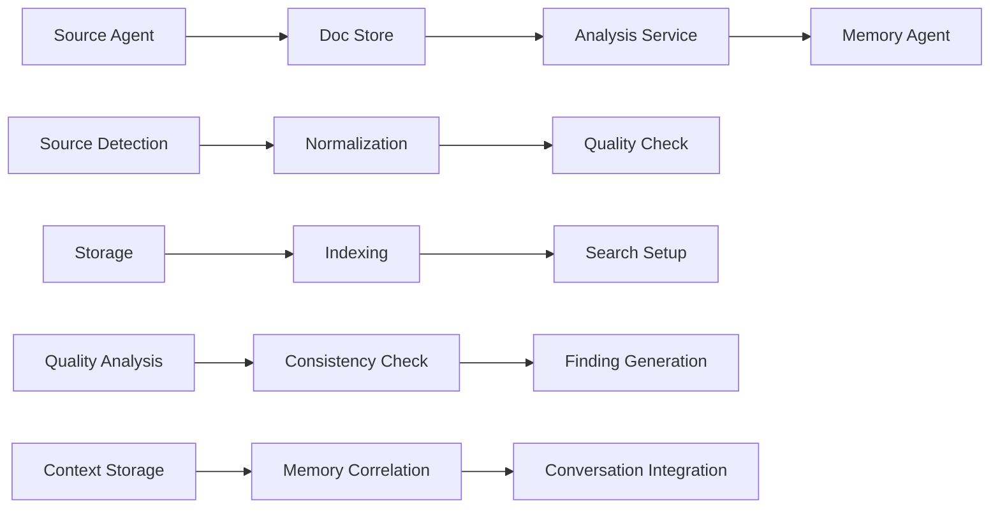
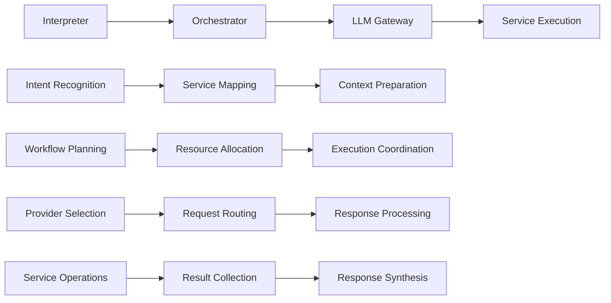

# 🏗️ LLM Documentation Ecosystem - System Architecture

<!--
LLM Processing Metadata:
- document_type: "architectural_design_documentation"
- content_focus: "system_architecture_and_design_patterns"
- key_concepts: ["ddd", "microservices", "clean_architecture", "service_mesh", "ai_orchestration"]
- processing_hints: "Comprehensive architectural guide with design decisions and implementation patterns"
- cross_references: ["../../ECOSYSTEM_MASTER_LIVING_DOCUMENT.md", "../../README.md", "../../docs/deployment/DEPLOYMENT_GUIDE.md"]
- architecture_patterns: ["domain_driven_design", "cqrs", "event_sourcing", "microservices", "service_mesh"]
- design_focus: ["enterprise_scalability", "ai_first_architecture", "operational_excellence"]
-->

**Last Updated**: September 18, 2025  
**Version**: 2.0.0  
**Status**: Living Architecture Document

---

## 📋 Document Overview

This document provides a comprehensive view of the LLM Documentation Ecosystem architecture, covering service design, interaction patterns, deployment strategies, and operational considerations. It serves as the authoritative architectural reference for developers, operators, and stakeholders.

---

## 🌟 **High-Level System Architecture**

### 🎯 Ecosystem Overview

The LLM Documentation Ecosystem is an **enterprise-grade, AI-powered microservices platform** consisting of 21+ specialized services orchestrated through intelligent workflows with advanced AI capabilities.

```
┌─────────────────────────────────────────────────────────────────┐
│                     LLM Documentation Ecosystem                 │
├─────────────────────────────────────────────────────────────────┤
│                                                                 │
│  ┌─────────────┐    ┌─────────────┐    ┌─────────────┐         │
│  │   AI/ML     │    │   Core      │    │Integration  │         │
│  │  Services   │◄──►│  Services   │◄──►│  Services   │         │
│  └─────────────┘    └─────────────┘    └─────────────┘         │
│         │                   │                   │              │
│         ▼                   ▼                   ▼              │
│  ┌─────────────────────────────────────────────────────────┐   │
│  │              Shared Infrastructure Layer                │   │
│  │  • Event Orchestration  • Service Discovery            │   │
│  │  • Configuration Mgmt   • Health Monitoring            │   │
│  │  • Security & Auth      • Caching & Persistence       │   │
│  └─────────────────────────────────────────────────────────┘   │
│                                                                 │
│  ┌─────────────────────────────────────────────────────────┐   │
│  │                 Infrastructure Layer                    │   │
│  │     Redis • Ollama • PostgreSQL • Docker Network       │   │
│  └─────────────────────────────────────────────────────────┘   │
└─────────────────────────────────────────────────────────────────┘
```

### 🏛️ Architectural Principles

#### **1. Domain-Driven Design (DDD)**
- **Bounded Contexts**: Clear service boundaries with domain-specific models
- **Layered Architecture**: Domain, Application, Infrastructure, Presentation layers
- **Event-Driven Communication**: Asynchronous processing with event sourcing
- **Shared Kernel**: Common infrastructure and utilities across services

#### **2. Microservices Best Practices**
- **Single Responsibility**: Each service handles one business domain
- **Autonomous Deployment**: Independent service lifecycle management
- **Fault Isolation**: Service failures don't cascade across the system
- **Technology Diversity**: Right tool for each service's specific needs

#### **3. AI-First Design Philosophy**
- **Intelligent Orchestration**: LLM-powered workflow decision making
- **Content-Aware Routing**: AI-driven service selection and optimization
- **Predictive Operations**: ML-based performance and maintenance optimization
- **Natural Language Interfaces**: Human-friendly system interaction

---

## 🔧 **Service Architecture Breakdown**

### 🏢 **Core Infrastructure Services**

#### **Orchestrator Service** (Port: 5099)
**Role**: Central coordination and workflow orchestration platform

**Architecture**: Domain-Driven Design with bounded contexts
```
services/orchestrator/
├── domain/
│   ├── workflow_management/     # Workflow execution and management
│   ├── service_registry/        # Service discovery and registration  
│   ├── health_monitoring/       # System health and monitoring
│   └── infrastructure/          # DLQ, saga, tracing, event streaming
├── application/                 # Use cases and application services
├── infrastructure/             # External services and persistence
└── presentation/               # API endpoints and controllers
```

**Key Responsibilities**:
- **Workflow Orchestration**: Complex multi-service workflow coordination
- **Service Discovery**: Dynamic service registration and health monitoring
- **Event Streaming**: Real-time coordination via Redis-based events
- **LangGraph Integration**: AI-powered workflow execution and optimization

#### **LLM Gateway Service** (Port: 5055)
**Role**: Intelligent AI model routing and orchestration

**Provider Integration Matrix**:
```yaml
Local Providers:
  ollama: # Primary local inference
    security: high
    cost: low
    latency: low
    
Cloud Providers:
  openai: # High performance
    models: ["gpt-4", "gpt-3.5-turbo"]
    speciality: "general purpose"
  anthropic: # Advanced reasoning
    models: ["claude-3", "claude-2"]
    speciality: "complex analysis"
  bedrock: # Enterprise security
    models: ["titan", "claude"]
    speciality: "secure enterprise"
  grok: # Real-time data
    models: ["grok-1"]
    speciality: "current events"
```

**Intelligent Routing Algorithm**:
```python
def select_provider(content, requirements):
    # Content sensitivity analysis
    sensitivity = analyze_content_sensitivity(content)
    
    # Route based on security requirements
    if sensitivity >= HIGH_SENSITIVITY:
        return ["ollama", "bedrock"]  # Secure providers only
    elif requires_advanced_reasoning(content):
        return ["anthropic", "openai"]  # High-capability providers
    else:
        return ["ollama"]  # Cost-effective local processing
```

### 📊 **Data & Storage Services**

#### **Doc Store Service** (Port: 5087)
**Role**: Comprehensive document storage and management

**Domain Architecture**:
```
services/doc_store/
├── domain/
│   ├── documents/              # Core document management
│   ├── analytics/              # Usage analytics and insights
│   ├── versioning/             # Document version control
│   ├── relationships/          # Document relationship management
│   ├── lifecycle/             # Document lifecycle management
│   └── notifications/         # Event-driven notifications
├── infrastructure/
│   ├── cache/                 # Redis caching layer
│   ├── persistence/           # SQLite/PostgreSQL abstraction
│   └── search/                # FTS5 search implementation
└── api/                       # RESTful API layer (90+ endpoints)
```

**Advanced Features**:
- **Full-Text Search**: FTS5 with semantic fallback using embeddings
- **Document Versioning**: Complete history with diff comparison tools
- **Relationship Tracking**: Document interconnection and dependency mapping
- **Bulk Operations**: Efficient batch processing for large datasets
- **Analytics Engine**: Storage trends, quality metrics, temporal analysis

#### **Analysis Service** (Port: 5020)
**Role**: Comprehensive document analysis and consistency checking

**Analysis Capabilities Matrix**:
```python
ANALYSIS_TYPES = {
    "semantic_similarity": "Embedding-based document comparison",
    "sentiment_analysis": "Tone, clarity, communication effectiveness",
    "quality_assessment": "Automated scoring with recommendations",
    "trend_analysis": "Predictive analytics for documentation issues",
    "risk_assessment": "Documentation drift and quality degradation",
    "change_impact": "Analysis of modification effects",
    "consistency_checking": "Cross-document consistency validation"
}
```

**Distributed Processing Architecture**:
```python
class DistributedAnalysisEngine:
    def __init__(self):
        self.worker_pools = ScalableWorkerManager()
        self.load_balancer = IntelligentLoadBalancer()
        self.task_queue = PriorityTaskQueue()
        
    def process_analysis(self, document_batch):
        # Dynamic worker scaling based on queue depth
        # Intelligent load balancing (round-robin, least-loaded, performance-based)
        # Priority-based task queuing with deadline management
```

### 🤖 **AI & Agent Services**

#### **Memory Agent Service** (Port: 5090)
**Role**: Memory and context management for AI workflows

**Memory Types & Management**:
```python
class MemoryTypes:
    CONVERSATION = "conversation"    # User conversation history
    DOCUMENT = "document"           # Document processing context
    ANALYSIS = "analysis"           # Analysis results and context
    WORKFLOW = "workflow"           # Workflow execution context
    SYSTEM = "system"              # System operational context
    
class ContextCorrelationEngine:
    def correlate_memories(new_memory, existing_memories):
        # Semantic similarity analysis
        # Temporal relationship detection
        # Causal relationship inference
        # Context clustering and organization
```

#### **Source Agent Service** (Port: 5085)
**Role**: Consolidated multi-source data ingestion

**Unified Source Integration**:
```python
CONSOLIDATED_SOURCES = {
    "github": {
        "repositories": "README fetching and normalization",
        "pull_requests": "PR normalization and analysis", 
        "code_analysis": "API endpoint extraction",
        "metadata": "Owner derivation from GitHub data"
    },
    "jira": {
        "issues": "Issue normalization and summarization",
        "projects": "Project context and metadata",
        "workflows": "Status and priority tracking"
    },
    "confluence": {
        "pages": "Content normalization with HTML-to-text",
        "spaces": "Space organization and hierarchy",
        "versions": "Content versioning and change tracking"
    }
}
```

**Intelligent Ingestion Pipeline**:
```python
class IntelligentIngestionEngine:
    def process_ingestion(source_data):
        1. Source Detection and Validation
        2. Content Normalization and Standardization  
        3. Conflict Detection and Resolution
        4. Quality Assessment and Validation
        5. Change Detection and Impact Analysis
        6. Predictive Ingestion Optimization
        7. Storage and Index Update
```

#### **Interpreter Service** (Port: 5120)
**Role**: Natural language interface to ecosystem

**Natural Language Processing Pipeline**:
```python
class EcosystemNLPPipeline:
    def process_query(natural_language_query):
        1. Intent Classification (determine target services)
        2. Entity Extraction (identify parameters and context)
        3. Service Capability Matching (find optimal service combinations)
        4. Workflow Generation (create execution plan)
        5. Orchestrator Integration (execute via orchestrator)
        6. Response Synthesis (natural language response generation)
```

---

## 🔄 **Service Interaction Patterns**

### 🌊 Data Flow Architecture

#### **Document Ingestion Flow**


#### **AI Workflow Execution Flow**


### 🔗 Cross-Service Communication

#### **Synchronous Communication Patterns**
```python
# Real-time operations requiring immediate response
SYNC_PATTERNS = {
    "health_checks": "GET /health -> immediate status response",
    "data_retrieval": "GET /documents/{id} -> immediate document access",
    "ai_queries": "POST /query -> real-time LLM response",
    "status_queries": "GET /status -> current system state"
}
```

#### **Asynchronous Communication Patterns**
```python
# Long-running operations using event-driven processing
ASYNC_PATTERNS = {
    "document_analysis": "analysis_request -> redis_queue -> worker_processing -> completion_event",
    "bulk_operations": "bulk_import -> background_processing -> progress_updates -> completion_notification",
    "workflow_orchestration": "workflow_trigger -> orchestrator_planning -> service_coordination -> result_aggregation"
}
```

#### **Saga Pattern Implementation**
```python
class DocumentConsistencySaga:
    def create_consistency_workflow():
        return [
            {
                "service": "source-agent",
                "action": "ingest_sources",
                "compensation": "rollback_ingestion"
            },
            {
                "service": "analysis-service", 
                "action": "analyze_consistency",
                "compensation": "clear_analysis_results"
            },
            {
                "service": "notification-service",
                "action": "notify_stakeholders", 
                "compensation": "send_cancellation_notice"
            }
        ]
```

---

## 🛡️ **Security Architecture**

### 🔒 Content Security Framework

#### **Multi-Layer Security Analysis**
```python
class ContentSecurityAnalyzer:
    def analyze_content_sensitivity(content):
        sensitivity_indicators = {
            "pii_detection": scan_for_personal_information(content),
            "credential_detection": scan_for_credentials_and_secrets(content),
            "proprietary_content": analyze_proprietary_indicators(content),
            "compliance_markers": check_compliance_requirements(content)
        }
        return calculate_sensitivity_score(sensitivity_indicators)
        
    def route_secure_content(content, sensitivity_score):
        if sensitivity_score >= HIGH_SENSITIVITY:
            return route_to_local_providers(["ollama"])
        elif sensitivity_score >= MEDIUM_SENSITIVITY:
            return route_to_secure_providers(["ollama", "bedrock"])
        else:
            return route_to_any_provider()
```

#### **Authentication & Authorization Framework**
```python
class SecurityFramework:
    def authenticate_request(request):
        # Multi-factor authentication support
        # Token-based authentication with JWT
        # Service-to-service authentication
        # External identity provider integration
        
    def authorize_operation(user, operation, resource):
        # Role-based access control (RBAC)
        # Resource-level permissions
        # Dynamic authorization based on content sensitivity
        # Audit trail for all authorization decisions
```

---

## ⚙️ **Configuration & Deployment Architecture**

### 🎛️ Configuration Management Hierarchy

```yaml
# Configuration Priority (highest to lowest)
1. Environment Variables: # Runtime override capability
   SERVICE_PORT: 5099
   REDIS_HOST: redis-cluster
   
2. Service-specific config.yaml: # Service customization
   port: 5099
   redis_host: localhost
   
3. Global config.yml: # Ecosystem defaults
   services:
     orchestrator:
       port: 5099
       
4. DDD config.yaml: # Domain-driven settings
   ddd_architecture:
     enabled: true
     
5. Hard-coded defaults: # Fallback values
   DEFAULT_PORT = 5099
```

### 🐳 Deployment Strategies

#### **Service Profile Matrix**
```yaml
deployment_profiles:
  core: # Essential services - always deployed
    services: [redis, orchestrator, doc_store, analysis-service, source-agent, frontend]
    priority: critical
    
  development: # Development-specific services
    services: [summarizer-hub, memory-agent, discovery-agent]
    priority: normal
    
  production: # Production-grade services
    services: [postgresql, log-collector, notification-service, secure-analyzer, code-analyzer]
    priority: high
    
  ai_services: # AI/ML specific services
    services: [bedrock-proxy, github-mcp, interpreter, prompt-store]
    priority: high
    
  tooling: # Operational tools
    services: [cli]
    priority: low
```

#### **Orchestrated Startup Sequence**
```python
STARTUP_PHASES = {
    "phase_1": {
        "services": ["redis", "ollama"],
        "description": "Infrastructure foundation",
        "wait_time": 10
    },
    "phase_2": {
        "services": ["orchestrator", "doc_store", "prompt_store"],
        "description": "Core services",
        "wait_time": 15
    },
    "phase_3": {
        "services": "ai_services_profile",
        "description": "AI services",
        "wait_time": 20
    },
    "phase_4": {
        "services": "development_profile", 
        "description": "Analysis services",
        "wait_time": 15
    },
    "phase_5": {
        "services": "core_profile",
        "description": "Frontend and remaining",
        "wait_time": 10
    }
}
```

---

## 🚀 **Operational Excellence**

### 📊 Monitoring & Observability

#### **Comprehensive Health Monitoring**
```python
class EcosystemHealthMonitor:
    def monitor_system_health():
        health_metrics = {
            "service_health": monitor_individual_services(),
            "integration_health": monitor_service_communications(),
            "performance_metrics": collect_performance_data(),
            "resource_utilization": monitor_resource_usage(),
            "ai_model_performance": monitor_ai_providers(),
            "data_quality": monitor_data_consistency()
        }
        return aggregate_health_score(health_metrics)
```

#### **Smart Health Check System**
```python
class HealthCheckEngine:
    def validate_service_health(service_name):
        if service_name in ["redis"]:
            return redis_ping_check()
        elif service_name in ["ollama"]:
            return ollama_api_check()
        elif service_name in ["frontend", "memory-agent", "analysis-service"]:
            return docker_health_status_check()
        else:
            return http_endpoint_check() or docker_fallback_check()
```

### 🛡️ Bulletproof Protection System

#### **Multi-Layer Protection**
```bash
PROTECTION_LAYERS = [
    "pre_flight_validation",     # Configuration and dependency validation
    "dockerfile_linting",        # Docker configuration verification  
    "orchestrated_startup",      # Phased service initialization
    "comprehensive_health_checks", # Multi-layer health validation
    "self_healing_capabilities", # Automatic issue detection and remediation
    "rollback_protection"        # Safe deployment with automatic rollback
]
```

#### **Self-Healing Capabilities**
```python
class SelfHealingSystem:
    def auto_remediate_issues():
        # Service restart automation for failed services
        # Configuration drift detection and correction
        # Resource scaling based on demand
        # Database cleanup and optimization
        # Cache invalidation and refresh
```

---

## 🔮 **Future Architecture Evolution**

### 🚀 Planned Enhancements

#### **Advanced AI Capabilities**
- **Multi-Modal AI Integration**: Support for image, video, and audio analysis
- **Federated Learning**: Distributed machine learning across service boundaries
- **AI Model Fine-Tuning**: Custom model training for domain-specific tasks
- **Conversational AI Enhancement**: Advanced multi-turn conversation capabilities

#### **Cloud-Native Evolution**
- **Kubernetes Integration**: Cloud-native deployment and orchestration
- **Service Mesh**: Advanced service mesh with Istio/Envoy integration
- **Serverless Integration**: Function-as-a-Service for specific workloads
- **Multi-Region Support**: Global distribution with data replication

#### **Enterprise Features**
- **Zero-Trust Security**: Advanced security architecture implementation
- **Multi-Tenant Support**: Enterprise multi-tenancy with resource isolation
- **Advanced Analytics**: Predictive analytics and business intelligence
- **Compliance Automation**: Automated compliance checking and reporting

---

## 📋 **Architecture Governance**

### 🔄 Architecture Decision Records (ADRs)

This document is supported by detailed Architecture Decision Records located in `/docs/architecture/adr/`. Key decisions include:

- **ADR-001**: Microservices Architecture Selection
- **ADR-002**: Domain-Driven Design Implementation
- **ADR-003**: Event-Driven Communication Patterns
- **ADR-004**: AI-First Design Philosophy
- **ADR-005**: Security-Aware Provider Routing
- **ADR-006**: Bulletproof Deployment Strategy

### 📊 Architecture Metrics

**Current Architecture Maturity**:
- **Service Cohesion**: ⭐⭐⭐⭐⭐ (5/5) - Clear domain boundaries
- **Loose Coupling**: ⭐⭐⭐⭐⭐ (5/5) - Event-driven communication
- **Scalability**: ⭐⭐⭐⭐⭐ (5/5) - Distributed processing ready
- **Resilience**: ⭐⭐⭐⭐⭐ (5/5) - Self-healing capabilities
- **Maintainability**: ⭐⭐⭐⭐⭐ (5/5) - DDD principles, shared infrastructure

---

*This architecture document serves as the definitive architectural reference for the LLM Documentation Ecosystem and is maintained continuously to reflect the current state of the system. For detailed implementation guidance, refer to individual service documentation and the master living document.*
