# 🧭 Ecosystem Architecture Diagrams

<!--
LLM Processing Metadata:
- document_type: "architecture_diagrams"
- service_name: "ecosystem"
- key_concepts: ["system_context", "containers", "sequence_flows", "microservices", "orchestration"]
- architecture: "microservices_with_ai_orchestration"
- processing_hints: "Use these diagrams to orient an LLM or developer on end-to-end flows and service boundaries"
- cross_references: ["../ECOSYSTEM_ARCHITECTURE.md", "../../ECOSYSTEM_MASTER_LIVING_DOCUMENT.md"]
- integration_points: ["orchestrator", "llm_gateway", "doc_store", "prompt_store", "analysis_service", "memory_agent", "source_agent", "secure_analyzer", "code_analyzer", "interpreter", "github_mcp", "bedrock_proxy", "summarizer_hub", "notification_service", "log_collector", "frontend", "cli", "redis", "ollama", "postgresql"]
-->

**Navigation**: [Architecture Overview](./ECOSYSTEM_ARCHITECTURE.md) · [Master Living Document](../../ECOSYSTEM_MASTER_LIVING_DOCUMENT.md) · [Docs Index](../README.md)

---

## 🌐 System Context Diagram

```mermaid
flowchart LR
    %% Actors
    user["👤 User (Developer/Operator)"]
    extGit["🔗 GitHub (External)"]
    extEmail["📧 Email/Slack/Webhooks (External)"]
    extBedrock["☁️ AWS Bedrock (External)"]

    %% Entry surfaces
    subgraph Interfaces
      fe["🖥️ Frontend (3000)"]
      cli["⌨️ CLI"]
    end

    %% Orchestration core
    orch["🎯 Orchestrator (5099)"]

    %% Data & Intelligence
    ds["🗄️ Doc Store (5087)"]
    ps["🎯 Prompt Store (5110)"]
    mem["🧠 Memory Agent (5090)"]
    an["📊 Analysis Service (5020)"]
    sa["🔒 Secure Analyzer (5100)"]
    ca["🔧 Code Analyzer (5025)"]
    intp["💬 Interpreter (5120)"]

    %% Integration & Ops
    gmcp["🐙 GitHub MCP (5030)"]
    bp["☁️ Bedrock Proxy (5060)"]
    shub["📝 Summarizer Hub (5160)"]
    notif["📢 Notification Service (5130)"]
    logs["📋 Log Collector (5040)"]
    src["📥 Source Agent (5085)"]
    disc["🔍 Discovery Agent (5045)"]

    %% Infra
    subgraph Infrastructure
      redis["🔴 Redis (6379)"]
      pg["🐘 PostgreSQL (prod)"]
      ollama["🦙 Ollama (11434)"]
    end

    %% User flows
    user -->|Browse dashboards| fe
    user -->|Automation & Ops| cli

    fe --> orch
    cli --> orch

    %% Orchestrator fan-out
    orch --> an
    orch --> intp
    orch --> ds
    orch --> ps
    orch --> mem
    orch --> sa
    orch --> ca
    orch --> src
    orch --> disc
    orch --> notif
    orch --> logs
    orch --> shub

    %% AI Provider path
    shub --> bp
    bp --> extBedrock

    %% GitHub path
    src -. optional .-> gmcp
    gmcp --> extGit

    %% Infra usage
    mem --- redis
    orch --- redis
    ds --- pg
    ps --- pg
    an --- redis
    sa --- redis
    ca --- redis
    shub --- redis
    orch -. secure content .-> ollama
    sa -. sensitive content .-> ollama

    %% Notifications
    notif --> extEmail

    %% Logging
    fe --> logs
    orch --> logs
    an --> logs
    ca --> logs
    sa --> logs
    shub --> logs
```



---

## 🧩 Container Diagram (Service Boundaries & Dependencies)

```mermaid
flowchart TB
    %% Core
    subgraph Core_Infrastructure
      orch["🎯 Orchestrator (5099)"]
      llm["🚪 LLM Gateway (5055)"]
    end

    %% Data Services
    subgraph Data_Services
      ds["🗄️ Doc Store (5087)"]
      ps["🎯 Prompt Store (5110)"]
      mem["🧠 Memory Agent (5090)"]
      src["📥 Source Agent (5085)"]
    end

    %% Intelligence Services
    subgraph Intelligence
      an["📊 Analysis (5020)"]
      sa["🔒 Secure Analyzer (5100)"]
      ca["🔧 Code Analyzer (5025)"]
      intp["💬 Interpreter (5120)"]
      shub["📝 Summarizer Hub (5160)"]
    end

    %% Integration & Ops
    subgraph Integrations_Ops
      gmcp["🐙 GitHub MCP (5030)"]
      notif["📢 Notification (5130)"]
      logs["📋 Log Collector (5040)"]
      disc["🔍 Discovery Agent (5045)"]
      fe["🖥️ Frontend (3000)"]
      cli["⌨️ CLI"]
      bedrock["☁️ Bedrock Proxy (5060)"]
    end

    %% Infra
    subgraph Infrastructure
      redis["🔴 Redis (6379)"]
      pg["🐘 PostgreSQL (prod)"]
      ollama["🦙 Ollama (11434)"]
    end

    %% Interactions
    fe --> orch
    cli --> orch

    orch --> an
    orch --> intp
    orch --> ds
    orch --> ps
    orch --> mem
    orch --> sa
    orch --> ca
    orch --> src
    orch --> disc
    orch --> shub
    orch --> notif
    orch --> logs

    %% AI routing
    an --> llm
    shub --> llm
    intp --> llm
    sa --> llm

    llm -. secure content .-> ollama
    shub --> bedrock

    %% Data & infra
    ds --- pg
    ps --- pg
    mem --- redis
    orch --- redis

    %% External
    gmcp --- src
    notif -->|email/webhook| logs
```



> Legend: Solid lines indicate direct synchronous calls; dotted lines indicate conditional/secure routing or optional integrations; triple-dash indicates data storage dependency.

---

## 🔁 Sequence: User Requests Document Analysis via Frontend

```mermaid
sequenceDiagram
    autonumber
    participant U as 👤 User
    participant FE as 🖥️ Frontend
    participant OR as 🎯 Orchestrator
    participant AN as 📊 Analysis Service
    participant DS as 🗄️ Doc Store
    participant LG as 🚪 LLM Gateway
    participant SA as 🔒 Secure Analyzer
    participant NO as 📢 Notification
    participant LC as 📋 Log Collector

    U->>FE: Open dashboard and request analysis
    FE->>OR: POST /workflows/analyze_document
    OR->>AN: Dispatch analysis task
    AN->>DS: Fetch document(s)
    AN->>LG: Request embeddings/summarization (if needed)
    LG-->>SA: Content sensitivity check (policy)
    SA-->>LG: Provider constraints (secure/local)
    LG-->>AN: AI result (cached/processed)
    AN->>DS: Store analysis results
    AN->>NO: Notify owners (findings)
    AN->>LC: Emit logs/metrics
    OR-->>FE: Workflow status + results link
    FE-->>U: Render findings & reports
```



---

## 🔁 Sequence: Summarization via Summarizer Hub (Bedrock Proxy)

```mermaid
sequenceDiagram
    autonumber
    participant U as 👤 User
    participant FE as 🖥️ Frontend
    participant OR as 🎯 Orchestrator
    participant SH as 📝 Summarizer Hub
    participant BP as ☁️ Bedrock Proxy
    participant BR as AWS Bedrock
    participant DS as 🗄️ Doc Store
    participant LC as 📋 Log Collector

    U->>FE: Request document summary
    FE->>OR: POST /workflows/summarize
    OR->>SH: Invoke summarization with provider config
    SH->>BP: POST /invoke (template/format)
    BP->>BR: Call Bedrock foundation model
    BR-->>BP: AI response
    BP-->>SH: Structured, template-driven output
    SH->>DS: Persist summary & metadata
    SH->>LC: Emit logs/metrics
    OR-->>FE: Workflow result reference
    FE-->>U: Render summary
```



---

## 🏗️ Deployment & Infrastructure Diagram (Networks, Containers, Health)

```mermaid
flowchart TB
    %% ======================
    %% Docker Host & Networks
    %% ======================
    subgraph host[Docker Host]
      direction TB

      subgraph net_interfaces[Network: interfaces]
        direction LR
        FE["🖥️ Frontend\nPort 3000\nHealth: docker"]
        CLI["⌨️ CLI (Host)\nInvokes Orchestrator APIs"]
      end

      subgraph net_services[Network: services]
        direction LR
        OR["🎯 Orchestrator\nPort 5099\nHealth: /health"]
        AN["📊 Analysis Service\nPort 5020\nHealth: docker + /health"]
        SA["🔒 Secure Analyzer\nPort 5100\nHealth: docker"]
        CA["🔧 Code Analyzer\nPort 5025\nHealth: docker"]
        INT["💬 Interpreter\nPort 5120\nHealth: /health"]
        SH["📝 Summarizer Hub\nPort 5160\nHealth: /health"]
        LLMG["🚪 LLM Gateway\nPort 5055\nHealth: /health"]
        GMCP["🐙 GitHub MCP\nPort 5030\nHealth: /health"]
        SRC["📥 Source Agent\nPort 5085\nHealth: /health"]
        DISC["🔍 Discovery Agent\nPort 5045\nHealth: /health"]
        NOTIF["📢 Notification\nPort 5130\nHealth: docker + /health"]
        LOGS["📋 Log Collector\nPort 5040\nHealth: docker + /health"]
        DS["🗄️ Doc Store\nPort 5087\nHealth: /health"]
        PS["🎯 Prompt Store\nPort 5110\nHealth: /health"]
        BED["☁️ Bedrock Proxy\nPort 7090\nHealth: /health"]
      end

      subgraph net_infra[Network: infra]
        direction LR
        REDIS["🔴 Redis\nPort 6379\nHealth: PING/PONG"]
        OLLAMA["🦙 Ollama\nPort 11434\nHealth: /api/tags"]
        PG["🐘 PostgreSQL (prod)"]

        subgraph ops[Operations]
          HM["🩺 Health Scripts\nhealth-check.sh\nbulletproof-startup.sh"]
          MON["📊 Monitoring/Logs\n(aggregated via Log Collector)"]
        end
      end
    end

    %% ======================
    %% Connectivity (Core Paths)
    %% ======================
    FE --> OR
    CLI --> OR

    OR --> AN
    OR --> INT
    OR --> DS
    OR --> PS
    OR --> SRC
    OR --> DISC
    OR --> NOTIF
    OR --> LOGS
    OR --> SH
    OR --> LLMG

    %% AI provider routes
    LLMG -. secure content .-> OLLAMA
    SH --> BED

    %% Persistence/infra
    DS --- PG
    PS --- PG
    AN --- REDIS
    OR --- REDIS
    SA --- REDIS
    CA --- REDIS
    SH --- REDIS

    %% External integrations (conceptual)
    GMCP -. Git operations .- SRC

    %% Health checks (dotted monitoring edges)
    HM -. HTTP /health .-> OR
    HM -. HTTP /health .-> AN
    HM -. HTTP /health .-> DS
    HM -. HTTP /health .-> PS
    HM -. HTTP /health .-> SH
    HM -. HTTP /health .-> LLMG
    HM -. Docker HEALTH .-> FE
    HM -. Docker HEALTH .-> SA
    HM -. Docker HEALTH .-> CA
    HM -. Docker HEALTH .-> NOTIF
    HM -. Docker HEALTH .-> LOGS
    HM -. Redis PING .-> REDIS
    HM -. Ollama /api/tags .-> OLLAMA
    HM -. Bedrock Proxy /health .-> BED

    %% Log emission (examples)
    FE --> LOGS
    OR --> LOGS
    AN --> LOGS
    SH --> LOGS
    CA --> LOGS
```



### Legend & Notes
- Solid lines: synchronous service calls; triple-dash (---): data persistence dependency
- Dotted lines: monitoring/health checks (HTTP /health, Docker HEALTHCHECK, Redis PING, Ollama /api/tags)
- Health orchestration implemented by `scripts/docker/health-check.sh` and `scripts/docker/bulletproof-startup.sh`
- Ports reflect canonical assignments in the Master Living Document; see `config/service-ports.yaml` for the registry

```
Health Checks Summary
- HTTP: /health endpoints (most services)
- Docker HEALTHCHECK: Frontend, Analysis, Code Analyzer, Secure Analyzer, Notification, Log Collector
- Redis: PING/PONG
- Ollama: GET /api/tags
- Bedrock Proxy: GET /health
```

---
## 📎 References
- Architecture Overview: `docs/architecture/ECOSYSTEM_ARCHITECTURE.md`
- Master Living Document: `ECOSYSTEM_MASTER_LIVING_DOCUMENT.md`
- Testing Patterns: `docs/architecture/ECOSYSTEM_ARCHITECTURE.md#section-x-comprehensive-testing-patterns--infrastructure`

---

## 🧩 Docker Compose Topology (Services, Networks, Ports)

Source: `docker-compose.dev.yml` (development profile). All services are attached to the `doc-ecosystem-dev` bridge network unless otherwise specified.

```mermaid
flowchart TB
    subgraph compose_net[Network: doc-ecosystem-dev]
      direction LR

      %% Infrastructure
      REDIS["🔴 redis\n6379:6379\nHealth: redis-cli ping"]
      OLLAMA["🦙 ollama\n11434:11434\nRestart: unless-stopped"]

      %% Core
      OR["🎯 orchestrator\n5099:5099\nHealth: GET /health\nDepends: redis"]
      DS["🗄️ doc_store\n5087:5010\nHealth: GET :5010/health\nDepends: redis"]
      FE["🖥️ frontend\n3000:3000\nDepends: orchestrator, analysis-service"]
      SA["📥 source-agent\n5070:5070\nHealth: GET /health\nDepends: redis"]

      %% AI/ML
      SH["📝 summarizer-hub\n5160:5160\nHealth: GET /health"]
      AD["🏗️ architecture-digitizer\n5105:5105\nHealth: GET /health"]
      BED["☁️ bedrock-proxy\n5060:7090\nHealth: GET /health"]
      LLMG["🚪 llm-gateway\n5055:5055\nHealth: GET /health\nDepends: redis, bedrock-proxy, ollama"]
      MDG["🎲 mock-data-generator\n5065:5065\nHealth: GET /health\nDepends: llm-gateway, doc_store, redis"]
      GMCP["🐙 github-mcp\n5030:5072\nHealth: GET /health"]

      %% Agents / Utilities
      MEM["🧠 memory-agent\n5090:5040\nHealth: GET /health\nDepends: redis"]
      DISC["🔍 discovery-agent\n5045:5045\nHealth: GET /health\nDepends: orchestrator"]
      NOTIF["📢 notification-service\n5020:5020\nHealth: GET /health"]
      PS["🎯 prompt_store\n5110:5110\nHealth: GET /health\nDepends: redis"]
      INT["💬 interpreter\n5120:5120\nHealth: GET /health\nDepends: prompt_store, orchestrator, analysis-service"]
      CLI["⌨️ cli (no ports)\nDepends: prompt_store, orchestrator, analysis-service"]

      %% Analysis
      AN["📊 analysis-service\n5080:5020\nHealth: GET /health\nDepends: redis, doc_store"]
      CA["🔧 code-analyzer\n5050:5050\nHealth: GET /health\nDepends: redis"]
      SEC["🔒 secure-analyzer\n5100:5070\nHealth: GET /health"]
      LOGS["📋 log-collector\n5040:5080\nHealth: GET /health"]

      %% Edges from depends_on
      OR --> REDIS
      DS --> REDIS
      SA --> REDIS
      AN --> REDIS
      PS --> REDIS
      MEM --> REDIS
      CA --> REDIS
      SH --> BED
      LLMG --> REDIS
      LLMG --> BED
      LLMG --> OLLAMA
      MDG --> LLMG
      MDG --> DS
      MDG --> REDIS
      INT --> PS
      INT --> OR
      INT --> AN
      FE --> OR
      FE --> AN
      DISC --> OR

      %% Logging examples
      OR --> LOGS
      AN --> LOGS
      SEC --> LOGS
      CA --> LOGS
      SH --> LOGS
      FE --> LOGS
    end
```



Notes:
- Format for each node is: `service_name` + `external:internal` port mapping and health type.
- Dependencies reflect `depends_on` conditions from `docker-compose.dev.yml`.
- For authoritative port assignments, see `config/service-ports.yaml` and the Master Living Document.

---

### 🔢 Ports Matrix (Dev Compose)

| Service | External Port | Internal Port | Health (compose) | Profiles |
|---------|---------------|---------------|------------------|----------|
| redis | 6379 | 6379 | redis-cli ping | core, development, ai_services, production |
| orchestrator | 5099 | 5099 | GET /health | core, ai_services |
| doc_store | 5087 | 5010 | GET :5010/health | core, ai_services |
| analysis-service | 5080 | 5020 | GET /health (5080) | core, ai_services |
| source-agent | 5070 | 5070 | GET /health | core |
| frontend | 3000 | 3000 | (none in compose) | core |
| ollama | 11434 | 11434 | (container up) | ai_services |
| summarizer-hub | 5160 | 5160 | GET /health | ai_services |
| architecture-digitizer | 5105 | 5105 | GET /health | ai_services |
| bedrock-proxy | 5060 | 7090 | GET /health | ai_services |
| llm-gateway | 5055 | 5055 | GET /health | ai_services |
| mock-data-generator | 5065 | 5065 | GET /health | ai_services |
| github-mcp | 5030 | 5072 | GET /health | ai_services |
| memory-agent | 5090 | 5040 | GET /health (5090) | development |
| discovery-agent | 5045 | 5045 | GET /health | development |
| notification-service | 5020 | 5020 | GET /health | production |
| prompt_store | 5110 | 5110 | GET /health | ai_services |
| interpreter | 5120 | 5120 | GET /health | ai_services |
| cli | - | - | (no ports) | tooling |
| code-analyzer | 5050 | 5050 | GET /health | production |
| secure-analyzer | 5100 | 5070 | GET /health | production |
| log-collector | 5040 | 5080 | GET /health | production |

Notes:
- External:Internal values mirror `ports` mappings in docker-compose.dev.yml.
- Some services expose different internal ports than their external port for local development (e.g., `doc_store`, `analysis-service`, `memory-agent`, `secure-analyzer`, `log-collector`, `bedrock-proxy`, `github-mcp`).
- “(none in compose)” indicates the container does not define a HEALTHCHECK in compose (application may still expose /health).

---
## ✅ Style & Conventions
- Matches Documentation Style Guide (headings, emojis, LLM metadata, clear legends)
- Ports shown where helpful; see the Master Living Document for authoritative port registry
- Dotted edges indicate conditional or security-sensitive routes; data edges show persistence dependencies
