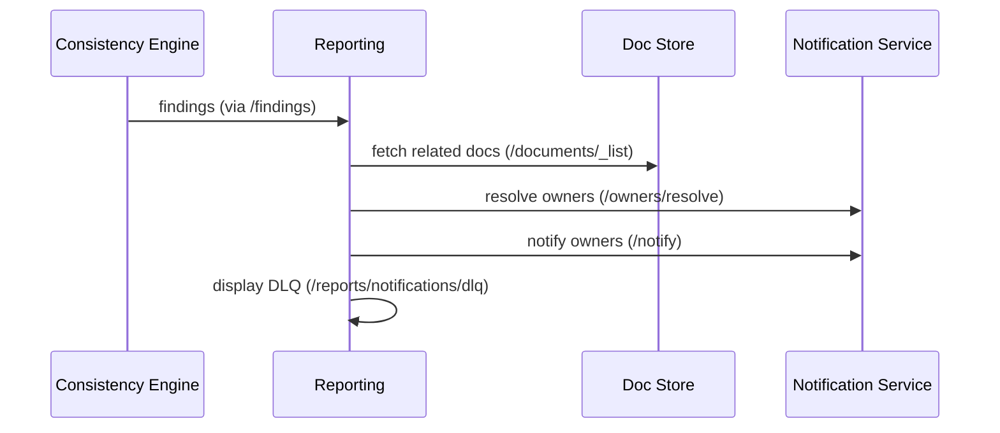

# Features and Service Interactions

> A practical guide to what the ecosystem does, how services interact, and how to use the APIs with concrete payloads.

## Architecture Overview
- Orchestrator coordinates ingestion and registry; can replicate to peers.
- Agents normalize raw inputs and emit envelopes.
- CE batches documents/schemas and runs detectors; exposes metrics.
- Reporting aggregates, visualizes, and notifies owners.
- Doc Store provides persistence, search, and quality signals.
- Notification Service routes messages to owners with dedup and DLQ.

## Service Feature Highlights
- Orchestrator:
  - Registry with peer sync, jobs (`/jobs/*`), `/info` and `/config/effective`.
  - Publishes ingestion requests; proxies summaries and report triggers.
- Reporting:
  - Trends, consolidation, Jira staleness (duplicates + summary), owners notify.
  - Snapshot export, DLQ proxy, `/info`, `/config/effective`, `/metrics`.
- Consistency Engine:
  - Debounced batch detectors (README drift, error code mismatch, Jira vs Confluence AC), metrics by detector.
- Doc Store:
  - SQLite + FTS5 search with semantic fallback; quality flags; `/documents/_list`.
  - `/info`, `/config/effective`, `/metrics` for ops visibility.
- Frontend:
  - Findings by severity/type; search; quality; consolidation; Jira staleness page.
  - Uses shared HTML helpers; `/info`, `/config/effective`, `/metrics`.
- Summarizer Hub:
  - Ensemble summaries; optional rate limiting; provider-agnostic.
- Secure Analyzer:
  - Sensitive content detection; policy-aware summarization suggestions.
- Discovery Agent:
  - Self-registration; OpenAPI parsing and service discovery.
- Notification Service:
  - Owner resolution cache, dedup, exponential backoff, DLQ with replay.

## End-to-End Flow (Example)
1. Orchestrator `/workflows/run` publishes `ingestion.requested` with a `trace_id`.
2. Agents ingest data and produce `DocumentEnvelope` or `ApiSchemaEnvelope`.
3. CE batches, runs detectors, and emits `findings.created`.
4. Reporting fetches findings and doc metadata, renders Trends/Consolidation.
5. Reporting resolves owners via Notification Service and sends notifications.
6. Frontend displays findings, trends, search, and quality.

## Envelope Examples
### DocumentEnvelope (GitHub README)
```json
{
  "id": "github:org/repo:readme",
  "version_tag": "v1",
  "correlation_id": "abc-123",
  "source_refs": [{"repo": "org/repo"}],
  "content_hash": "...",
  "timestamp": "2025-09-05T12:00:00Z",
  "document": {
    "id": "github:org/repo:readme",
    "source_type": "github",
    "title": "README.md",
    "content": "...",
    "metadata": {"owner": "team-app", "code_owner": "@devs"}
  }
}
```

### ApiSchemaEnvelope (Swagger/OpenAPI)
```json
{
  "id": "svc:openapi",
  "version_tag": "v1",
  "correlation_id": "abc-123",
  "source_refs": [{"service": "svc"}],
  "content_hash": "...",
  "timestamp": "2025-09-05T12:00:00Z",
  "schema": {
    "service_name": "svc",
    "version": "1.0.0",
    "endpoints": [{"path": "/items", "method": "GET"}]
  }
}
```

## Key APIs by Service

### Orchestrator
| Method | Path | Purpose |
|---|---|---|
| GET | `/health` | Liveness |
| GET | `/info` | Service info (version, basics) |
| GET | `/config/effective` | Redacted config (dev) |
| GET | `/ready` | Readiness |
| POST | `/ingest` | Publish `ingestion.requested` with `trace_id` |
| POST | `/workflows/run` | Trigger multi-source ingestion |
| GET | `/registry` | List services |
| POST | `/registry/register` | Register a service |
| POST | `/registry/sync-peers` | Replicate registry to peers |
| POST | `/registry/poll-openapi` | Drift monitoring |

### GitHub Agent
| Method | Path | Purpose |
|---|---|---|
| GET | `/health` | Liveness |
| POST | `/pr/normalize` | Normalize PR payload → Document (enveloped to Doc Store) |
| POST | `/code/analyze` | Analyze code text/URL → DocumentEnvelope |

### Jira Agent
| Method | Path | Purpose |
|---|---|---|
| GET | `/health` | Liveness |
| POST | `/summarize/issue` | Normalize Jira issue → DocumentEnvelope |

### Confluence Agent
| Method | Path | Purpose |
|---|---|---|
| GET | `/health` | Liveness |
| POST | `/page/normalize` | Normalize page → Document (with created_by/space_owner) |
| POST | `/page/consolidate` | Extract sections/endpoints/topics |

### Swagger Agent
| Method | Path | Purpose |
|---|---|---|
| GET | `/health` | Liveness |
| POST | `/ingest` | Ingest spec (validates info.title) |

### Consistency Engine
| Method | Path | Purpose |
|---|---|---|
| GET | `/health` | Liveness |
| GET | `/ready` | Readiness |
| GET | `/metrics` | Per-detector metrics |
| POST | `/analyze` | Run analysis (stub) |
| GET | `/findings` | List accumulated findings |

### Reporting
| Method | Path | Purpose |
|---|---|---|
| GET | `/health` | Liveness |
| GET | `/info` | Service info (version, env keys) |
| GET | `/config/effective` | Redacted config (dev) |
| POST | `/reports/generate` | Summary report |
| POST | `/reports/trends` | Severity/type histograms |
| GET | `/reports/confluence/consolidation` | Consolidation candidates |
| POST | `/reports/confluence/notify-owners` | Notify owners for consolidation |
| POST | `/reports/findings/notify-owners` | Notify owners for findings |
| GET | `/reports/notifications/dlq` | Proxy notification DLQ |
| GET | `/reports/jira/staleness` | Jira stale/duplicate candidates; params: `summarize`, `min_confidence`, `min_duplicate_confidence`, `limit` |
| GET | `/reports/confluence/orphans_duplicates` | Confluence orphan/duplicate candidates; params: `min_confidence`, `limit` |
| GET | `/reports/auto_doc_prs` | Suggested doc updates/PRs derived from drift-like findings |
| GET | `/reports/doc_owners_reviewers` | Map documents to suggested reviewers from metadata/CODEOWNERS |
| GET | `/reports/doc_accuracy_badge` | Badge info for a doc; params: `id` |
| GET | `/reports/topic_hubs` | Topic groupings with canonical picks per topic |
| GET | `/reports/adr_drift` | ADR/RFC documents likely stale or duplicated |
| GET | `/reports/jira/ac_coverage` | Jira Acceptance Criteria coverage approximation |
| GET | `/reports/duplicates/clusters` | Duplicate clusters across Jira/Confluence/GitHub |
| GET | `/owners/resolve_doc` | Resolve owners using metadata + CODEOWNERS + blame |
| POST | `/jobs/ingest-analytics` | Patch views/unique_views/watchers (Confluence/Jira/GitHub) into Doc Store |
| POST | `/jobs/ingest-jira-activity` | Patch `last_transition_at`/`last_comment_at` for Jira issues |
| POST | `/jobs/ingest-confluence-structure` | Patch `labels`/`parent_id`/`ancestors` for Confluence pages |
| POST | `/jobs/ingest-github-blame` | Patch `blame_authors` for GitHub README/docs |
| POST | `/jobs/ingest-github-release` | Patch `release_tag`/`release_date` for GitHub repos |
| POST | `/jobs/ingest-github-doc-commits` | Patch `doc_commits_30d`/`doc_commits_90d` for GitHub docs |
| POST | `/jobs/ingest-confluence-backlinks` | Patch `backlinks` count for Confluence pages |
| POST | `/jobs/ingest-jira-fields` | Patch `due_date`/`resolution`/`activity_score` for Jira issues |
| POST | `/webhooks/jira` | Receive Jira watcher/issue updates → patch Doc Store |
| POST | `/webhooks/confluence` | Receive Confluence analytics → patch Doc Store |
| POST | `/webhooks/github` | Receive GitHub traffic for README → patch Doc Store |

### Doc Store
| Method | Path | Purpose |
|---|---|---|
| GET | `/health` | Liveness |
| GET | `/info` | Service info |
| GET | `/config/effective` | Redacted config (dev) |
| POST | `/documents` | Store Document |
| POST | `/documents/enveloped` | Store DocumentEnvelope |
| GET | `/documents/{id}` | Get document |
| GET | `/search` | FTS search (semantic fallback) |
| GET | `/documents/quality` | Quality flags (stale/redundant/low_views/missing_owner/thin_content) |
| PATCH | `/documents/{id}/metadata` | Patch document metadata (analytics, watchers, etc.) |

### Frontend
| Method | Path | Purpose |
|---|---|---|
| GET | `/health` | Liveness |
| GET | `/info` | Service info (version, configured backends) |
| GET | `/config/effective` | Redacted config (dev) |
| GET | `/` | Home page with links to reports |
| GET | `/findings` | Findings by severity/type |
| GET | `/search` | Search interface |
| GET | `/quality` | Document quality flags |
| GET | `/consolidation` | Consolidation candidates |
| GET | `/reports/jira/staleness` | Jira staleness report page |
| GET | `/duplicates/clusters` | Duplicate clusters report page |

### Notification Service
| Method | Path | Purpose |
|---|---|---|
| GET | `/health` | Liveness |
| POST | `/owners/resolve` | Resolve owners to targets (cached) |
| POST | `/notify` | Send message (dedup + DLQ) |
| GET | `/dlq` | Inspect failed notifications |

## Example: Findings → Owners Notification
