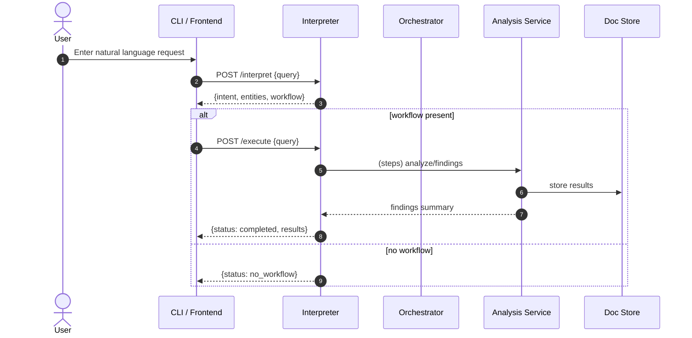
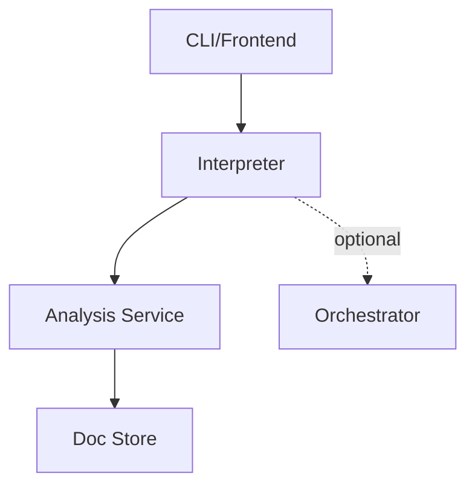

# Analyze Query Flow

```mermaid
sequenceDiagram
    autonumber
    actor User
    participant CLI/Frontend as CLI / Frontend
    participant Interpreter
    participant Orchestrator
    participant Analysis as Analysis Service
    participant DocStore as Doc Store

    User->>CLI/Frontend: Enter natural language request
    CLI/Frontend->>Interpreter: POST /interpret {query}
    Interpreter-->>CLI/Frontend: {intent, entities, workflow}
    alt workflow present
      CLI/Frontend->>Interpreter: POST /execute {query}
      Interpreter->>Analysis: (steps) analyze/findings
      Analysis->>DocStore: store results
      Analysis-->>Interpreter: findings summary
      Interpreter-->>CLI/Frontend: {status: completed, results}
    else no workflow
      Interpreter-->>CLI/Frontend: {status: no_workflow}
    end
```

## Components

```mermaid
graph TD
  UI[CLI/Frontend]
  INT[Interpreter]
  ANA[Analysis Service]
  DS[Doc Store]
  ORCH[Orchestrator]

  UI --> INT
  INT --> ANA
  ANA --> DS
  INT -.optional.-> ORCH
```
