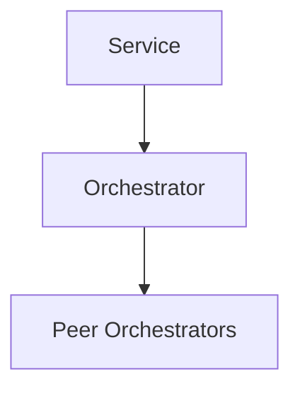

# Register Service Flow

```mermaid
sequenceDiagram
    autonumber
    participant Service
    participant Orchestrator

    Service->>Orchestrator: POST /registry/register {name, url, metadata}
    Orchestrator-->>Service: {status: registered}
    Orchestrator->>Orchestrator: Persist to registry; replicate to peers
```

## Components

