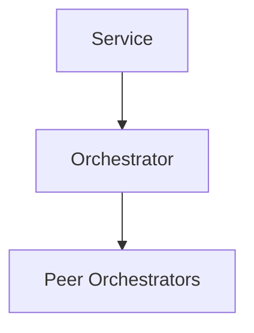

---
llm_metadata:
  document_type: architecture
  content_focus: technical
  platform:
    primary: shared
    secondary: []
  status: active
  created_date: '2024-09-01'
  last_modified: '2025-10-07'
  topics: []
  concepts: []
  technologies: []
  services_mentioned: []
  semantic_summary: Architecture document about technical aspects of the shared platform
  archive_reason: n/a
  historical_value: current
  reference_value: medium
semantic_embedding:
  model: text-embedding-ada-002
  embedding_date: '2025-10-07'
  embedding_checksum: pending
rag_metadata:
  chunk_strategy: semantic
  optimal_chunk_size: 512
  retrieval_priority: medium
---

# Register Service Flow

```mermaid
sequenceDiagram
    autonumber
    participant Service
    participant Orchestrator

    Service->>Orchestrator: POST /registry/register {name, url, metadata}
    Orchestrator-->>Service: {status: registered}
    Orchestrator->>Orchestrator: Persist to registry; replicate to peers
```

## Components

```mermaid
graph TD
  SVC[Service]
  ORCH[Orchestrator]
  PEER[Peer Orchestrators]

  SVC --> ORCH
  ORCH --> PEER
```
