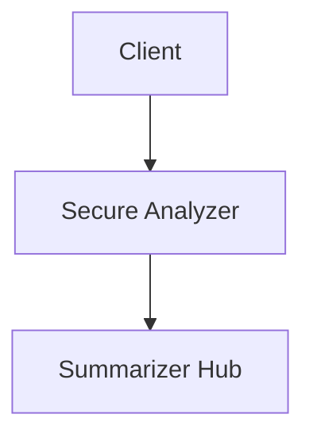

# Summarize with Policy Flow

```mermaid
sequenceDiagram
    autonumber
    participant Client
    participant Secure as Secure Analyzer
    participant Hub as Summarizer Hub

    Client->>Secure: POST /summarize {content, override_policy?}
    Secure->>Secure: Detect sensitivity; choose providers per policy
    alt sensitive
      Secure->>Hub: summarize with {bedrock, ollama}
    else not sensitive
      Secure->>Hub: summarize with {all configured}
    end
    Hub-->>Secure: {summaries, analysis}
    Secure-->>Client: policy-enforced summary
```

## Components

