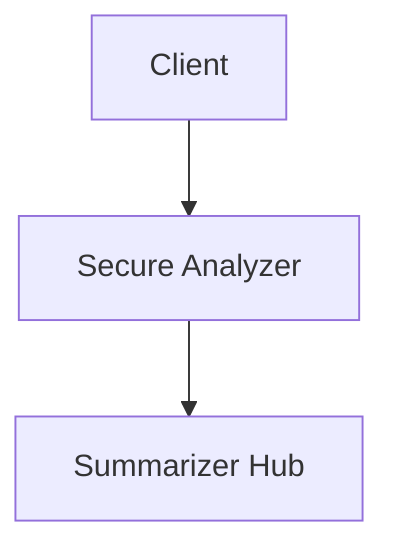

---
llm_metadata:
  document_type: architecture
  content_focus: technical
  platform:
    primary: shared
    secondary: []
  status: active
  created_date: '2024-09-01'
  last_modified: '2025-10-07'
  topics:
  - ollama
  concepts: []
  technologies: []
  services_mentioned: []
  semantic_summary: Architecture document about technical aspects of the shared platform
  archive_reason: n/a
  historical_value: current
  reference_value: medium
semantic_embedding:
  model: text-embedding-ada-002
  embedding_date: '2025-10-07'
  embedding_checksum: pending
rag_metadata:
  chunk_strategy: semantic
  optimal_chunk_size: 512
  retrieval_priority: medium
---

# Summarize with Policy Flow

```mermaid
sequenceDiagram
    autonumber
    participant Client
    participant Secure as Secure Analyzer
    participant Hub as Summarizer Hub

    Client->>Secure: POST /summarize {content, override_policy?}
    Secure->>Secure: Detect sensitivity; choose providers per policy
    alt sensitive
      Secure->>Hub: summarize with {bedrock, ollama}
    else not sensitive
      Secure->>Hub: summarize with {all configured}
    end
    Hub-->>Secure: {summaries, analysis}
    Secure-->>Client: policy-enforced summary
```

## Components

```mermaid
graph TD
  SEC[Secure Analyzer]
  HUB[Summarizer Hub]
  CLIENT[Client]

  CLIENT --> SEC
  SEC --> HUB
```
