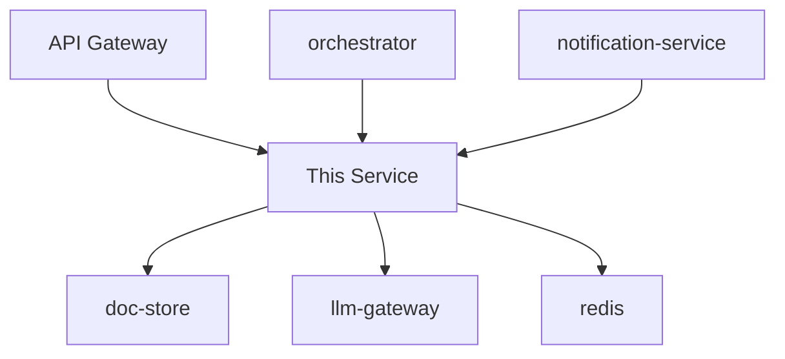

<!-- AI_READ_PRIORITY: 3 -->
<!-- AI_TAGS: documentation, readme, diagrams, relationships -->
<!-- AI_KEY_SECTIONS: README Structure, Visual Documentation, Dependency Documentation, Service Relationships -->

---
ai_metadata:
  purpose: documentation_guidance
  read_priority: 3
  context_level: tactical
  tags:
  - documentation
  - readme
  - diagrams
  - relationships
  when_to_read: During Phase 5 (Documentation)
  key_sections:
  - README Structure
  - Visual Documentation
  - Dependency Documentation
  - Service Relationships
  execution_relevance: phase-specific
  relevant_phases:
  - Phase 5
---

# 📚 Service Documentation Strategy - Comprehensive Service README

**Version**: 1.0.0  
**Created**: October 9, 2025  
**Status**: Active

---

## 📋 Table of Contents

1. [Overview](#overview)
2. [Documentation Requirements](#documentation-requirements)
3. [README Structure](#readme-structure)
4. [Visual Documentation](#visual-documentation)
5. [Dependency Documentation](#dependency-documentation)
6. [Endpoint Documentation](#endpoint-documentation)
7. [Service Relationships](#service-relationships)
8. [Implementation Guide](#implementation-guide)
9. [Examples](#examples)

---

## 🎯 Overview

### Purpose

Every service must have **comprehensive, standardized documentation** that clearly describes:

- **What the service does** (solo capabilities)
- **What the service provides** to the ecosystem
- **How the service integrates** with other services
- **What the service depends on** (libraries and services)
- **How to use the service** (endpoints and workflows)

### Documentation Philosophy

1. **Self-Documenting**: Service should be understandable from README alone
2. **Visual**: Diagrams show architecture, data flow, and workflows
3. **Comprehensive**: Cover all aspects (capabilities, dependencies, integrations)
4. **Discoverable**: Easy to find what you need
5. **Maintained**: Keep up-to-date with changes

### Key Requirements

| Requirement | Description |
|-------------|-------------|
| **Comprehensive README** | Complete service description |
| **Visual Elements** | Architecture, data flow, workflow diagrams |
| **Library Documentation** | All major libraries listed with purpose |
| **Dependency Mapping** | All service dependencies documented |
| **Endpoint List** | All REST endpoints documented |
| **Relationship Matrix** | Provider/consumer relationships |

---

## 📏 Documentation Requirements

### Mandatory Sections

Every service README MUST include:

1. **Service Overview**
   - Solo capabilities
   - Ecosystem contributions
   - Key features

2. **Architecture Diagrams**
   - Ecosystem architecture support
   - Data architecture and flow
   - Workflow execution

3. **Dependencies**
   - Major libraries (with versions)
   - Service dependencies (provider/consumer)
   - External system integrations

4. **API Endpoints**
   - Complete endpoint list
   - Request/response examples
   - OpenAPI/Swagger link

5. **Service Relationships**
   - Services this service provides to
   - Services this service consumes from
   - Relationship types

6. **Quick Start**
   - Installation
   - Configuration
   - Running the service

7. **Integration Guide**
   - How to integrate with this service
   - Example workflows
   - Best practices

---

## 📋 README Structure

### Standard Template

```markdown
# 🚀 [Service Name]

**Version**: [X.Y.Z]  
**Port**: [XXXX]  
**Status**: [Development/Production]

> Brief one-line description of the service

---

## 📊 Overview

### Solo Capabilities

What this service does independently:
- Capability 1
- Capability 2
- Capability 3

### Ecosystem Contributions

What this service provides to the ecosystem:
- Contribution 1
- Contribution 2
- Contribution 3

### Key Features

- ✅ Feature 1
- ✅ Feature 2
- ✅ Feature 3

---

## 🏗️ Architecture

### Ecosystem Architecture

[Diagram showing how service fits in ecosystem]

```
┌─────────────────────────────────────────┐
│          Ecosystem Overview             │
├─────────────────────────────────────────┤
│                                         │
│  [Other Services] → [This Service] →   │
│                     [Dependent Svcs]    │
│                                         │
└─────────────────────────────────────────┘
```

**Role in Ecosystem**: [Description]

### Data Architecture

[Diagram showing data flow]

```
┌──────────┐         ┌──────────┐         ┌──────────┐
│ Source 1 │────────>│   This   │────────>│ Target 1 │
└──────────┘         │ Service  │         └──────────┘
┌──────────┐         │          │         ┌──────────┐
│ Source 2 │────────>│          │────────>│ Target 2 │
└──────────┘         └──────────┘         └──────────┘
```

**Data Responsibilities**:
- Data transformation: [Description]
- Data storage: [Description]
- Data validation: [Description]

### Workflow Execution

[Diagram showing workflow participation]

```
Workflow: [Workflow Name]

┌─────────────┐       ┌─────────────┐       ┌─────────────┐
│  Service A  │──(1)─>│ This Service│──(2)─>│  Service B  │
└─────────────┘       └─────────────┘       └─────────────┘
                            │
                          (3)│
                            ▼
                      ┌─────────────┐
                      │  Service C  │
                      └─────────────┘
```

**Workflows Participated**:
- Workflow 1: [Description]
- Workflow 2: [Description]

---

## 📚 Dependencies

### Major Libraries

Core libraries used to achieve functionality:

| Library | Version | Purpose |
|---------|---------|---------|
| FastAPI | 0.104.0 | REST API framework |
| SQLAlchemy | 2.0.0 | ORM for database access |
| Pydantic | 2.4.0 | Data validation |
| httpx | 0.24.1 | HTTP client for service calls |
| Redis | 4.6.0 | Caching and pub/sub |

### Service Dependencies

#### Provider Services (We Consume From)

Services this service depends on:

| Service | Relationship | Purpose | Endpoints Used |
|---------|-------------|---------|----------------|
| redis | Consumer | Caching, pub/sub | N/A (direct connection) |
| doc-store | Consumer | Document retrieval | GET /api/v2/documents/{id} |
| llm-gateway | Consumer | AI processing | POST /api/v2/generate |

#### Consumer Services (They Consume From Us)

Services that depend on this service:

| Service | Relationship | Purpose | Endpoints Provided |
|---------|-------------|---------|-------------------|
| orchestrator | Provider | Orchestration | POST /api/v2/analyze |
| notification-service | Provider | Analysis results | GET /api/v2/results/{id} |

#### Bidirectional Relationships

Services with two-way communication:

| Service | Relationship | Purpose |
|---------|-------------|---------|
| prompt-store | Provide-Consume | Template exchange |

### Connection Summary

- **Providers** (services we depend on): [Count or "core" if >4, "all" if all]
- **Consumers** (services depending on us): [Count or "core" if >4, "all" if all]

---

## 🔌 API Endpoints

### Standard Endpoints

All services implement these standard endpoints:

| Endpoint | Method | Description |
|----------|--------|-------------|
| `/health` | GET | Service health status |
| `/about-me` | GET | Service descriptor |
| `/endpoints` | GET | List of all endpoints |
| `/provider-consumer` | GET | Service relationships |

### Business Endpoints

Service-specific endpoints:

| Endpoint | Method | Description | Auth Required |
|----------|--------|-------------|---------------|
| `/api/v2/resource` | POST | Create resource | Yes |
| `/api/v2/resource/{id}` | GET | Get resource | Yes |
| `/api/v2/resource/{id}` | PUT | Update resource | Yes |
| `/api/v2/resource/{id}` | DELETE | Delete resource | Yes |

### OpenAPI Documentation

**Swagger UI**: `http://localhost:[PORT]/docs`  
**OpenAPI Spec**: `http://localhost:[PORT]/openapi.json`

---

## 🤝 Service Relationships

### Relationship Matrix

```json
{
  "service_name": "[service-name]",
  "version": "2.0.0",
  "relationships": {
    "providers": [
      {
        "service": "redis",
        "type": "provider",
        "purpose": "Caching and message queue",
        "critical": true
      },
      {
        "service": "doc-store",
        "type": "provider",
        "purpose": "Document storage and retrieval",
        "critical": true
      }
    ],
    "consumers": [
      {
        "service": "orchestrator",
        "type": "consumer",
        "purpose": "Workflow orchestration",
        "critical": false
      }
    ],
    "bidirectional": [
      {
        "service": "prompt-store",
        "type": "provide-consume",
        "purpose": "Template management",
        "critical": false
      }
    ]
  },
  "summary": {
    "total_connections": 4,
    "providers_count": 2,
    "consumers_count": 1,
    "bidirectional_count": 1,
    "scope": "standard"
  }
}
```

**Scope Values**:
- `standard`: < 4 connections
- `core`: ≥ 4 connections (list specific services)
- `all`: Connected to all services in ecosystem

### Dependency Graph

```
         [redis]
            │
            ▼
      [This Service]
       │    │    │
       │    │    └──────> [notification-service]
       │    │
       │    └───────────> [orchestrator]
       │
       └────────────────> [prompt-store] <──┐
                               │            │
                               └────────────┘
```

---

## 🚀 Quick Start

### Prerequisites

- Python 3.11+
- Redis running on localhost:6379
- Docker (optional)

### Installation

```bash
# Clone repository
git clone [repo-url]

# Navigate to service
cd services/[service-name]

# Install dependencies
pip install -r requirements.txt

# Set up environment
cp .env.example .env
```

### Configuration

```bash
# Required environment variables
SERVICE_NAME=[service-name]
SERVICE_VERSION=2.0.0
SERVICE_PORT=[PORT]
ENVIRONMENT=development

# Dependencies
REDIS_URL=redis://localhost:6379
DOC_STORE_URL=http://localhost:5001
```

### Running

```bash
# Run directly
python main.py

# Or with uvicorn
uvicorn main:app --host 0.0.0.0 --port [PORT] --reload

# Or with Docker
docker build -t [service-name] .
docker run -p [PORT]:[PORT] [service-name]
```

### Verify

```bash
# Check health
curl http://localhost:[PORT]/health

# Check about-me
curl http://localhost:[PORT]/about-me

# View API docs
open http://localhost:[PORT]/docs
```

---

## 🔧 Integration Guide

### How to Use This Service

#### Basic Usage

```python
import httpx

async def use_service():
    async with httpx.AsyncClient() as client:
        # Create resource
        response = await client.post(
            "http://localhost:[PORT]/api/v2/resource",
            json={"name": "Example"}
        )
        resource = response.json()
        
        # Get resource
        response = await client.get(
            f"http://localhost:[PORT]/api/v2/resource/{resource['id']}"
        )
        return response.json()
```

#### Example Workflows

**Workflow 1: [Workflow Name]**

```python
# Step 1: [Description]
result1 = await service.operation1()

# Step 2: [Description]
result2 = await service.operation2(result1)

# Step 3: [Description]
final_result = await service.operation3(result2)
```

### Best Practices

1. **Error Handling**: Always handle errors gracefully
2. **Retries**: Implement retry logic for transient failures
3. **Timeouts**: Set appropriate timeouts (default: 30s)
4. **Authentication**: Use service tokens for auth
5. **Rate Limiting**: Respect rate limits (100 req/min)

---

## 📊 Monitoring

### Health Checks

```bash
# Basic health
GET /health

Response:
{
  "status": "healthy",
  "version": "2.0.0",
  "uptime": 12345,
  "dependencies": {
    "redis": "healthy",
    "doc-store": "healthy"
  }
}
```

### Metrics

Available at `/metrics` (Prometheus format):
- Request count
- Request duration
- Error rate
- Dependency health

### Logs

Structured JSON logs sent to log-collector:
- All requests logged with correlation IDs
- All errors logged with context
- Performance metrics included

---

## 🧪 Testing

### Run Tests

```bash
# All tests
pytest

# With coverage
pytest --cov --cov-report=html

# Specific test types
pytest -m unit
pytest -m integration
pytest -m e2e
```

### Test Coverage

- Overall: 85%
- Domain: 92%
- Application: 87%
- Infrastructure: 78%
- Presentation: 84%

---

## 🔐 Security

### Authentication

- **Method**: Bearer token
- **Header**: `Authorization: Bearer <token>`

### Rate Limiting

- **Limit**: 100 requests/minute
- **Burst**: 20 requests

### Data Security

- No sensitive data in logs
- Encryption at rest
- TLS for all connections

---

## 🐛 Troubleshooting

### Common Issues

**Issue**: Service won't start

**Solution**: Check Redis connection

```bash
redis-cli ping
```

**Issue**: High latency

**Solution**: Check dependency health

```bash
curl http://localhost:[PORT]/health
```

---

## 📈 Performance

### Benchmarks

- **Throughput**: 1000 req/sec
- **Latency** (P50): 50ms
- **Latency** (P95): 200ms
- **Latency** (P99): 500ms

### Scaling

- **Horizontal**: Can run multiple instances
- **Vertical**: Optimized for 2 CPU / 4GB RAM
- **Database**: Connection pooling (10 connections)

---

## 📝 Changelog

### Version 2.0.0 (2025-10-09)

- ✨ Refactored to DDD architecture
- ✨ Added OpenAPI documentation
- ✨ Implemented standardized logging
- ✨ Added comprehensive tests (85% coverage)
- 🐛 Fixed race condition in concurrent requests
- ⚡ Improved performance (2x faster)

### Version 1.0.0 (2025-01-15)

- 🎉 Initial release

---

## 👥 Contributing

See [CONTRIBUTING.md](../../CONTRIBUTING.md) for guidelines.

---

## 📄 License

See [LICENSE](../../LICENSE) for details.

---

## 📞 Support

- **Team**: [Team Name]
- **Slack**: #[channel-name]
- **Email**: [team-email]

---

**Last Updated**: 2025-10-09  
**Maintained By**: [Team Name]
```

---

## 📊 Visual Documentation

### Required Diagrams

Every service must include these visual elements:

#### 1. Ecosystem Architecture Diagram

Shows how the service fits into the overall ecosystem.

**Format**: Mermaid diagram or ASCII art

**Example**:


#### 2. Data Flow Diagram

Shows how data flows through the service.

**Example**:
```
Input Data → Validation → Transformation → Storage → Output
     │            │              │            │         │
     │            │              │            │         │
  External    Business       Core         Cache    Response
   Source      Rules       Processing    Layer    to Client
```

#### 3. Workflow Diagram

Shows participation in multi-service workflows.

**Example**:
```
Document Analysis Workflow:

User Request
     │
     ▼
[orchestrator] ──(1. Create doc)──> [doc-store]
     │
     ├──(2. Analyze)──────────────> [THIS SERVICE]
     │                                     │
     │                              (2a. Get prompt)
     │                                     │
     │                                     ▼
     │                              [prompt-store]
     │                                     │
     │                              (2b. Call LLM)
     │                                     │
     │                                     ▼
     │                              [llm-gateway]
     │                                     │
     │<──(3. Results)────────────────────┘
     │
     ├──(4. Notify)──────────────> [notification-service]
     │
     ▼
User Response
```

---

## 📦 Dependency Documentation

### Library Documentation Format

For each major library, document:

```markdown
### [Library Name]

**Version**: [X.Y.Z]  
**Purpose**: [Why we use this library]  
**Core Functionality**: [What features we use]  
**Documentation**: [Link to docs]

**Usage Example**:
```python
from library import feature

result = feature.do_something()
```
```

### Example

```markdown
### FastAPI

**Version**: 0.104.0  
**Purpose**: REST API framework with automatic OpenAPI generation  
**Core Functionality**:
- Automatic request validation
- OpenAPI/Swagger documentation
- Async support
- Dependency injection

**Documentation**: https://fastapi.tiangolo.com/

**Usage Example**:
```python
from fastapi import FastAPI, Depends

app = FastAPI(title="My Service")

@app.get("/api/v2/resource")
async def get_resource():
    return {"status": "ok"}
```
```

---

## 🔗 Service Relationships Documentation

### Relationship Categories

**Provider** (We consume from them):
- Service provides data/functionality to us
- We depend on this service
- Our service calls their endpoints

**Consumer** (They consume from us):
- Service consumes our data/functionality
- They depend on us
- Their service calls our endpoints

**Provide-Consume** (Bidirectional):
- Both services provide to and consume from each other
- Mutual dependency
- Two-way communication

### Scope Definitions

| Scope | Definition | Documentation |
|-------|------------|---------------|
| **Standard** | < 4 connections | List all services explicitly |
| **Core** | ≥ 4 connections | List all services explicitly |
| **All** | Connected to all services | State "all" and list categories |

### Provider-Consumer JSON Format

```json
{
  "service_name": "analysis-service",
  "version": "2.0.0",
  "port": 5003,
  "relationships": {
    "providers": [
      {
        "service": "redis",
        "type": "provider",
        "purpose": "Caching and pub/sub messaging",
        "endpoints_used": ["N/A (direct connection)"],
        "critical": true,
        "fallback": "none"
      },
      {
        "service": "doc-store",
        "type": "provider",
        "purpose": "Document retrieval for analysis",
        "endpoints_used": [
          "GET /api/v2/documents/{id}",
          "GET /api/v2/documents"
        ],
        "critical": true,
        "fallback": "cached data"
      }
    ],
    "consumers": [
      {
        "service": "orchestrator",
        "type": "consumer",
        "purpose": "Orchestrates analysis workflows",
        "endpoints_consumed": [
          "POST /api/v2/analyze",
          "GET /api/v2/results/{id}"
        ],
        "critical": false
      }
    ],
    "bidirectional": [
      {
        "service": "prompt-store",
        "type": "provide-consume",
        "purpose": "Template exchange and customization",
        "provides": ["Template execution results"],
        "consumes": ["Analysis prompt templates"],
        "critical": false
      }
    ]
  },
  "summary": {
    "total_connections": 4,
    "providers_count": 2,
    "consumers_count": 1,
    "bidirectional_count": 1,
    "scope": "standard",
    "critical_dependencies": ["redis", "doc-store"]
  }
}
```

---

## 💻 Implementation Guide

### Step 1: Create README Structure

```bash
cd services/<service-name>

# Create README from template
cp ../../docs/refactoring/templates/SERVICE_README_TEMPLATE.md README.md
```

### Step 2: Fill in Service Overview

Document:
- Solo capabilities (what service does independently)
- Ecosystem contributions (what service provides to others)
- Key features (highlights)

### Step 3: Create Diagrams

Use tools:
- **Mermaid**: For interactive diagrams
- **Diagrams.py**: For Python-based diagrams
- **ASCII Art**: For simple representations
- **draw.io**: For complex diagrams

### Step 4: Document Dependencies

List:
- All major libraries (with versions and purposes)
- All service dependencies (provider/consumer/bidirectional)
- Connection scope (standard/core/all)

### Step 5: Document Endpoints

Include:
- Standard endpoints (health, about-me, endpoints, provider-consumer)
- Business endpoints (service-specific)
- OpenAPI/Swagger link

### Step 6: Document Relationships

Create:
- Provider list (services we depend on)
- Consumer list (services depending on us)
- Bidirectional list (two-way communication)
- Dependency graph

### Step 7: Add Integration Guide

Provide:
- Basic usage examples
- Common workflows
- Best practices
- Troubleshooting tips

---

## ✅ Documentation Checklist

### Completeness Checklist

- [ ] Service overview (solo + ecosystem)
- [ ] Ecosystem architecture diagram
- [ ] Data flow diagram
- [ ] Workflow diagram
- [ ] Major libraries documented (with versions)
- [ ] Service dependencies listed
- [ ] Provider/consumer relationships documented
- [ ] All endpoints documented
- [ ] OpenAPI/Swagger link included
- [ ] Quick start guide
- [ ] Integration guide with examples
- [ ] Troubleshooting section
- [ ] Performance benchmarks
- [ ] Test coverage documented
- [ ] Changelog
- [ ] Contact information

### Quality Checklist

- [ ] Diagrams are clear and up-to-date
- [ ] Examples are tested and work
- [ ] Links are valid
- [ ] Version numbers are correct
- [ ] Scope is accurate (standard/core/all)
- [ ] Critical dependencies marked
- [ ] README is < 1000 lines (link to external docs if longer)

---

## 📚 Examples

See [SERVICE_DOCUMENTATION_EXAMPLES.md](./SERVICE_DOCUMENTATION_EXAMPLES.md) for complete examples of:
- analysis-service (comprehensive example)
- doc-store (standard service)
- orchestrator (core service with many connections)
- redis (infrastructure service)

---

**Document Control**  
**Version**: 1.0.0  
**Last Updated**: October 9, 2025  
**Next Review**: 2025-11-09  
**Owner**: Hackathon Team

