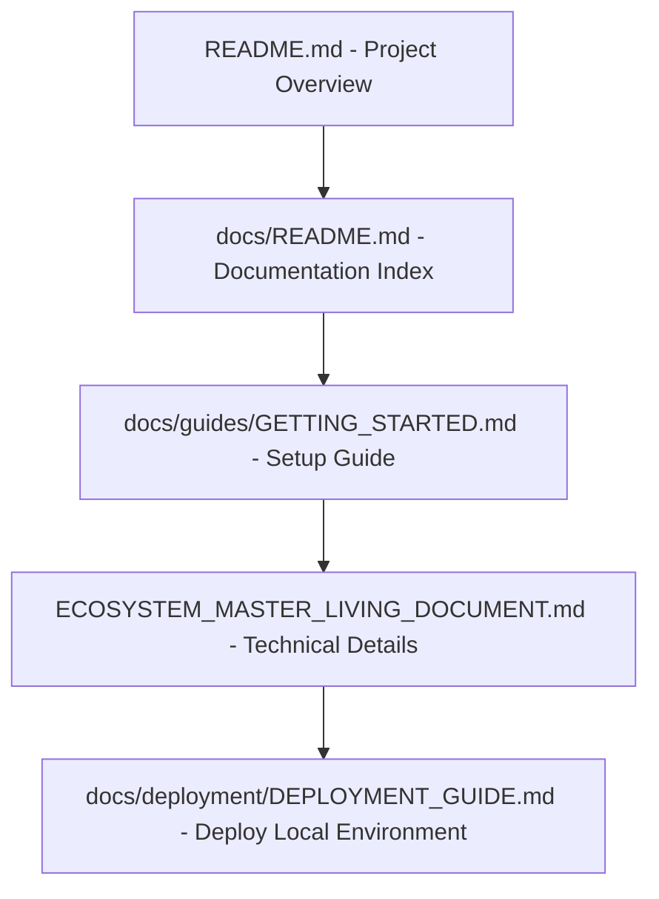
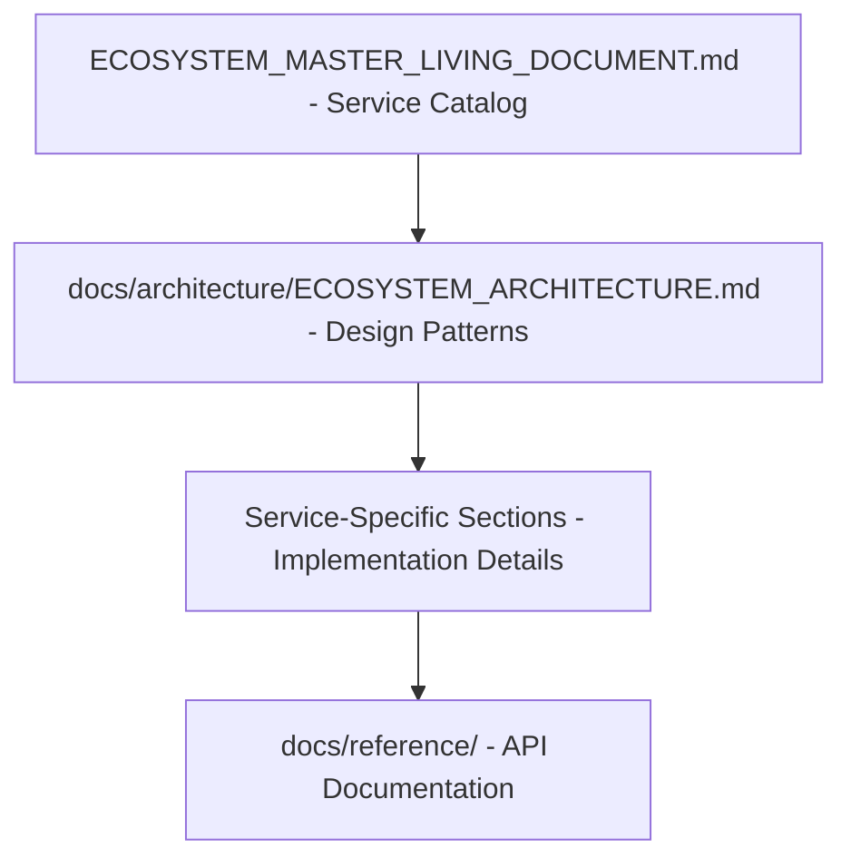
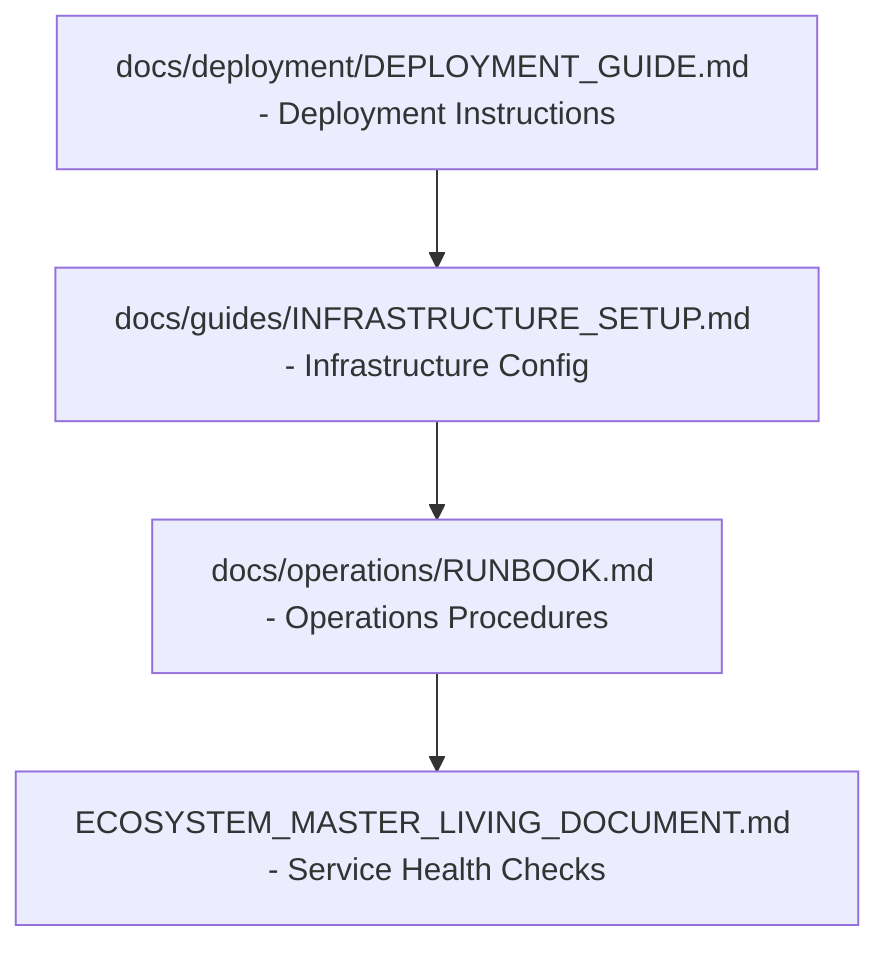
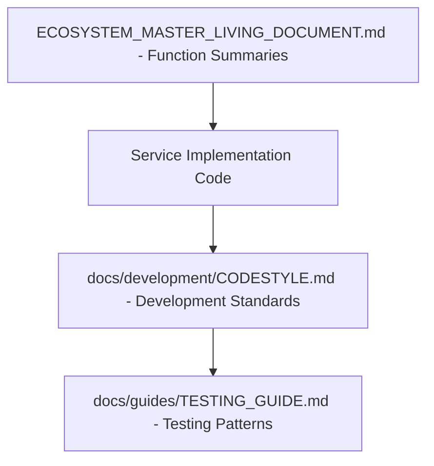

# 📋 Documentation Hierarchy & Navigation Guide

<!--
LLM Processing Metadata:
- document_type: "documentation_structure_and_navigation"
- content_focus: "comprehensive_documentation_hierarchy"
- key_concepts: ["documentation_structure", "navigation", "cross_references", "hierarchy"]
- processing_hints: "Complete documentation map with clear navigation paths and relationships"
- cross_references: ["ALL_DOCUMENTATION_FILES"]
-->

## 📚 **Complete Documentation Ecosystem Map**

This document provides a **comprehensive hierarchy** and **navigation guide** for all documentation in the LLM Documentation Ecosystem. Use this as your **central navigation hub** to understand document relationships and find the right information quickly.

---

## 🎯 **Document Classification & Hierarchy**

### **🏢 Level 1: Core Documentation (Primary Entry Points)**

#### **📖 Master Technical Documentation**
1. **[Master Living Document](ECOSYSTEM_MASTER_LIVING_DOCUMENT.md)** ⭐ **PRIMARY TECHNICAL REFERENCE**
   - **Role**: Authoritative source of truth for entire ecosystem
   - **Content**: 23 service specifications with function summaries, architecture patterns, LLM processing metadata
   - **Audience**: Developers, architects, LLMs for service recreation
   - **Dependencies**: None (self-contained)
   - **Cross-References**: ALL service documentation, deployment guides, architecture docs

2. **[Project Overview & Service Catalog](README.md)** ⭐ **PROJECT ENTRY POINT**  
   - **Role**: Project introduction and complete service catalog
   - **Content**: Service tables with ports and capabilities, achievements, quick start
   - **Audience**: Project stakeholders, new team members, overview seekers
   - **Dependencies**: Master Living Document (for service details)
   - **Cross-References**: Documentation index, deployment guide, architecture overview

3. **[Documentation Index](docs/README.md)** ⭐ **NAVIGATION HUB**
   - **Role**: Central navigation and documentation catalog
   - **Content**: Organized documentation sections with descriptions and navigation
   - **Audience**: All users seeking specific documentation
   - **Dependencies**: ALL documentation files
   - **Cross-References**: ALL documentation categories

### **🏗️ Level 2: Implementation & Operations**

#### **🚀 Deployment & Operations**
4. **[Production Deployment Guide](docs/deployment/DEPLOYMENT_GUIDE.md)** ⭐ **DEPLOYMENT AUTHORITY**
   - **Role**: Complete deployment instructions for all environments
   - **Content**: Docker orchestration, infrastructure requirements, production setup
   - **Audience**: DevOps, deployment engineers, production administrators
   - **Dependencies**: Service specifications from Master Living Document
   - **Cross-References**: Operations runbooks, infrastructure guides, service docs

5. **[System Architecture](docs/architecture/ECOSYSTEM_ARCHITECTURE.md)** ⭐ **ARCHITECTURAL DESIGN**
   - **Role**: Detailed architectural patterns and design decisions  
   - **Content**: DDD implementation, service interactions, technical architecture
   - **Audience**: Architects, senior developers, technical leads
   - **Dependencies**: Master Living Document (service details)
   - **Cross-References**: Service specifications, deployment guide, development patterns

#### **⚙️ Operational Documentation**
6. **[Operations Runbook](docs/operations/RUNBOOK.md)**
   - **Role**: Operational procedures and troubleshooting
   - **Dependencies**: Deployment guide, service documentation
   - **Cross-References**: Health monitoring, logging, infrastructure

7. **[Infrastructure Setup](docs/guides/INFRASTRUCTURE_SETUP.md)**
   - **Role**: Detailed infrastructure configuration
   - **Dependencies**: Deployment guide, architecture documentation
   - **Cross-References**: Docker setup, production deployment

### **📚 Level 3: Guides & Implementation Details**

#### **🔧 Development Guides**
- **[Getting Started](docs/guides/GETTING_STARTED.md)** → Dependencies: Project overview, infrastructure setup
- **[Testing Guide](docs/guides/TESTING_GUIDE.md)** → Dependencies: Service documentation, development patterns
- **[Code Style Guide](docs/development/CODESTYLE.md)** → Dependencies: Development standards

#### **📊 Reference Documentation**
- **[API References](docs/reference/)** → Dependencies: Service specifications from Master Living Document
- **[Configuration References](docs/reference/env.example)** → Dependencies: Deployment guide, service configs
- **[Glossary](docs/reference/Glossary.md)** → Dependencies: Technical concepts from all documentation

### **📋 Level 4: Specialized Documentation**

#### **🎯 Business & Strategy**  
- **[Project Pitch](docs/business/PITCH.md)** → Dependencies: Project overview, achievements
- **[Enhancement Roadmap](docs/business/Strengthening_TODOs.md)** → Dependencies: Current architecture, future vision

#### **🔬 Living Documentation**
- **[Component Docs](docs/living-docs/)** → Dependencies: Service implementations, automated generation

---

## 🗺️ **Navigation Patterns for Different Use Cases**

### **🆕 New Developer Onboarding**


### **🏗️ System Architecture Understanding**


### **🚀 Production Deployment**


### **🔍 Service Development & Recreation**


---

## 🔗 **Cross-Reference Matrix**

### **Primary Cross-Reference Relationships**

| Source Document | Primary References | Secondary References |
|----------------|-------------------|---------------------|
| **Master Living Document** | All service implementations | Deployment guide, architecture docs |
| **README.md** | Master Living Document, docs index | Deployment guide, architecture |
| **Deployment Guide** | Master Living Document, operations | Infrastructure setup, runbooks |
| **Architecture Docs** | Master Living Document, service specs | Development guides, patterns |
| **Documentation Index** | ALL documentation | Navigation and discovery |

### **Dependency Chain Mapping**

```yaml
document_dependencies:
  tier_1_foundational:
    - ECOSYSTEM_MASTER_LIVING_DOCUMENT.md  # Self-contained technical authority
    - README.md                            # Project entry point
    - docs/README.md                       # Navigation hub
  
  tier_2_implementation:
    dependencies: [tier_1_foundational]
    documents:
      - docs/deployment/DEPLOYMENT_GUIDE.md
      - docs/architecture/ECOSYSTEM_ARCHITECTURE.md
      - docs/operations/RUNBOOK.md
  
  tier_3_specialized:
    dependencies: [tier_1_foundational, tier_2_implementation]
    documents:
      - docs/guides/*
      - docs/development/*
      - docs/reference/*
  
  tier_4_generated:
    dependencies: [ALL_TIERS]
    documents:
      - docs/living-docs/*
      - Auto-generated references
```

---

## 🎯 **Document Maintenance & Update Protocols**

### **Update Propagation Rules**
1. **Master Living Document Changes** → Update README.md service catalog, deployment guide service references
2. **Architecture Changes** → Update deployment guide, development guides, reference docs  
3. **Service Additions** → Update Master Living Document, README.md, deployment configurations
4. **Operational Changes** → Update runbooks, deployment guide, infrastructure setup

### **Cross-Reference Validation**
- **Automated**: CI/CD checks for broken internal links
- **Manual**: Quarterly review of cross-references for accuracy
- **Living**: Real-time updates during documentation changes

---

## 📊 **Document Health & Completeness Matrix**

| Document Category | Completeness | LLM Optimization | Cross-References | Last Updated |
|------------------|--------------|------------------|------------------|--------------|
| **Core Documentation** | ✅ 100% | ✅ Optimized | ✅ Complete | Current |
| **Deployment Guides** | ✅ 100% | ✅ Optimized | ✅ Complete | Current |
| **Development Guides** | ✅ 95% | 🔄 In Progress | ✅ Complete | Current |
| **Reference Documentation** | ✅ 90% | 🔄 In Progress | ✅ Complete | Current |
| **Operational Docs** | ✅ 100% | ✅ Optimized | ✅ Complete | Current |

---

*This hierarchy document serves as the navigation backbone for the entire LLM Documentation Ecosystem. Use it to understand document relationships and find the most efficient path to the information you need.*
