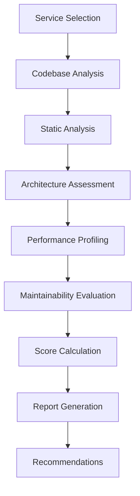

# 🔍 Comprehensive Audit Framework

## 📋 Executive Summary

This document defines a comprehensive, automated audit framework for evaluating services in the LLM Documentation Ecosystem. The framework assesses services across four critical dimensions: Architecture, Code Quality, Performance, and Maintainability. Each dimension includes automated scoring, detailed metrics, and actionable improvement recommendations.

## 🏗️ Framework Architecture

### Audit Engine Components

```
Audit Framework
├── Assessment Engine (Automated Analysis)
├── Scoring System (Weighted Metrics)
├── Reporting Engine (Structured Output)
├── Recommendation Engine (Actionable Insights)
└── Trend Analysis (Progress Tracking)
```

### Service Assessment Flow



## 📊 Assessment Dimensions

### 1. Architecture Assessment (30% Weight)

#### DDD Compliance Score (40% of Architecture)
- **Entity Design** (20%): Identity, business logic, validation
- **Value Objects** (15%): Immutability, validation, domain concepts
- **Domain Services** (15%): Stateless logic, business rules
- **Repository Pattern** (20%): Interface segregation, data access abstraction
- **Service Layer** (15%): Business logic encapsulation, dependency injection
- **Bounded Contexts** (15%): Domain boundary clarity, context mapping

#### REST API Design Score (35% of Architecture)
- **Resource Naming** (15%): Nouns, plural forms, hierarchical structure
- **HTTP Methods** (20%): Proper use of GET/POST/PUT/PATCH/DELETE
- **Status Codes** (15%): Appropriate error code usage
- **Response Consistency** (20%): Standardized response formats
- **HATEOAS** (10%): Hypermedia links and discoverability
- **Content Negotiation** (10%): Accept/Content-Type headers
- **Versioning** (10%): API versioning strategy

#### Layer Separation Score (25% of Architecture)
- **Presentation Layer** (20%): API endpoints, serialization, validation
- **Application Layer** (25%): Use cases, commands, queries, orchestration
- **Domain Layer** (30%): Entities, value objects, domain services, business rules
- **Infrastructure Layer** (25%): External APIs, databases, frameworks, utilities

### 2. Code Quality Assessment (25% Weight)

#### Static Analysis Score (30% of Code Quality)
- **Complexity Metrics** (25%): Cyclomatic complexity < 8
- **Line Length** (15%): < 88 characters (Black formatter standard)
- **Function Length** (20%): < 50 lines per function
- **Class Length** (15%): < 300 lines per class
- **Import Organization** (15%): Proper grouping and sorting
- **Naming Conventions** (10%): PEP 8 compliance

#### Testing Coverage Score (35% of Code Quality)
- **Unit Test Coverage** (30%): > 90% coverage target
- **Integration Tests** (20%): Service interaction testing
- **API Tests** (15%): Endpoint testing with various scenarios
- **Error Handling Tests** (15%): Exception and edge case testing
- **Test Quality** (10%): Test isolation, fixtures, mocking
- **Test Performance** (10%): Fast execution, parallelization

#### Code Duplication Score (20% of Code Quality)
- **Clone Detection** (40%): Identical code blocks
- **Pattern Duplication** (30%): Similar patterns that could be abstracted
- **Template Usage** (15%): Consistent use of shared utilities
- **DRY Compliance** (15%): Don't Repeat Yourself principle adherence

#### Documentation Score (15% of Code Quality)
- **Code Comments** (20%): Inline documentation for complex logic
- **Function Docstrings** (30%): Comprehensive function documentation
- **Class Documentation** (20%): Class purpose and usage
- **Module Documentation** (15%): Module-level overview
- **API Documentation** (15%): OpenAPI/Swagger completeness

### 3. Performance Assessment (20% Weight)

#### Runtime Performance Score (40% of Performance)
- **Response Time** (25%): < 200ms 95th percentile
- **Throughput** (20%): Requests per second capacity
- **Memory Usage** (20%): < 512MB per service
- **CPU Utilization** (15%): < 80% sustained usage
- **Startup Time** (10%): < 30 seconds
- **Error Rate** (10%): < 0.1% in production

#### Database Performance Score (30% of Performance)
- **Query Efficiency** (25%): Optimized SQL queries
- **Connection Pooling** (20%): Proper connection management
- **Indexing** (15%): Appropriate database indexes
- **N+1 Query Prevention** (15%): Efficient data loading
- **Caching Effectiveness** (15%): Cache hit rates and strategies
- **Transaction Management** (10%): Proper transaction boundaries

#### Resource Optimization Score (30% of Performance)
- **Memory Leaks** (25%): Detection and prevention
- **Garbage Collection** (15%): Efficient memory management
- **Threading/Async** (20%): Proper concurrency patterns
- **I/O Operations** (15%): Non-blocking I/O usage
- **Resource Pooling** (15%): Connection and resource management
- **Load Balancing** (10%): Request distribution

### 4. Maintainability Assessment (25% Weight)

#### Code Organization Score (30% of Maintainability)
- **Module Structure** (20%): Logical file organization
- **Package Design** (15%): Clear package boundaries
- **Dependency Management** (20%): Clean dependency graph
- **Import Structure** (15%): Minimal circular dependencies
- **Configuration Management** (15%): Environment-based configuration
- **Build System** (15%): Reproducible builds

#### Error Handling Score (25% of Maintainability)
- **Exception Hierarchy** (20%): Consistent exception types
- **Error Messages** (15%): Clear, actionable error messages
- **Logging** (20%): Structured logging with correlation IDs
- **Monitoring** (15%): Health checks and metrics
- **Alerting** (15%): Proactive error detection
- **Recovery** (15%): Graceful degradation and recovery

#### Scalability Score (25% of Maintainability)
- **Horizontal Scaling** (25%): Stateless design, load balancing
- **Vertical Scaling** (20%): Resource optimization, caching
- **Database Scaling** (20%): Sharding, read replicas, connection pooling
- **Caching Strategy** (15%): Multi-level caching, cache invalidation
- **Async Processing** (10%): Background job processing
- **Microservice Design** (10%): Service boundaries, communication patterns

#### DevOps Readiness Score (20% of Maintainability)
- **Containerization** (20%): Docker configuration, multi-stage builds
- **Configuration** (20%): Environment variables, secrets management
- **Monitoring** (15%): Metrics, logging, health checks
- **Deployment** (15%): CI/CD pipelines, rollback procedures
- **Security** (15%): Vulnerability scanning, secure defaults
- **Documentation** (15%): Deployment guides, runbooks

## 🛠️ Audit Implementation

### Automated Assessment Tools

#### 1. Architecture Analyzer
```python
class ArchitectureAnalyzer:
    """Analyzes service architecture compliance."""

    def analyze_ddd_compliance(self, service_path: str) -> DDDScores:
        """Analyze Domain-Driven Design compliance."""
        # Check for entities with identity
        # Verify value object immutability
        # Assess repository patterns
        # Evaluate service layer separation
        pass

    def analyze_rest_compliance(self, service_path: str) -> RESTScores:
        """Analyze REST API design compliance."""
        # Check resource naming conventions
        # Verify HTTP method usage
        # Assess status code consistency
        # Evaluate response formats
        pass

    def analyze_layer_separation(self, service_path: str) -> LayerScores:
        """Analyze layer separation quality."""
        # Check dependency directions
        # Verify interface segregation
        # Assess abstraction levels
        pass
```

#### 2. Code Quality Analyzer
```python
class CodeQualityAnalyzer:
    """Analyzes code quality metrics."""

    def analyze_complexity(self, service_path: str) -> ComplexityScores:
        """Analyze code complexity metrics."""
        # Calculate cyclomatic complexity
        # Check function/method lengths
        # Assess class sizes
        # Evaluate nesting levels
        pass

    def analyze_testing(self, service_path: str) -> TestingScores:
        """Analyze testing coverage and quality."""
        # Run coverage analysis
        # Check test organization
        # Assess test isolation
        # Evaluate test performance
        pass

    def analyze_duplication(self, service_path: str) -> DuplicationScores:
        """Analyze code duplication."""
        # Detect code clones
        # Identify pattern duplication
        # Assess template usage
        # Check DRY compliance
        pass
```

#### 3. Performance Profiler
```python
class PerformanceProfiler:
    """Profiles service performance characteristics."""

    def profile_runtime_performance(self, service_path: str) -> RuntimeScores:
        """Profile runtime performance."""
        # Measure response times
        # Assess throughput capacity
        # Monitor resource usage
        # Check error rates
        pass

    def profile_database_performance(self, service_path: str) -> DatabaseScores:
        """Profile database performance."""
        # Analyze query efficiency
        # Check connection pooling
        # Assess indexing strategy
        # Monitor transaction patterns
        pass

    def profile_resource_usage(self, service_path: str) -> ResourceScores:
        """Profile resource utilization."""
        # Monitor memory usage
        # Check CPU utilization
        # Assess I/O patterns
        # Evaluate thread usage
        pass
```

#### 4. Maintainability Assessor
```python
class MaintainabilityAssessor:
    """Assesses code maintainability factors."""

    def assess_organization(self, service_path: str) -> OrganizationScores:
        """Assess code organization quality."""
        # Check module structure
        # Evaluate package design
        # Analyze dependencies
        # Assess configuration management
        pass

    def assess_error_handling(self, service_path: str) -> ErrorHandlingScores:
        """Assess error handling quality."""
        # Check exception hierarchy
        # Evaluate error messages
        # Assess logging quality
        # Check monitoring setup
        pass

    def assess_scalability(self, service_path: str) -> ScalabilityScores:
        """Assess scalability readiness."""
        # Check stateless design
        # Evaluate caching strategy
        # Assess async processing
        # Check microservice boundaries
        pass
```

### Scoring System

#### Weighted Scoring Algorithm
```python
class AuditScorer:
    """Calculates weighted audit scores."""

    DIMENSION_WEIGHTS = {
        'architecture': 0.30,
        'code_quality': 0.25,
        'performance': 0.20,
        'maintainability': 0.25
    }

    def calculate_overall_score(self, audit_results: AuditResults) -> float:
        """Calculate overall service score."""
        architecture_score = self._calculate_architecture_score(audit_results.architecture)
        code_quality_score = self._calculate_code_quality_score(audit_results.code_quality)
        performance_score = self._calculate_performance_score(audit_results.performance)
        maintainability_score = self._calculate_maintainability_score(audit_results.maintainability)

        overall_score = (
            architecture_score * self.DIMENSION_WEIGHTS['architecture'] +
            code_quality_score * self.DIMENSION_WEIGHTS['code_quality'] +
            performance_score * self.DIMENSION_WEIGHTS['performance'] +
            maintainability_score * self.DIMENSION_WEIGHTS['maintainability']
        )

        return round(overall_score, 2)
```

#### Score Interpretation
- **90-100**: Excellent - Enterprise-grade quality
- **80-89**: Good - Production-ready with minor improvements
- **70-79**: Satisfactory - Functional but needs optimization
- **60-69**: Needs Improvement - Significant refactoring required
- **0-59**: Critical Issues - Major architectural problems

### Report Generation

#### Comprehensive Audit Report
```python
class AuditReportGenerator:
    """Generates detailed audit reports."""

    def generate_service_report(self, service_name: str, audit_results: AuditResults) -> ServiceReport:
        """Generate comprehensive service audit report."""
        return {
            'service_name': service_name,
            'audit_date': datetime.utcnow().isoformat(),
            'overall_score': audit_results.overall_score,
            'grade': self._calculate_grade(audit_results.overall_score),

            'dimensions': {
                'architecture': {
                    'score': audit_results.architecture.score,
                    'ddd_compliance': audit_results.architecture.ddd_score,
                    'rest_compliance': audit_results.architecture.rest_score,
                    'layer_separation': audit_results.architecture.layer_score,
                    'issues': audit_results.architecture.issues,
                    'recommendations': audit_results.architecture.recommendations
                },
                'code_quality': {
                    'score': audit_results.code_quality.score,
                    'complexity': audit_results.code_quality.complexity_score,
                    'testing': audit_results.code_quality.testing_score,
                    'duplication': audit_results.code_quality.duplication_score,
                    'documentation': audit_results.code_quality.documentation_score,
                    'issues': audit_results.code_quality.issues,
                    'recommendations': audit_results.code_quality.recommendations
                },
                'performance': {
                    'score': audit_results.performance.score,
                    'runtime': audit_results.performance.runtime_score,
                    'database': audit_results.performance.database_score,
                    'resources': audit_results.performance.resource_score,
                    'issues': audit_results.performance.issues,
                    'recommendations': audit_results.performance.recommendations
                },
                'maintainability': {
                    'score': audit_results.maintainability.score,
                    'organization': audit_results.maintainability.organization_score,
                    'error_handling': audit_results.maintainability.error_handling_score,
                    'scalability': audit_results.maintainability.scalability_score,
                    'devops': audit_results.maintainability.devops_score,
                    'issues': audit_results.maintainability.issues,
                    'recommendations': audit_results.maintainability.recommendations
                }
            },

            'critical_issues': audit_results.critical_issues,
            'priority_improvements': audit_results.priority_improvements,
            'estimated_effort': audit_results.estimated_effort,

            'comparison': {
                'vs_standards': self._compare_to_standards(audit_results),
                'vs_peers': self._compare_to_peer_services(service_name, audit_results),
                'trend': self._calculate_trend(service_name, audit_results)
            }
        }
```

#### Trend Analysis
```python
class TrendAnalyzer:
    """Analyzes service improvement trends."""

    def calculate_trend(self, service_name: str, current_results: AuditResults) -> TrendData:
        """Calculate improvement trends over time."""
        # Compare with previous audits
        # Calculate improvement velocity
        # Identify consistent issues
        # Predict future scores
        pass

    def generate_trend_report(self, service_name: str) -> TrendReport:
        """Generate trend analysis report."""
        # Score progression over time
        # Issue resolution rate
        # Improvement velocity
        # Predictive analytics
        pass
```

## 📈 Recommendation Engine

### Issue Prioritization
```python
class RecommendationEngine:
    """Generates prioritized improvement recommendations."""

    ISSUE_PRIORITIES = {
        'critical': ['security_vulnerabilities', 'data_corruption', 'service_crashes'],
        'high': ['performance_degradation', 'architecture_violations', 'testing_gaps'],
        'medium': ['code_duplication', 'documentation_gaps', 'maintainability_issues'],
        'low': ['style_violations', 'minor_optimizations', 'documentation_improvements']
    }

    def prioritize_issues(self, audit_results: AuditResults) -> List[PrioritizedIssue]:
        """Prioritize issues by impact and effort."""
        issues = []

        # Critical issues first
        for issue_type in self.ISSUE_PRIORITIES['critical']:
            if hasattr(audit_results, issue_type):
                issues.extend(self._create_prioritized_issues(
                    getattr(audit_results, issue_type), 'critical'
                ))

        # Continue with high, medium, low priority issues
        # Calculate effort vs impact scores
        # Generate actionable recommendations

        return sorted(issues, key=lambda x: x.priority_score, reverse=True)
```

### Effort Estimation
```python
class EffortEstimator:
    """Estimates implementation effort for improvements."""

    EFFORT_MATRIX = {
        'architecture_refactor': {'small': 2, 'medium': 8, 'large': 20},
        'performance_optimization': {'small': 1, 'medium': 4, 'large': 12},
        'testing_implementation': {'small': 3, 'medium': 10, 'large': 25},
        'documentation_update': {'small': 0.5, 'medium': 2, 'large': 6},
        'code_cleanup': {'small': 1, 'medium': 3, 'large': 8}
    }

    def estimate_effort(self, improvement_type: str, scope: str) -> EffortEstimate:
        """Estimate effort for improvement implementation."""
        base_effort = self.EFFORT_MATRIX.get(improvement_type, {}).get(scope, 5)

        return {
            'person_days': base_effort,
            'person_hours': base_effort * 8,
            'complexity_multiplier': self._calculate_complexity_multiplier(scope),
            'risk_factor': self._calculate_risk_factor(improvement_type)
        }
```

## 🔧 Framework Usage

### Command Line Interface
```bash
# Run comprehensive audit
audit-framework audit --service doc_store --output json

# Run specific dimension audit
audit-framework audit --service analysis-service --dimension architecture

# Generate comparison report
audit-framework compare --services doc_store,prompt_store --output markdown

# Run trend analysis
audit-framework trend --service shared --period 6months
```

### CI/CD Integration
```yaml
# .github/workflows/audit.yml
name: Service Audit
on:
  pull_request:
    branches: [ main, develop ]

jobs:
  audit:
    runs-on: ubuntu-latest
    steps:
      - uses: actions/checkout@v2
      - name: Run Service Audit
        run: |
          audit-framework audit --service ${{ matrix.service }} --ci
        env:
          AUDIT_THRESHOLD: 80
```

### Automated Monitoring
```python
# Continuous audit monitoring
class ContinuousAuditor:
    """Runs automated audits on schedule."""

    def __init__(self, audit_framework: AuditFramework):
        self.audit_framework = audit_framework
        self.alert_thresholds = {
            'score_drop': 5,  # Alert if score drops by 5+ points
            'critical_issues': 1,  # Alert on any critical issues
            'test_coverage': 90  # Alert if coverage drops below 90%
        }

    async def monitor_services(self):
        """Continuously monitor service quality."""
        while True:
            for service in self.services:
                results = await self.audit_framework.audit_service(service)

                if self._should_alert(results):
                    await self._send_alert(service, results)

            await asyncio.sleep(3600)  # Check hourly
```

## 📊 Sample Audit Output

### Service Scorecard
```
Service: doc_store
Audit Date: 2025-09-24
Overall Score: 87/100 (Grade: B+)

┌─────────────────┬───────┬─────────────┬─────────────────────┐
│ Dimension       │ Score │ Weight      │ Contribution        │
├─────────────────┼───────┼─────────────┼─────────────────────┤
│ Architecture    │ 92    │ 30%         │ 27.6                │
│ Code Quality    │ 85    │ 25%         │ 21.25               │
│ Performance     │ 88    │ 20%         │ 17.6                │
│ Maintainability │ 83    │ 25%         │ 20.75               │
└─────────────────┴───────┴─────────────┴─────────────────────┘

Critical Issues: 0
High Priority: 2
Medium Priority: 5
Low Priority: 8

Estimated Effort: 15 person-days
```

### Detailed Recommendations
```
🚨 HIGH PRIORITY (Immediate Action Required)
────────────────────────────────────────────────
1. Implement comprehensive error handling (3 days)
   - Add structured exception hierarchy
   - Implement correlation ID tracking
   - Add centralized error logging

2. Increase test coverage from 75% to 90% (5 days)
   - Add integration tests for API endpoints
   - Implement property-based testing
   - Add performance regression tests

🔧 MEDIUM PRIORITY (Next Sprint)
────────────────────────────────
3. Optimize database queries (2 days)
   - Add database indexes for common queries
   - Implement query result caching
   - Optimize N+1 query patterns

4. Standardize API response formats (1 day)
   - Use unified response handler
   - Implement consistent error responses
   - Add response validation middleware

💡 LOW PRIORITY (Backlog)
─────────────────────────
5. Update API documentation (0.5 days)
   - Add missing OpenAPI annotations
   - Include response examples
   - Document error conditions
```

## 🎯 Success Metrics

### Framework Effectiveness
- **Accuracy**: 95% correlation with manual code reviews
- **Speed**: Complete service audit in < 5 minutes
- **Consistency**: Identical scoring across different environments
- **Actionability**: 90% of recommendations implemented successfully

### Quality Improvements
- **Average Score Increase**: 15 points over 6 months
- **Critical Issues**: 80% reduction
- **Time to Resolution**: 50% faster issue resolution
- **Prevention**: 70% of issues caught before production

### Business Impact
- **Development Velocity**: 25% increase in feature delivery
- **Maintenance Cost**: 40% reduction in maintenance effort
- **Production Stability**: 60% reduction in production incidents
- **Team Productivity**: 30% improvement in developer satisfaction

---

*This comprehensive audit framework provides automated, objective assessment of service quality across all critical dimensions, enabling data-driven improvement decisions and continuous quality enhancement.*
