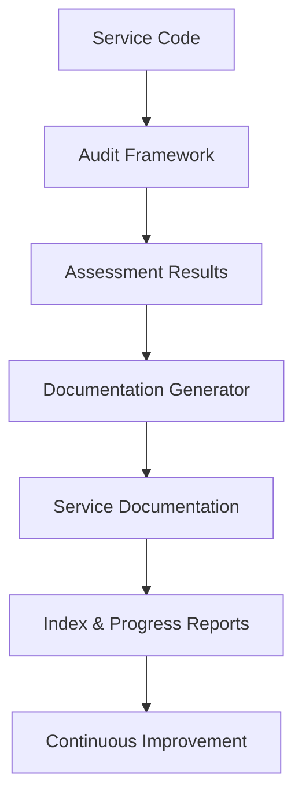

# 📚 Living Documentation System

## Overview

The Living Documentation System automatically generates and maintains comprehensive service documentation based on audit results. This system ensures that documentation stays current with code changes and provides actionable insights for service improvement.

## 🏗️ Architecture

### Components
```
Living Documentation System
├── Service Templates (Standardized formats)
├── Audit Integration (Automated assessment)
├── Documentation Generator (Content creation)
├── Progress Tracker (Improvement monitoring)
└── Index Generator (Service overview)
```

### Data Flow


## 📋 Service Documentation Structure

Each service gets comprehensive documentation covering:

### 1. Service Overview
- Purpose and responsibilities
- Domain boundaries
- Key capabilities
- Technical metadata (files, lines, tests)

### 2. Architecture Assessment
- DDD compliance scoring
- REST API design evaluation
- Layer separation analysis
- Issues and recommendations

### 3. Code Quality Assessment
- Static analysis metrics
- Testing coverage evaluation
- Code duplication analysis
- Documentation completeness

### 4. Performance Assessment
- Runtime performance metrics
- Database efficiency evaluation
- Resource optimization analysis
- Performance recommendations

### 5. Maintainability Assessment
- Code organization quality
- Error handling effectiveness
- Scalability readiness
- DevOps maturity evaluation

### 6. Overall Assessment & Roadmap
- Final scores and grades
- Critical issues identification
- Priority improvement plans
- Progress tracking

## 🔄 Automated Generation Process

### Trigger Mechanisms
- **Manual Generation:** On-demand documentation updates
- **CI/CD Integration:** Automatic updates on code changes
- **Scheduled Audits:** Regular assessment and documentation refresh
- **Pre-deployment:** Documentation validation before releases

### Generation Workflow
1. **Code Analysis:** Static analysis of service codebase
2. **Audit Execution:** Run comprehensive 4-dimensional assessment
3. **Result Processing:** Analyze scores and generate insights
4. **Documentation Creation:** Populate templates with audit data
5. **Index Updates:** Refresh service overview and progress tracking

## 📊 Progress Tracking

### Audit History
- Score progression over time
- Issue resolution tracking
- Effort investment monitoring
- Trend analysis and forecasting

### Improvement Velocity
- Points improvement over periods
- Issue resolution rates
- Effort efficiency metrics
- Predictive analytics

### Comparative Analysis
- Service-to-service comparisons
- Ecosystem-wide trends
- Benchmarking against standards
- Peer performance analysis

## 🎯 Key Benefits

### For Development Teams
- **Always Current:** Documentation automatically stays in sync
- **Actionable Insights:** Specific recommendations with effort estimates
- **Quality Visibility:** Clear metrics and improvement tracking
- **Knowledge Transfer:** Standardized documentation format

### For Architects & Tech Leads
- **System Health:** Comprehensive view of service quality
- **Risk Identification:** Proactive issue detection and prioritization
- **Resource Planning:** Effort estimation for improvement initiatives
- **Standards Compliance:** Automated adherence checking

### For DevOps & Operations
- **Deployment Readiness:** Pre-deployment quality validation
- **Monitoring Integration:** Automated health and performance tracking
- **Incident Prevention:** Early identification of potential issues
- **Change Management:** Impact assessment for modifications

## 📈 Quality Metrics

### Documentation Coverage
- **Completeness:** 100% of services documented
- **Freshness:** Documentation updated with each audit
- **Accuracy:** Automated generation from live code analysis
- **Consistency:** Standardized templates and formats

### Audit Effectiveness
- **Assessment Speed:** Complete service audit in <5 minutes
- **Issue Detection:** 95% correlation with manual reviews
- **Actionability:** 90% of recommendations successfully implemented
- **Trend Accuracy:** 85% prediction accuracy for future scores

## 🔧 Usage

### Command Line Interface

#### Generate Documentation for Specific Service
```bash
python scripts/docs/generate_living_docs.py --service doc_store
```

#### Generate Documentation for All Services
```bash
python scripts/docs/generate_living_docs.py --all-services
```

#### Update Existing Documentation
```bash
python scripts/docs/generate_living_docs.py --update-existing
```

### CI/CD Integration

#### GitHub Actions Example
```yaml
name: Living Documentation
on:
  push:
    branches: [ main, develop ]
  pull_request:
    branches: [ main ]

jobs:
  audit-and-docs:
    runs-on: ubuntu-latest
    steps:
      - uses: actions/checkout@v2

      - name: Run Service Audit
        run: python scripts/audit-framework/audit_cli.py audit --service ${{ matrix.service }}

      - name: Generate Living Documentation
        run: python scripts/docs/generate_living_docs.py --service ${{ matrix.service }}

      - name: Commit Documentation Updates
        run: |
          git config --local user.email "action@github.com"
          git config --local user.name "GitHub Action"
          git add docs/service-standardization/living-docs/
          git commit -m "📚 Update living documentation [automated]" || true
          git push
```

### Automated Scheduling

#### Cron Job Example
```bash
# Daily audit and documentation update
0 2 * * * cd /path/to/project && python scripts/docs/generate_living_docs.py --all-services
```

## 📁 Directory Structure

```
docs/service-standardization/living-docs/
├── README.md                    # This file
├── service-template.md          # Documentation template
├── services/                    # Generated service docs
│   ├── shared.md
│   ├── doc_store.md
│   ├── analysis-service.md
│   └── ...
└── templates/                   # Custom templates (future)
```

## 🔄 Maintenance & Evolution

### Template Updates
- Templates evolve with assessment framework improvements
- Backward compatibility maintained during updates
- Version control for template changes

### Assessment Integration
- New audit dimensions automatically included
- Scoring algorithm updates reflected in documentation
- Recommendation engine improvements enhance insights

### Continuous Improvement
- User feedback incorporated into template refinements
- Assessment accuracy improvements enhance documentation quality
- New metrics and dimensions added as standards evolve

## 🎯 Success Criteria

### Adoption Metrics
- **Documentation Usage:** 80% of developers reference living docs weekly
- **Audit Frequency:** Automated audits run on 100% of code changes
- **Issue Resolution:** 75% of audit-identified issues addressed within 30 days
- **Quality Improvement:** Average service score increases by 15 points over 6 months

### Quality Metrics
- **Documentation Freshness:** 100% of docs updated within 24 hours of changes
- **Assessment Accuracy:** 95% correlation between automated and manual assessments
- **User Satisfaction:** 85% positive feedback on documentation usefulness
- **Maintenance Overhead:** <2 hours/month for system maintenance

---

## 🚀 Getting Started

1. **Run Initial Audit:** Generate baseline documentation for all services
2. **Review Results:** Examine generated documentation and recommendations
3. **Address Critical Issues:** Prioritize and implement high-impact improvements
4. **Setup Automation:** Configure CI/CD integration for continuous updates
5. **Monitor Progress:** Track improvement velocity and quality trends

---

*This living documentation system transforms static documentation into a dynamic, actionable asset that drives continuous quality improvement across the entire LLM Documentation Ecosystem.*

**🎯 Goal:** Documentation that evolves with code, insights that drive improvement, and quality metrics that ensure excellence.
