# Ecosystem MCP - Architecture Diagrams

**Date:** October 28, 2025  
**Version:** 1.0  
**Status:** Comprehensive Architecture Documentation

## Table of Contents

1. [High-Level Architecture](#high-level-architecture)
2. [Ingestion Pipeline](#ingestion-pipeline)
3. [RAG Query Flow](#rag-query-flow)
4. [Temporal RAG System](#temporal-rag-system)
5. [Caching Architecture](#caching-architecture)
6. [Database Schema](#database-schema)
7. [Deployment Architecture](#deployment-architecture)
8. [Error Handling & Resilience](#error-handling--resilience)

---

## High-Level Architecture

### System Overview

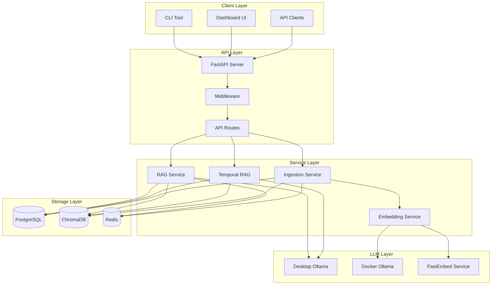

---

## Ingestion Pipeline

### Complete Ingestion Flow

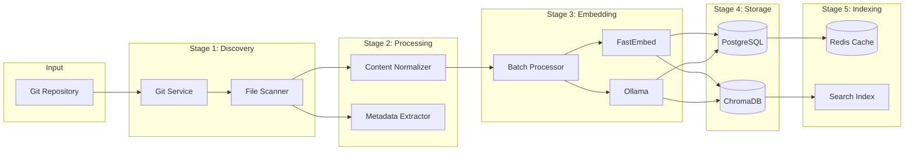

### Ingestion Modes

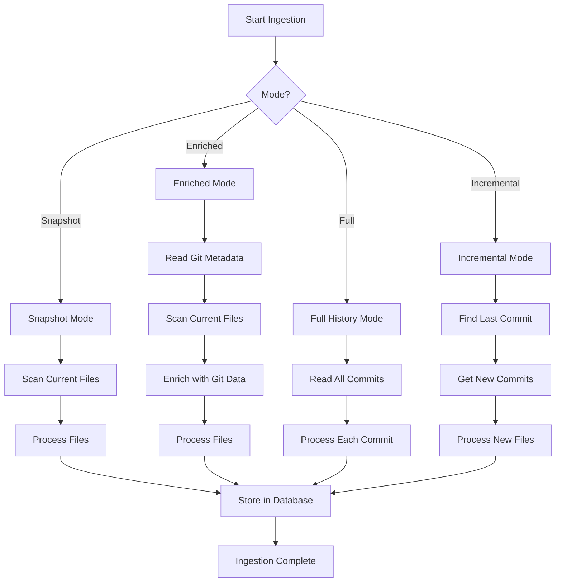

---

## RAG Query Flow

### Standard RAG Query

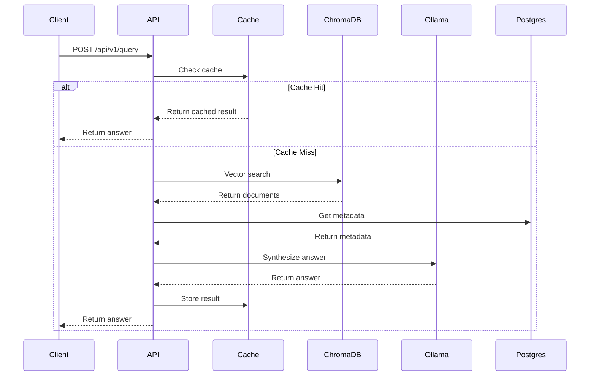

### Multi-Pass RAG Query

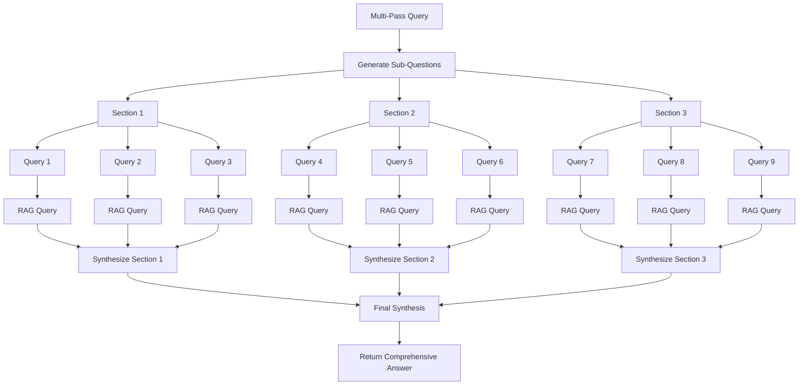

---

## Temporal RAG System

### Timeline Architecture

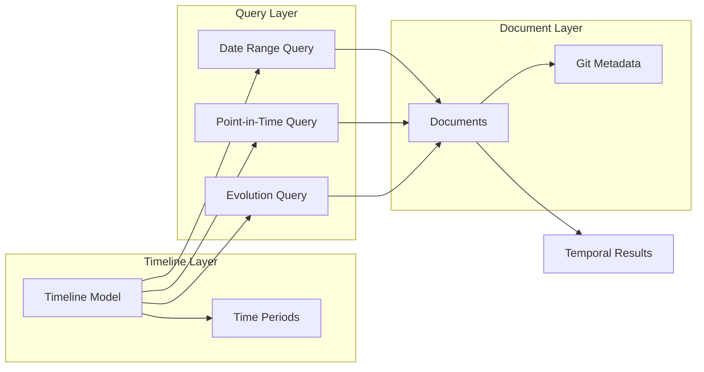

### Temporal Query Flow

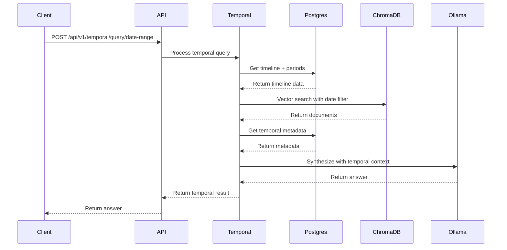

---

## Caching Architecture

### Multi-Level Cache

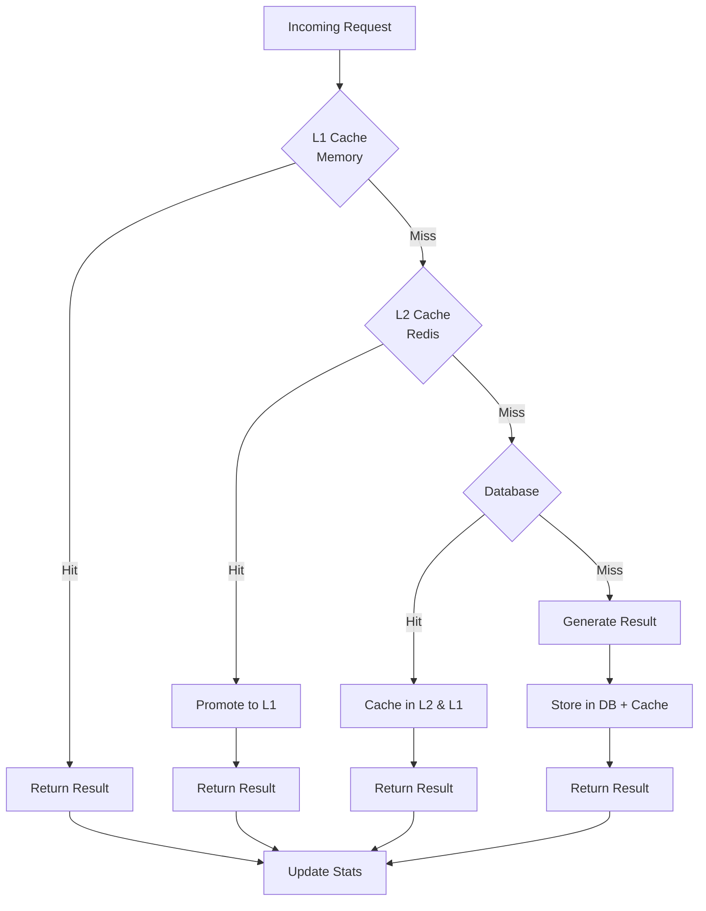

### Cache Strategy

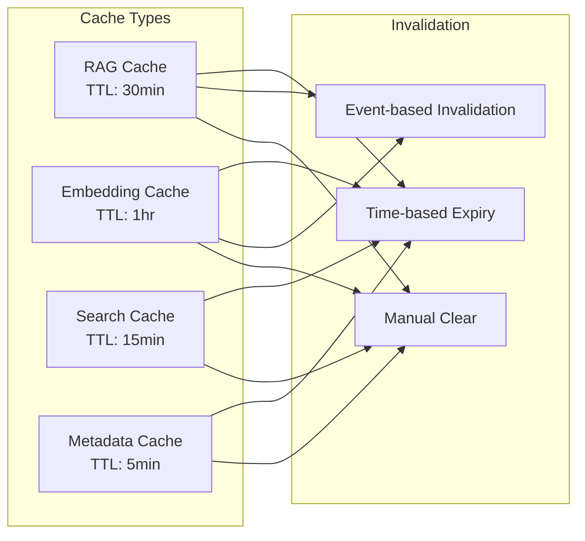

---

## Database Schema

### Core Tables

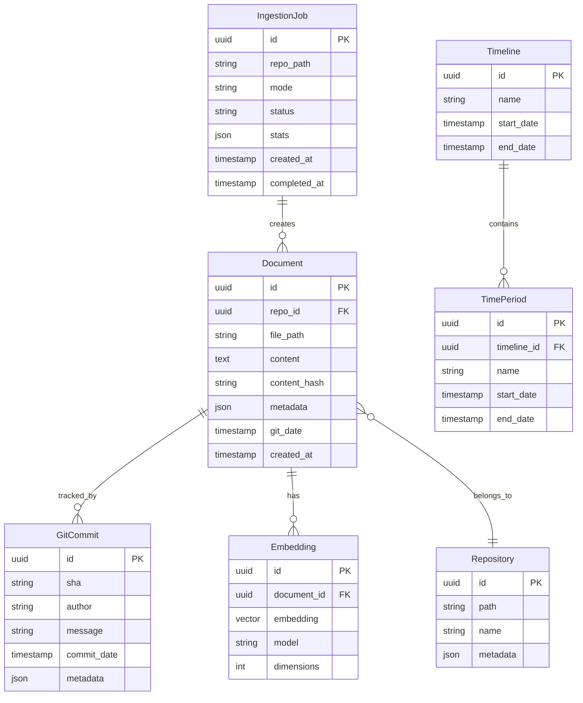

---

## Deployment Architecture

### Docker Compose Stack

```mermaid
graph TB
    subgraph "Application Services"
        API[ecosystem-mcp<br/>Port 8002]
        Dashboard[dashboard<br/>Port 8501]
        Worker[ingestion-worker]
        Embedding[embedding-service<br/>Port 8001]
    end
    
    subgraph "Data Services"
        Postgres[(PostgreSQL<br/>Port 5432)]
        Redis[(Redis<br/>Port 6379)]
        ChromaDB[(ChromaDB<br/>Port 8000)]
    end
    
    subgraph "LLM Services"
        Ollama[Ollama<br/>Port 11434]
        FastE[FastEmbed<br/>internal)]
    end
    
    API --> Postgres
    API --> Redis
    API --> ChromaDB
    API --> Ollama
    
    Dashboard --> API
    
    Worker --> Redis
    Worker --> Postgres
    Worker --> ChromaDB
    
    Embedding --> FastE
    Embedding --> Ollama
    
    API --> Embedding
    Worker --> Embedding
```

### Volume Mounts

```mermaid
graph LR
    subgraph "Host"
        Repo[/path/to/repo]
        Data[./data]
    end
    
    subgraph "Container"
        App[/app]
        ChromaData[/chroma_db]
        PGData[/var/lib/postgresql/data]
    end
    
    Repo -->|read-only| App
    Data -->|read-write| ChromaData
    Data -->|read-write| PGData
```

---

## Error Handling & Resilience

### Circuit Breaker Pattern

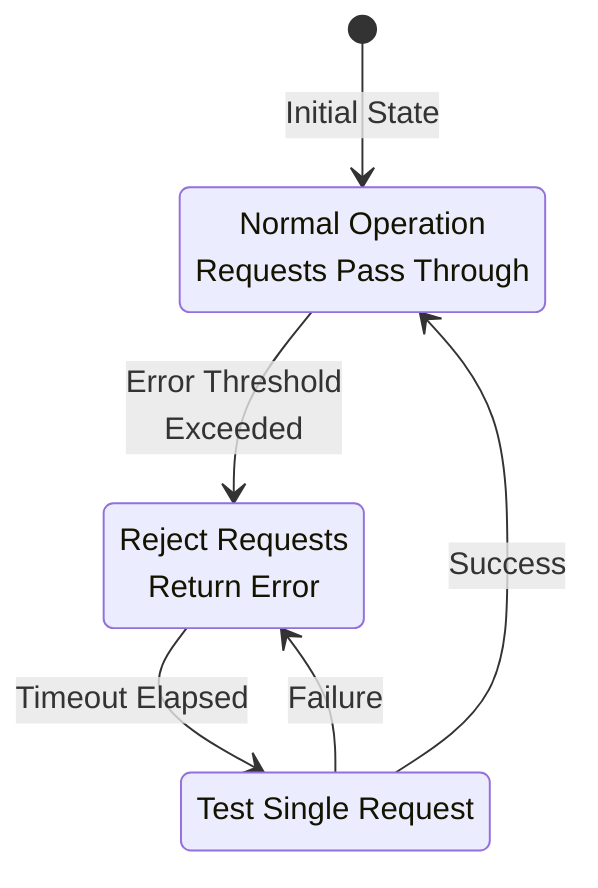

### Retry Strategy

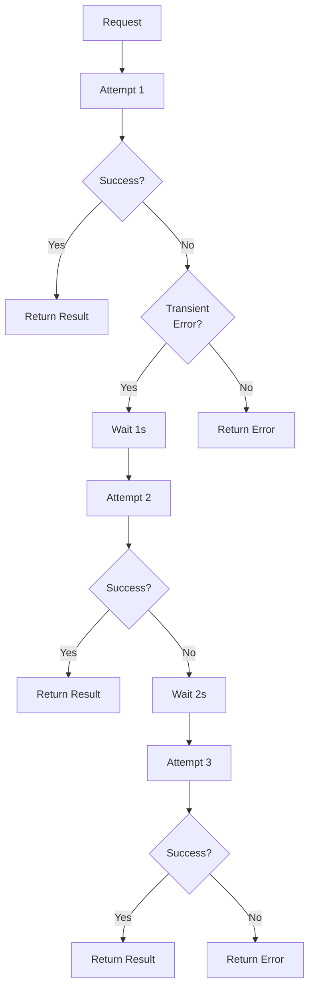

### Fallback Architecture

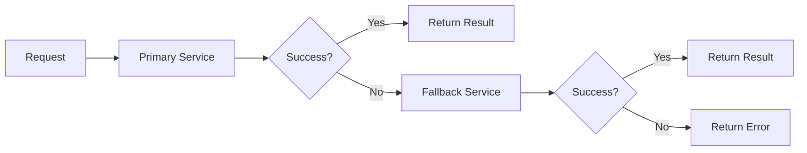

---

## Performance Optimizations

### Request Flow with Optimizations

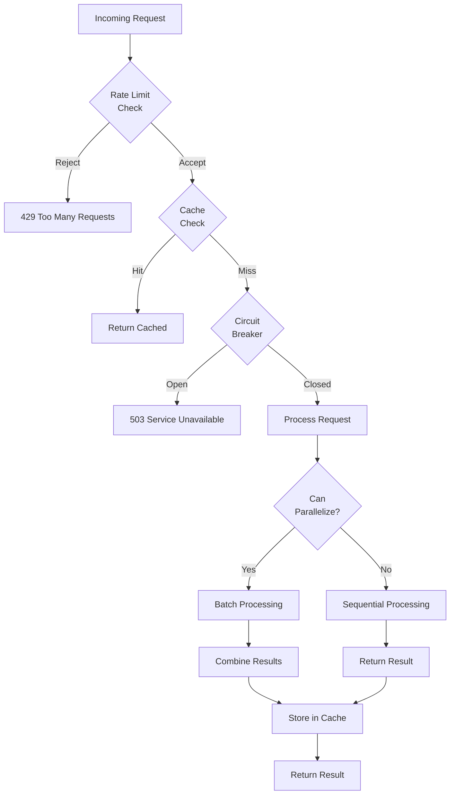

---

## Monitoring & Observability

### Metrics Collection

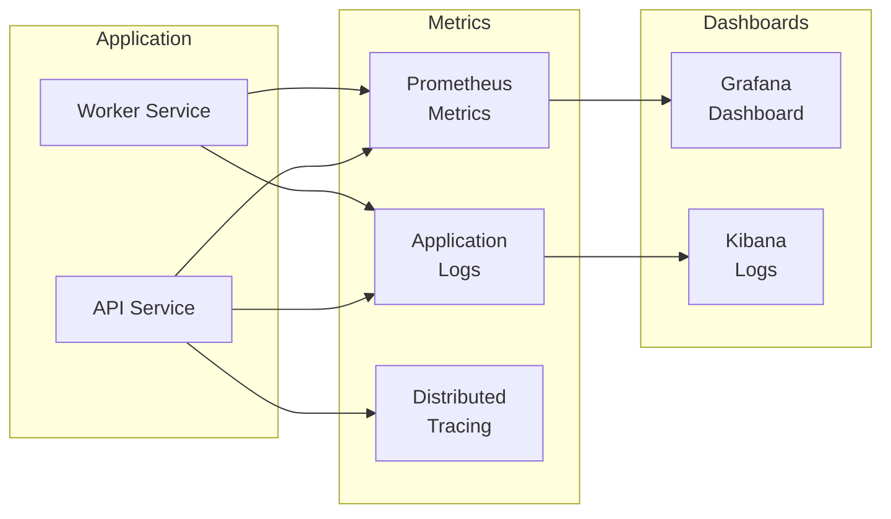

---

## Development Workflow

### CI/CD Pipeline

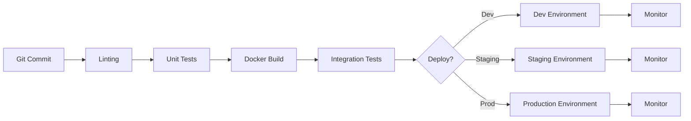

---

## Security Architecture

### Authentication & Authorization (Future)

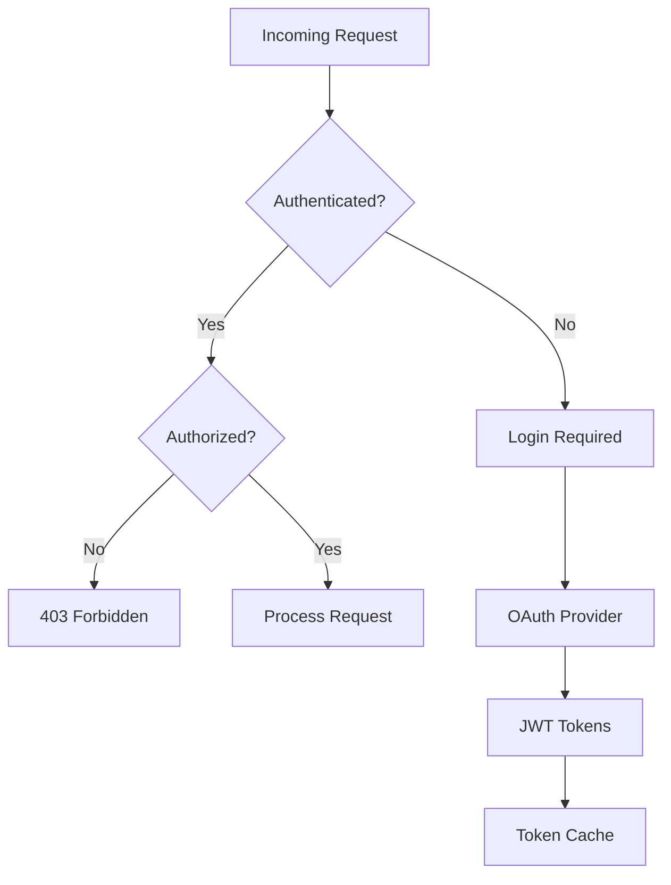

---

## Additional Resources

- [API Documentation](../api/EXAMPLES.md)
- [Deployment Guide](../DEPLOYMENT_GUIDE.md)
- [Testing Guide](../development/TESTING_GUIDE.md)
- [Performance Guide](./RAG_PERFORMANCE_OPTIMIZATION_GUIDE.md)

---

**Last Updated:** October 28, 2025  
**Version:** 1.0  
**Maintainer:** Ecosystem MCP Team

