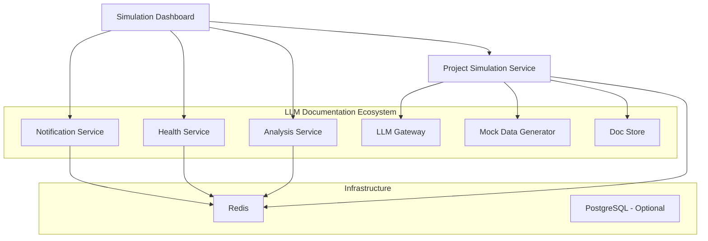

# Simulation Dashboard - Ecosystem Integration Guide

## Overview

The **Project Simulation Dashboard** is designed to seamlessly integrate with the **LLM Documentation Ecosystem**, providing a rich, interactive interface for managing and monitoring project simulations. This guide covers various integration scenarios and deployment options.

## Integration Architecture



## Deployment Options

### 1. Standalone Simulation Services

Run only the simulation ecosystem without the full LLM Documentation Ecosystem:

```bash
# Start simulation services only
docker-compose -f docker-compose.simulation.yml up

# Or with specific profile
docker-compose -f docker-compose.simulation.yml --profile simulation up
```

**Services Available:**
- **Simulation Dashboard**: http://localhost:8501
- **Project Simulation API**: http://localhost:5075
- **Redis**: localhost:6379

### 2. Full Ecosystem Integration

Run the simulation dashboard as part of the complete LLM Documentation Ecosystem:

```bash
# Start with simulation services included
docker-compose --profile simulation up

# Or start everything
docker-compose up
```

**Services Available:**
- **Simulation Dashboard**: http://localhost:8501
- **Project Simulation API**: http://localhost:5075
- **Full Ecosystem Services**: All LLM Documentation Ecosystem services

### 3. Development Environment

For local development with live code reloading:

```bash
# Start core development services
docker-compose --profile development up

# Add simulation services
docker-compose --profile simulation up
```

## Configuration

### Environment Variables

#### Core Configuration
```bash
# Dashboard Configuration
DASHBOARD_ENVIRONMENT=development
DASHBOARD_DEBUG=true
DASHBOARD_PORT=8501
DASHBOARD_HOST=0.0.0.0

# Simulation Service Connection
DASHBOARD_SIMULATION_SERVICE_HOST=project-simulation
DASHBOARD_SIMULATION_SERVICE_PORT=5075
```

#### Ecosystem Integration
```bash
# Optional Ecosystem Services
DASHBOARD_ANALYSIS_SERVICE_URL=http://analysis-service:5080
DASHBOARD_HEALTH_SERVICE_URL=http://notification-service:5130

# LLM Integration (when available)
LLM_GATEWAY_URL=http://llm-gateway:5055
MOCK_DATA_GENERATOR_URL=http://mock-data-generator:5065
```

#### Performance Tuning
```bash
# WebSocket Configuration
DASHBOARD_WEBSOCKET_ENABLED=true
DASHBOARD_WEBSOCKET_RECONNECT_ATTEMPTS=5
DASHBOARD_WEBSOCKET_HEARTBEAT_INTERVAL=30.0

# Performance Settings
DASHBOARD_PERFORMANCE_ENABLE_COMPRESSION=true
DASHBOARD_PERFORMANCE_MAX_CONCURRENT_REQUESTS=10
```

## Service Dependencies

### Required Services
- **Redis**: In-memory data store and caching
- **Project Simulation Service**: Core simulation engine

### Optional Ecosystem Services
- **Analysis Service**: Document analysis and consistency checking
- **Notification Service**: Health monitoring and alerts
- **LLM Gateway**: AI-powered content generation
- **Mock Data Generator**: Test data generation
- **Doc Store**: Document storage and retrieval

## Network Configuration

### Docker Networks
```yaml
networks:
  simulation-network:
    name: hackathon-simulation-network
    driver: bridge
  doc-ecosystem:
    name: doc-ecosystem-dev
    driver: bridge
```

### Port Mappings
```yaml
# Simulation Services
simulation-dashboard: "8501:8501"
project-simulation: "5075:5075"

# Infrastructure
redis: "6379:6379"
```

## Health Checks & Monitoring

### Service Health Endpoints
- **Dashboard**: `http://localhost:8501/health`
- **Simulation Service**: `http://localhost:5075/health`
- **Redis**: `redis-cli ping`

### Monitoring Integration
The dashboard automatically integrates with ecosystem monitoring services:
- **Prometheus**: Metrics collection
- **Grafana**: Visualization dashboards
- **AlertManager**: Notification routing

## Data Persistence

### Volumes Configuration
```yaml
volumes:
  # Simulation data
  simulation_data:
    driver: local
  simulation_logs:
    driver: local

  # Dashboard data
  dashboard_cache:
    driver: local
  dashboard_logs:
    driver: local

  # Infrastructure
  redis_data:
    driver: local
```

### Backup Strategy
```bash
# Backup simulation data
docker run --rm -v simulation_data:/data -v $(pwd):/backup alpine tar czf /backup/simulation_backup.tar.gz -C /data .

# Backup dashboard cache
docker run --rm -v dashboard_cache:/data -v $(pwd):/backup alpine tar czf /backup/dashboard_backup.tar.gz -C /data .
```

## Security Considerations

### Network Security
```yaml
# Restrict external access in production
services:
  simulation-dashboard:
    ports:
      - "127.0.0.1:8501:8501"  # Bind to localhost only
```

### Environment Variables
- Store sensitive configuration in Docker secrets
- Use environment-specific configuration files
- Rotate API keys and tokens regularly

### Access Control
- Implement authentication for production deployments
- Use reverse proxy for SSL termination
- Configure CORS policies appropriately

## Scaling & Performance

### Horizontal Scaling
```yaml
# Multiple dashboard instances
services:
  simulation-dashboard-1:
    extends: simulation-dashboard
    ports:
      - "8501:8501"

  simulation-dashboard-2:
    extends: simulation-dashboard
    ports:
      - "8502:8501"
```

### Load Balancing
```yaml
# Nginx load balancer configuration
upstream simulation_dashboard {
    server simulation-dashboard-1:8501;
    server simulation-dashboard-2:8501;
}

server {
    listen 80;
    server_name dashboard.example.com;

    location / {
        proxy_pass http://simulation_dashboard;
        proxy_set_header Host $host;
        proxy_set_header X-Real-IP $remote_addr;
    }
}
```

## Troubleshooting

### Common Issues

#### Connection Refused
```bash
# Check service health
curl http://localhost:5075/health
curl http://localhost:8501/health

# Verify Docker networks
docker network ls
docker network inspect hackathon-simulation-network
```

#### WebSocket Connection Issues
```bash
# Enable debug logging
export DASHBOARD_DEBUG=true
export DASHBOARD_WEBSOCKET_ENABLED=true

# Check WebSocket configuration
docker-compose logs simulation-dashboard
```

#### Performance Issues
```bash
# Monitor resource usage
docker stats

# Check Redis memory usage
docker exec -it hackathon-redis redis-cli info memory
```

### Debug Commands

```bash
# View service logs
docker-compose logs simulation-dashboard
docker-compose logs project-simulation

# Access service containers
docker exec -it hackathon-simulation-dashboard /bin/bash
docker exec -it hackathon-project-simulation /bin/bash

# Test service connectivity
docker-compose exec simulation-dashboard curl http://project-simulation:5075/health
```

## Development Workflow

### Local Development Setup
```bash
# Clone repositories
git clone https://github.com/your-org/llm-doc-ecosystem.git
git clone https://github.com/your-org/project-simulation.git
git clone https://github.com/your-org/simulation-dashboard.git

# Start development environment
docker-compose -f docker-compose.dev.yml --profile development up

# Start simulation services
docker-compose -f docker-compose.simulation.yml up
```

### Testing Integration
```bash
# Run integration tests
docker-compose exec simulation-dashboard python -m pytest tests/integration/

# Test WebSocket connections
docker-compose exec simulation-dashboard python tests/test_websocket.py

# Performance testing
docker-compose exec simulation-dashboard python tests/test_performance.py
```

## Migration & Upgrades

### Version Compatibility
- **Dashboard v1.0+**: Compatible with Simulation Service v2.0+
- **WebSocket Support**: Requires Simulation Service with WebSocket support
- **API Compatibility**: REST API v1.0 compliance required

### Upgrade Process
```bash
# Stop services
docker-compose down

# Update images
docker-compose pull

# Backup data volumes
docker run --rm -v simulation_data:/data -v $(pwd):/backup alpine tar czf /backup/pre_upgrade_backup.tar.gz -C /data .

# Start updated services
docker-compose up -d

# Verify health
curl http://localhost:8501/health
curl http://localhost:5075/health
```

## Support & Resources

### Documentation Links
- [Simulation Dashboard README](./README.md)
- [Project Simulation Service Docs](../project-simulation/README.md)
- [LLM Documentation Ecosystem Docs](../../docs/)

### Community Resources
- **GitHub Issues**: Report bugs and request features
- **Discussions**: Community support and questions
- **Wiki**: Detailed setup guides and examples

### Contact Information
- **Technical Support**: dev-support@your-org.com
- **Documentation Issues**: docs@your-org.com
- **Security Issues**: security@your-org.com

---

**Last Updated**: September 19, 2025
**Version**: 1.0.0
**Compatibility**: LLM Documentation Ecosystem v2.0+
