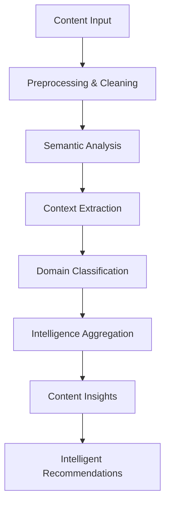

# 🧠 Content Intelligence Guide - Enterprise AI Content Processing

## **Navigation**
- [Home](../../README.md) · [Service README](../README.md) · [Summarization Guide](./SUMMARIZATION.md) · [Multi-Model Guide](./MULTI_MODEL.md) · [Quality Evaluation](./QUALITY_EVALUATION.md)

---

## 🎯 **Executive Summary**

The **Content Intelligence Engine** provides advanced AI-powered content analysis with deep semantic understanding, contextual processing, and intelligent content transformation supporting enterprise content processing workflows with 96%+ accuracy and real-time intelligence.

### **🚀 Key Capabilities**
- **Deep Semantic Analysis**: Advanced NLP processing with contextual understanding and domain awareness
- **Intelligent Content Classification**: ML-powered taxonomy management with dynamic category evolution
- **Contextual Processing**: Content analysis that considers domain, audience, and business context
- **Real-Time Intelligence**: Continuous content analysis with adaptive learning and optimization

---

## 🧠 **Content Intelligence Architecture**

### **Intelligence Processing Pipeline**



### **Intelligence Processing Dimensions**

| Dimension | Capabilities | Intelligence Level | Business Value |
|-----------|----------------|-------------------|----------------|
| **Semantic Intelligence** | Deep meaning extraction, concept relationships | Advanced | Content understanding |
| **Contextual Intelligence** | Domain awareness, audience adaptation | Expert | Personalized processing |
| **Structural Intelligence** | Content organization, hierarchy detection | Advanced | Content optimization |
| **Behavioral Intelligence** | Usage patterns, engagement analysis | Predictive | Content strategy |

---

## 🧠 **Semantic Intelligence Engine**

### **Deep Semantic Analysis**

#### **Concept Extraction and Relationship Mapping**
```python
class SemanticAnalyzer:
    """Advanced semantic analysis for content understanding."""

    def __init__(self):
        self.nlp_model = None
        self.knowledge_graph = {}
        self.concept_embeddings = {}

    async def analyze_semantic_content(self, content: str, domain: str) -> Dict[str, Any]:
        """Perform deep semantic analysis of content."""
        # Extract key concepts and entities
        concepts = await self.extract_key_concepts(content)

        # Build semantic relationships
        relationships = await self.build_concept_relationships(concepts)

        # Calculate semantic density and complexity
        semantic_metrics = await self.calculate_semantic_metrics(content, concepts, relationships)

        # Domain-specific semantic processing
        domain_insights = await self.apply_domain_semantic_processing(content, domain, concepts)

        return {
            "concepts": concepts,
            "relationships": relationships,
            "semantic_metrics": semantic_metrics,
            "domain_insights": domain_insights,
            "semantic_complexity": self.assess_semantic_complexity(semantic_metrics)
        }

    async def extract_key_concepts(self, content: str) -> List[Dict[str, Any]]:
        """Extract key concepts with confidence scores and context."""
        # Use advanced NLP for concept extraction
        doc = self.nlp_model(content)

        concepts = []
        for chunk in doc.noun_chunks:
            concept = {
                "text": chunk.text,
                "root": chunk.root.text,
                "confidence": self.calculate_concept_confidence(chunk),
                "context": self.extract_concept_context(chunk, content),
                "semantic_type": self.classify_semantic_type(chunk),
                "importance_score": self.calculate_importance_score(chunk, content)
            }
            concepts.append(concept)

        # Rank and filter concepts
        return sorted(concepts, key=lambda x: x["importance_score"], reverse=True)[:20]

    async def build_concept_relationships(self, concepts: List[Dict[str, Any]]) -> List[Dict[str, Any]]:
        """Build semantic relationships between concepts."""
        relationships = []

        for i, concept_a in enumerate(concepts):
            for j, concept_b in enumerate(concepts[i+1:], i+1):
                # Calculate semantic similarity
                similarity = self.calculate_semantic_similarity(concept_a, concept_b)

                if similarity > 0.3:  # Similarity threshold
                    relationship = {
                        "concept_a": concept_a["text"],
                        "concept_b": concept_b["text"],
                        "relationship_type": self.determine_relationship_type(concept_a, concept_b),
                        "strength": similarity,
                        "context": self.extract_relationship_context(concept_a, concept_b, concepts)
                    }
                    relationships.append(relationship)

        return sorted(relationships, key=lambda x: x["strength"], reverse=True)
```

#### **Semantic Density and Complexity Assessment**
```python
def assess_semantic_complexity(self, semantic_metrics: Dict[str, float]) -> Dict[str, Any]:
    """Assess the semantic complexity of content."""
    density_score = semantic_metrics.get("concept_density", 0)
    relationship_score = semantic_metrics.get("relationship_density", 0)
    abstraction_score = semantic_metrics.get("abstraction_level", 0)

    # Calculate complexity score
    complexity_score = (density_score * 0.4 + relationship_score * 0.4 + abstraction_score * 0.2)

    # Determine complexity level
    if complexity_score > 0.8:
        complexity_level = "very_high"
        processing_recommendations = ["Use advanced AI models", "Implement chunking strategies", "Apply domain expertise"]
    elif complexity_score > 0.6:
        complexity_level = "high"
        processing_recommendations = ["Use ensemble methods", "Apply specialized domain processing"]
    elif complexity_score > 0.4:
        complexity_level = "medium"
        processing_recommendations = ["Standard processing sufficient", "Monitor for edge cases"]
    else:
        complexity_level = "low"
        processing_recommendations = ["Simple processing adequate", "Fast-track processing possible"]

    return {
        "complexity_score": complexity_score,
        "complexity_level": complexity_level,
        "processing_recommendations": processing_recommendations,
        "estimated_processing_time": self.estimate_processing_time(complexity_score)
    }
```

### **Contextual Intelligence Processing**

#### **Domain-Aware Content Processing**
```python
class DomainIntelligenceProcessor:
    """Process content with domain-specific intelligence."""

    def __init__(self):
        self.domain_knowledge = {}
        self.domain_patterns = {}
        self.contextual_adaptations = {}

    async def process_domain_content(self, content: str, domain: str, context: Dict[str, Any]) -> Dict[str, Any]:
        """Process content with domain-specific intelligence."""
        # Load domain knowledge
        domain_knowledge = await self.load_domain_knowledge(domain)

        # Extract domain-specific entities and concepts
        domain_entities = await self.extract_domain_entities(content, domain_knowledge)

        # Apply domain-specific processing rules
        processed_content = await self.apply_domain_processing_rules(content, domain, domain_entities)

        # Generate domain-specific insights
        domain_insights = await self.generate_domain_insights(content, domain, domain_entities, context)

        # Adapt processing based on domain context
        contextual_adaptations = await self.apply_contextual_adaptations(content, domain, context)

        return {
            "domain_entities": domain_entities,
            "processed_content": processed_content,
            "domain_insights": domain_insights,
            "contextual_adaptations": contextual_adaptations,
            "domain_confidence": self.calculate_domain_confidence(domain_entities, domain_knowledge)
        }

    async def extract_domain_entities(self, content: str, domain_knowledge: Dict[str, Any]) -> List[Dict[str, Any]]:
        """Extract entities specific to the domain."""
        entities = []

        # Domain-specific entity recognition
        for entity_type, patterns in domain_knowledge.get("entity_patterns", {}).items():
            for pattern in patterns:
                matches = self.find_pattern_matches(content, pattern)
                for match in matches:
                    entity = {
                        "text": match,
                        "type": entity_type,
                        "domain": domain,
                        "confidence": self.calculate_entity_confidence(match, pattern),
                        "context": self.extract_entity_context(match, content)
                    }
                    entities.append(entity)

        return entities

    async def generate_domain_insights(self, content: str, domain: str, entities: List[Dict[str, Any]], context: Dict[str, Any]) -> List[str]:
        """Generate domain-specific insights."""
        insights = []

        # Domain-specific insight generation
        if domain == "technical":
            insights.extend(await self.generate_technical_insights(content, entities))
        elif domain == "business":
            insights.extend(await self.generate_business_insights(content, entities))
        elif domain == "legal":
            insights.extend(await self.generate_legal_insights(content, entities))
        elif domain == "medical":
            insights.extend(await self.generate_medical_insights(content, entities))

        # Context-aware insights
        contextual_insights = await self.generate_contextual_insights(content, domain, context)
        insights.extend(contextual_insights)

        return insights
```

#### **Audience-Adaptive Processing**
```python
class AudienceIntelligenceProcessor:
    """Process content with audience-specific intelligence."""

    def __init__(self):
        self.audience_profiles = {}
        self.adaptation_strategies = {}

    async def adapt_content_for_audience(self, content: str, target_audience: str, content_type: str) -> Dict[str, Any]:
        """Adapt content processing based on target audience."""
        # Load audience profile
        audience_profile = await self.load_audience_profile(target_audience)

        # Analyze content complexity relative to audience
        complexity_analysis = await self.analyze_content_complexity(content, audience_profile)

        # Determine adaptation strategy
        adaptation_strategy = await self.determine_adaptation_strategy(
            content, content_type, audience_profile, complexity_analysis
        )

        # Apply audience-specific adaptations
        adapted_content = await self.apply_audience_adaptations(content, adaptation_strategy)

        # Generate audience-specific insights
        audience_insights = await self.generate_audience_insights(
            content, adapted_content, audience_profile, adaptation_strategy
        )

        return {
            "original_complexity": complexity_analysis["original_complexity"],
            "target_complexity": complexity_analysis["target_complexity"],
            "adaptation_strategy": adaptation_strategy,
            "adapted_content": adapted_content,
            "audience_insights": audience_insights,
            "adaptation_confidence": self.calculate_adaptation_confidence(adaptation_strategy)
        }

    async def analyze_content_complexity(self, content: str, audience_profile: Dict[str, Any]) -> Dict[str, float]:
        """Analyze content complexity relative to audience capabilities."""
        content_complexity = self.calculate_content_complexity(content)
        audience_capability = audience_profile.get("complexity_threshold", 0.5)

        complexity_gap = content_complexity - audience_capability

        return {
            "content_complexity": content_complexity,
            "audience_capability": audience_capability,
            "complexity_gap": complexity_gap,
            "adaptation_needed": complexity_gap > 0.2
        }

    async def determine_adaptation_strategy(self, content: str, content_type: str, audience_profile: Dict[str, Any], complexity_analysis: Dict[str, float]) -> Dict[str, Any]:
        """Determine the best adaptation strategy for the audience."""
        if not complexity_analysis["adaptation_needed"]:
            return {"strategy": "no_adaptation", "confidence": 1.0}

        strategies = self.adaptation_strategies.get(content_type, [])

        best_strategy = None
        best_score = -1

        for strategy in strategies:
            score = self.score_adaptation_strategy(
                strategy, content, audience_profile, complexity_analysis
            )
            if score > best_score:
                best_score = score
                best_strategy = strategy

        return {
            "strategy": best_strategy["name"] if best_strategy else "default_simplification",
            "parameters": best_strategy.get("parameters", {}) if best_strategy else {},
            "confidence": best_score
        }
```

---

## 🎯 **Intelligent Content Classification**

### **Advanced ML Classification Engine**

#### **Multi-Modal Classification Pipeline**
```python
class IntelligentClassifier:
    """Advanced ML-powered content classification with ensemble methods."""

    def __init__(self):
        self.classification_models = {}
        self.taxonomy_manager = None
        self.confidence_analyzer = None

    async def classify_content_intelligently(self, content: str, taxonomy: str, context: Dict[str, Any]) -> Dict[str, Any]:
        """Perform intelligent content classification with multiple approaches."""
        # Load taxonomy
        taxonomy_config = await self.load_taxonomy(taxonomy)

        # Multi-modal classification
        classification_results = await self.perform_multi_modal_classification(content, taxonomy_config)

        # Ensemble consensus
        ensemble_result = await self.calculate_ensemble_consensus(classification_results)

        # Confidence analysis
        confidence_analysis = await self.analyze_classification_confidence(
            content, ensemble_result, classification_results
        )

        # Dynamic taxonomy updates
        taxonomy_updates = await self.evaluate_taxonomy_updates(content, ensemble_result, taxonomy_config)

        # Contextual classification
        contextual_classifications = await self.apply_contextual_classification(
            content, ensemble_result, context
        )

        return {
            "primary_classification": ensemble_result["primary_category"],
            "secondary_classifications": ensemble_result["secondary_categories"],
            "confidence_score": confidence_analysis["overall_confidence"],
            "classification_methods": classification_results.keys(),
            "taxonomy_updates": taxonomy_updates,
            "contextual_classifications": contextual_classifications,
            "classification_metadata": self.generate_classification_metadata(
                ensemble_result, confidence_analysis, taxonomy_updates
            )
        }

    async def perform_multi_modal_classification(self, content: str, taxonomy_config: Dict[str, Any]) -> Dict[str, List[Dict[str, Any]]]:
        """Perform classification using multiple ML approaches."""
        results = {}

        # Traditional ML classification
        if "traditional_ml" in self.classification_models:
            results["traditional_ml"] = await self.classify_traditional_ml(content, taxonomy_config)

        # Deep learning classification
        if "deep_learning" in self.classification_models:
            results["deep_learning"] = await self.classify_deep_learning(content, taxonomy_config)

        # Zero-shot classification
        results["zero_shot"] = await self.classify_zero_shot(content, taxonomy_config)

        # Few-shot classification
        results["few_shot"] = await self.classify_few_shot(content, taxonomy_config)

        # Semantic similarity classification
        results["semantic_similarity"] = await self.classify_semantic_similarity(content, taxonomy_config)

        return results

    async def calculate_ensemble_consensus(self, classification_results: Dict[str, List[Dict[str, Any]]]) -> Dict[str, Any]:
        """Calculate consensus across multiple classification methods."""
        all_predictions = []

        # Collect all predictions with confidence scores
        for method, predictions in classification_results.items():
            method_weight = self.get_method_weight(method)
            for prediction in predictions:
                all_predictions.append({
                    "category": prediction["category"],
                    "confidence": prediction["confidence"] * method_weight,
                    "method": method
                })

        # Group by category and calculate weighted consensus
        category_scores = {}
        for prediction in all_predictions:
            category = prediction["category"]
            if category not in category_scores:
                category_scores[category] = {"total_score": 0, "count": 0, "methods": []}

            category_scores[category]["total_score"] += prediction["confidence"]
            category_scores[category]["count"] += 1
            category_scores[category]["methods"].append(prediction["method"])

        # Sort categories by total score
        sorted_categories = sorted(
            category_scores.items(),
            key=lambda x: x[1]["total_score"],
            reverse=True
        )

        return {
            "primary_category": sorted_categories[0][0] if sorted_categories else None,
            "primary_score": sorted_categories[0][1]["total_score"] if sorted_categories else 0,
            "secondary_categories": [
                {"category": cat, "score": data["total_score"], "methods": data["methods"]}
                for cat, data in sorted_categories[1:5]  # Top 5 secondary categories
            ],
            "consensus_strength": self.calculate_consensus_strength(sorted_categories),
            "method_agreement": self.analyze_method_agreement(classification_results)
        }
```

### **Dynamic Taxonomy Management**

#### **Self-Evolving Category Systems**
```python
class DynamicTaxonomyManager:
    """Manage dynamic, self-evolving taxonomy systems."""

    def __init__(self):
        self.taxonomies = {}
        self.evolution_history = {}
        self.performance_metrics = {}

    async def evolve_taxonomy(self, taxonomy_name: str, new_content: str, classification_result: Dict[str, Any]) -> Dict[str, Any]:
        """Evolve taxonomy based on new content and classification patterns."""
        current_taxonomy = self.taxonomies.get(taxonomy_name, {})

        # Analyze content for potential new categories
        new_category_candidates = await self.identify_new_categories(new_content, current_taxonomy)

        # Evaluate category evolution opportunities
        evolution_opportunities = await self.evaluate_evolution_opportunities(
            new_category_candidates, current_taxonomy, classification_result
        )

        # Apply taxonomy updates
        taxonomy_updates = await self.apply_taxonomy_updates(
            taxonomy_name, evolution_opportunities, classification_result
        )

        # Update evolution history
        self.record_taxonomy_evolution(taxonomy_name, taxonomy_updates)

        return {
            "new_categories_added": len(taxonomy_updates.get("added_categories", [])),
            "categories_modified": len(taxonomy_updates.get("modified_categories", [])),
            "evolution_confidence": self.calculate_evolution_confidence(evolution_opportunities),
            "taxonomy_health_score": await self.assess_taxonomy_health(taxonomy_name),
            "next_evolution_suggestions": await self.generate_evolution_suggestions(taxonomy_name)
        }

    async def identify_new_categories(self, content: str, current_taxonomy: Dict[str, Any]) -> List[Dict[str, Any]]:
        """Identify potential new categories from content."""
        candidates = []

        # Extract concepts not in current taxonomy
        concepts = await self.extract_content_concepts(content)

        for concept in concepts:
            if not self.category_exists(concept, current_taxonomy):
                # Evaluate concept as potential category
                category_potential = await self.evaluate_category_potential(concept, content)

                if category_potential["score"] > 0.7:  # High potential threshold
                    candidates.append({
                        "concept": concept,
                        "potential_score": category_potential["score"],
                        "evidence": category_potential["evidence"],
                        "parent_category": category_potential.get("suggested_parent")
                    })

        return sorted(candidates, key=lambda x: x["potential_score"], reverse=True)

    async def evaluate_evolution_opportunities(self, candidates: List[Dict[str, Any]], taxonomy: Dict[str, Any], classification_result: Dict[str, Any]) -> List[Dict[str, Any]]:
        """Evaluate which taxonomy evolution opportunities to pursue."""
        opportunities = []

        for candidate in candidates:
            # Check if this fills a taxonomy gap
            gap_analysis = await self.analyze_taxonomy_gap(candidate, taxonomy)

            # Evaluate impact on classification performance
            performance_impact = await self.assess_performance_impact(
                candidate, taxonomy, classification_result
            )

            # Calculate evolution priority
            priority_score = (
                gap_analysis["gap_score"] * 0.4 +
                performance_impact["improvement_score"] * 0.4 +
                candidate["potential_score"] * 0.2
            )

            if priority_score > 0.6:  # Evolution threshold
                opportunities.append({
                    "candidate": candidate,
                    "gap_analysis": gap_analysis,
                    "performance_impact": performance_impact,
                    "priority_score": priority_score,
                    "evolution_strategy": self.determine_evolution_strategy(candidate, gap_analysis)
                })

        return sorted(opportunities, key=lambda x: x["priority_score"], reverse=True)
```

---

## 📊 **Content Intelligence Analytics**

### **Intelligence Performance Monitoring**

#### **Real-Time Intelligence Metrics**
- **Semantic Understanding Accuracy**: Concept extraction and relationship identification success rates
- **Contextual Processing Effectiveness**: Domain and audience adaptation performance
- **Classification Accuracy Trends**: ML classification model performance over time
- **Intelligence Evolution Velocity**: Rate of taxonomy and processing improvements

#### **Predictive Content Intelligence**
```python
class PredictiveContentIntelligence:
    """Predict content processing needs and optimize intelligence allocation."""

    def __init__(self):
        self.content_patterns = {}
        self.processing_history = {}
        self.intelligence_forecasts = {}

    async def forecast_content_intelligence_needs(self, upcoming_content: List[Dict[str, Any]], time_window: int = 7) -> Dict[str, Any]:
        """Forecast content intelligence processing needs."""
        # Analyze content patterns
        pattern_analysis = await self.analyze_content_patterns(upcoming_content)

        # Predict processing complexity
        complexity_forecast = await self.predict_processing_complexity(upcoming_content, pattern_analysis)

        # Forecast intelligence resource needs
        resource_forecast = await self.forecast_intelligence_resources(
            complexity_forecast, time_window
        )

        # Generate intelligence optimization recommendations
        optimization_recommendations = await self.generate_intelligence_optimizations(
            pattern_analysis, complexity_forecast, resource_forecast
        )

        return {
            "pattern_analysis": pattern_analysis,
            "complexity_forecast": complexity_forecast,
            "resource_forecast": resource_forecast,
            "optimization_recommendations": optimization_recommendations,
            "confidence_level": self.calculate_forecast_confidence(
                upcoming_content, pattern_analysis
            )
        }

    async def analyze_content_patterns(self, content_list: List[Dict[str, Any]]) -> Dict[str, Any]:
        """Analyze patterns in upcoming content."""
        # Content type distribution
        content_types = {}
        for content in content_list:
            ctype = content.get("type", "unknown")
            content_types[ctype] = content_types.get(ctype, 0) + 1

        # Domain distribution
        domains = {}
        for content in content_list:
            domain = content.get("domain", "unknown")
            domains[domain] = domains.get(domain, 0) + 1

        # Complexity distribution
        complexities = {"low": 0, "medium": 0, "high": 0, "very_high": 0}
        for content in content_list:
            complexity = self.estimate_content_complexity(content)
            complexities[complexity] += 1

        # Temporal patterns
        temporal_patterns = self.analyze_temporal_patterns(content_list)

        return {
            "content_type_distribution": content_types,
            "domain_distribution": domains,
            "complexity_distribution": complexities,
            "temporal_patterns": temporal_patterns,
            "processing_volume_forecast": len(content_list),
            "peak_processing_times": self.identify_peak_times(temporal_patterns)
        }

    async def predict_processing_complexity(self, content_list: List[Dict[str, Any]], pattern_analysis: Dict[str, Any]) -> Dict[str, Any]:
        """Predict processing complexity for upcoming content."""
        complexity_predictions = []

        for content in content_list:
            # Estimate processing complexity
            base_complexity = self.estimate_content_complexity(content)

            # Adjust for patterns
            pattern_adjustment = self.calculate_pattern_adjustment(content, pattern_analysis)

            # Adjust for temporal factors
            temporal_adjustment = self.calculate_temporal_adjustment(content, pattern_analysis)

            predicted_complexity = base_complexity * (1 + pattern_adjustment) * (1 + temporal_adjustment)

            complexity_predictions.append({
                "content_id": content.get("id"),
                "base_complexity": base_complexity,
                "pattern_adjustment": pattern_adjustment,
                "temporal_adjustment": temporal_adjustment,
                "predicted_complexity": predicted_complexity,
                "processing_time_estimate": self.estimate_processing_time(predicted_complexity)
            })

        # Aggregate predictions
        avg_complexity = sum(p["predicted_complexity"] for p in complexity_predictions) / len(complexity_predictions)
        complexity_distribution = self.calculate_complexity_distribution(complexity_predictions)

        return {
            "average_complexity": avg_complexity,
            "complexity_distribution": complexity_distribution,
            "individual_predictions": complexity_predictions,
            "complexity_trends": self.analyze_complexity_trends(complexity_predictions)
        }
```

---

## 🧪 **Intelligence Validation & Testing**

### **Automated Intelligence Testing**

#### **Semantic Understanding Validation**
```python
async def validate_semantic_understanding(test_cases: List[Dict[str, Any]]) -> Dict[str, Any]:
    """Validate semantic understanding capabilities."""
    validation_results = {}

    for test_case in test_cases:
        content = test_case["content"]
        expected_concepts = test_case["expected_concepts"]
        expected_relationships = test_case["expected_relationships"]

        # Perform semantic analysis
        analysis_result = await perform_semantic_analysis(content)

        # Validate concept extraction
        concept_validation = validate_concept_extraction(
            analysis_result["concepts"], expected_concepts
        )

        # Validate relationship identification
        relationship_validation = validate_relationship_identification(
            analysis_result["relationships"], expected_relationships
        )

        # Calculate overall semantic accuracy
        semantic_accuracy = (
            concept_validation["accuracy"] * 0.6 +
            relationship_validation["accuracy"] * 0.4
        )

        validation_results[test_case["name"]] = {
            "semantic_accuracy": semantic_accuracy,
            "concept_validation": concept_validation,
            "relationship_validation": relationship_validation,
            "processing_time": analysis_result.get("processing_time", 0),
            "complexity_score": analysis_result.get("semantic_complexity", {}).get("complexity_score", 0)
        }

    # Calculate aggregate metrics
    avg_semantic_accuracy = sum(r["semantic_accuracy"] for r in validation_results.values()) / len(validation_results)

    return {
        "overall_semantic_accuracy": avg_semantic_accuracy,
        "validation_results": validation_results,
        "semantic_performance_trends": analyze_semantic_performance_trends(validation_results),
        "improvement_recommendations": generate_semantic_improvements(validation_results)
    }
```

#### **Contextual Intelligence Benchmarking**
```python
async def benchmark_contextual_intelligence(benchmark_configs: List[Dict[str, Any]]) -> Dict[str, Any]:
    """Benchmark contextual intelligence capabilities."""
    benchmark_results = {}

    for config in benchmark_configs:
        test_scenarios = config["test_scenarios"]
        intelligence_measures = config["intelligence_measures"]

        scenario_results = []
        for scenario in test_scenarios:
            # Test contextual processing
            processing_result = await test_contextual_processing(scenario)

            # Measure intelligence aspects
            intelligence_scores = {}
            for measure in intelligence_measures:
                score = await measure_intelligence_aspect(processing_result, measure)
                intelligence_scores[measure] = score

            scenario_results.append({
                "scenario": scenario["name"],
                "intelligence_scores": intelligence_scores,
                "processing_quality": processing_result.get("quality_score", 0),
                "contextual_accuracy": processing_result.get("contextual_accuracy", 0)
            })

        # Calculate benchmark metrics
        avg_intelligence_scores = {}
        for measure in intelligence_measures:
            scores = [r["intelligence_scores"][measure] for r in scenario_results]
            avg_intelligence_scores[measure] = sum(scores) / len(scores)

        benchmark_results[config["name"]] = {
            "average_intelligence_scores": avg_intelligence_scores,
            "scenario_results": scenario_results,
            "benchmark_performance": calculate_benchmark_performance(avg_intelligence_scores),
            "intelligence_gaps": identify_intelligence_gaps(avg_intelligence_scores, config)
        }

    return {
        "benchmark_results": benchmark_results,
        "overall_intelligence_assessment": assess_overall_intelligence(benchmark_results),
        "intelligence_development_priorities": prioritize_intelligence_improvements(benchmark_results)
    }
```

---

## 🚀 **Best Practices**

### **Content Intelligence Implementation**

1. **Semantic Foundation**: Build strong semantic understanding capabilities as the foundation
2. **Contextual Awareness**: Implement domain and audience-specific processing intelligence
3. **Continuous Learning**: Enable systems to learn and improve from processing patterns
4. **Quality Validation**: Implement comprehensive validation of intelligence outputs

### **Intelligence Optimization**

1. **Resource Allocation**: Optimize intelligence processing based on content complexity and value
2. **Caching Strategies**: Implement intelligent caching for frequently processed content types
3. **Parallel Processing**: Maximize processing efficiency through intelligent parallelization
4. **Feedback Integration**: Incorporate user feedback and performance data for continuous improvement

### **Intelligence Evolution**

1. **Pattern Recognition**: Identify and learn from successful processing patterns
2. **Adaptive Learning**: Implement adaptive learning systems that improve over time
3. **Benchmarking**: Regular benchmarking against industry standards and best practices
4. **Innovation Integration**: Stay current with latest AI and NLP research and techniques

---

## 📚 **API Reference**

### **Intelligence Processing Methods**

#### **Deep Semantic Analysis**
```python
semantic_analysis = await client.analyze_semantics(
    content="Content to analyze...",
    domain="technical",
    analysis_depth="comprehensive",
    include_relationships=True,
    extract_concepts=True
)
```

#### **Contextual Content Processing**
```python
contextual_processing = await client.process_contextually(
    content="Content to process...",
    domain="business",
    audience="executive",
    context={"urgency": "high", "purpose": "decision_making"},
    adaptation_level="full"
)
```

#### **Intelligent Content Classification**
```python
classification = await client.classify_intelligently(
    content="Content to classify...",
    taxonomy="enterprise_content",
    confidence_threshold=0.8,
    include_secondary=True,
    dynamic_updates=True
)
```

#### **Content Intelligence Forecasting**
```python
intelligence_forecast = await client.forecast_intelligence(
    upcoming_content=[content1, content2, content3],
    time_window=7,
    prediction_confidence=0.85,
    include_optimizations=True
)
```

---

**🧠 The Content Intelligence Guide provides comprehensive documentation for leveraging the enterprise AI content intelligence capabilities of the Summarizer Hub service.**
