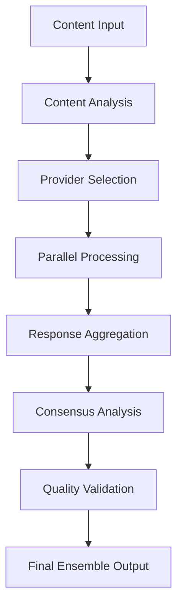

# 🤖 Multi-Model Guide - Enterprise AI Ensemble Intelligence

## **Navigation**
- [Home](../../README.md) · [Service README](../README.md) · [Summarization Guide](./SUMMARIZATION.md) · [Quality Evaluation](./QUALITY_EVALUATION.md) · [Content Intelligence](./CONTENT_INTELLIGENCE.md)

---

## 🎯 **Executive Summary**

The **Multi-Model Ensemble Engine** provides enterprise-grade AI orchestration with intelligent provider selection, cross-provider consensus analysis, and adaptive ensemble strategies supporting 20+ AI providers with real-time performance optimization.

### **🚀 Key Capabilities**
- **Intelligent Provider Routing**: Dynamic selection based on content type, quality requirements, and cost optimization
- **Ensemble Consensus Analysis**: Cross-provider validation with configurable agreement thresholds
- **Adaptive Quality Optimization**: Self-learning systems that optimize provider combinations
- **Real-Time Performance Monitoring**: Continuous provider health assessment and failover management

---

## 🔮 **Multi-Model Architecture**

### **Ensemble Processing Pipeline**



### **Provider Orchestration Strategies**

| Strategy | Use Case | Provider Count | Consensus Method | Quality Focus |
|----------|----------|----------------|------------------|----------------|
| **Cost Optimized** | High-volume processing | 2-3 providers | Majority vote | Efficiency |
| **Quality Focused** | Critical analysis | 4-6 providers | Weighted consensus | Accuracy |
| **Balanced** | General purpose | 3-4 providers | Confidence weighted | Balance |
| **Speed Optimized** | Real-time processing | 1-2 providers | Fastest response | Performance |

---

## 🎯 **Intelligent Provider Selection**

### **Content-Based Routing**

#### **Content Type Classification**
```python
def classify_content_for_providers(content: str) -> Dict[str, Any]:
    """Classify content to determine optimal provider selection."""
    analysis = {
        "complexity_score": calculate_complexity(content),
        "domain": identify_domain(content),
        "technical_density": measure_technical_content(content),
        "creativity_required": assess_creativity_needs(content),
        "speed_requirement": determine_speed_priority(content)
    }

    return {
        "recommended_providers": select_optimal_providers(analysis),
        "ensemble_strategy": choose_ensemble_approach(analysis),
        "quality_threshold": determine_quality_requirements(analysis)
    }
```

#### **Provider Capability Mapping**
| Content Type | Preferred Providers | Rationale |
|-------------|-------------------|-----------|
| **Technical Documentation** | Claude-3-Opus, GPT-4 | Deep reasoning, technical accuracy |
| **Business Reports** | Claude-3-Sonnet, Gemini-Pro | Balanced analysis, professional tone |
| **Creative Content** | Claude-3-Haiku, GPT-3.5-Turbo | Speed and creativity |
| **Legal Documents** | Claude-3-Opus, PaLM-2 | Precision and compliance focus |
| **Research Papers** | GPT-4, Claude-3-Opus | Analytical depth and citations |

### **Dynamic Provider Routing**

#### **Load Balancing**
- **Round Robin**: Equal distribution across healthy providers
- **Weighted Random**: Provider selection based on historical performance
- **Least Loaded**: Route to providers with lowest current utilization
- **Geographic**: Route to providers in optimal regions for latency

#### **Health-Based Routing**
```python
class ProviderHealthMonitor:
    """Monitor provider health for intelligent routing."""

    def __init__(self):
        self.provider_health = {}
        self.failure_counts = {}
        self.response_times = {}

    def update_health(self, provider: str, success: bool, response_time: float):
        """Update provider health metrics."""
        if success:
            self.provider_health[provider] = min(1.0, self.provider_health.get(provider, 1.0) + 0.1)
            self.failure_counts[provider] = 0
        else:
            self.provider_health[provider] = max(0.0, self.provider_health.get(provider, 1.0) - 0.2)
            self.failure_counts[provider] = self.failure_counts.get(provider, 0) + 1

        self.response_times[provider] = response_time

    def get_healthy_providers(self) -> List[str]:
        """Return providers above health threshold."""
        return [p for p, h in self.provider_health.items() if h > 0.7]
```

---

## 🤖 **Ensemble Consensus Algorithms**

### **Consensus Strategies**

#### **1. Majority Vote Consensus**
**Simple majority agreement across providers**
```python
def majority_vote_consensus(responses: List[str], threshold: float = 0.5) -> str:
    """Implement majority vote consensus."""
    if len(responses) == 1:
        return responses[0]

    # Count frequency of each response
    response_counts = {}
    for response in responses:
        # Use semantic similarity for grouping
        key = find_similar_response(response, response_counts.keys())
        response_counts[key] = response_counts.get(key, 0) + 1

    # Find majority
    total_responses = len(responses)
    for response, count in response_counts.items():
        if count / total_responses >= threshold:
            return response

    # No majority, return most common
    return max(response_counts.items(), key=lambda x: x[1])[0]
```

#### **2. Confidence-Weighted Consensus**
**Weight responses by provider confidence scores**
```python
def confidence_weighted_consensus(responses: List[Tuple[str, float]]) -> str:
    """Consensus weighted by confidence scores."""
    weighted_responses = {}

    for response, confidence in responses:
        key = find_similar_response(response, weighted_responses.keys())
        if key not in weighted_responses:
            weighted_responses[key] = {"response": response, "total_weight": 0, "count": 0}

        weighted_responses[key]["total_weight"] += confidence
        weighted_responses[key]["count"] += 1

    # Return response with highest average confidence
    best_response = max(weighted_responses.values(),
                       key=lambda x: x["total_weight"] / x["count"])
    return best_response["response"]
```

#### **3. Semantic Similarity Consensus**
**Group responses by semantic meaning**
```python
def semantic_similarity_consensus(responses: List[str], similarity_threshold: float = 0.8) -> str:
    """Group responses by semantic similarity."""
    from sentence_transformers import SentenceTransformer

    model = SentenceTransformer('all-MiniLM-L6-v2')
    embeddings = model.encode(responses)

    # Cluster similar responses
    clusters = cluster_embeddings(embeddings, similarity_threshold)

    # Return response from largest cluster
    largest_cluster = max(clusters.values(), key=len)
    return largest_cluster[0]  # Return first response from largest cluster
```

### **Advanced Consensus Techniques**

#### **Bayesian Consensus**
```python
class BayesianConsensus:
    """Bayesian approach to consensus analysis."""

    def __init__(self):
        self.provider_reliability = {}  # Historical reliability scores

    def calculate_consensus_probability(self, responses: List[str]) -> str:
        """Calculate consensus using Bayesian probabilities."""
        # Implementation of Bayesian consensus algorithm
        # Considers provider reliability, response similarity, and historical performance
        pass
```

#### **Ensemble Quality Scoring**
```python
def calculate_ensemble_quality(responses: List[str], consensus_response: str) -> Dict[str, float]:
    """Calculate quality metrics for ensemble result."""
    return {
        "consensus_strength": calculate_agreement_strength(responses),
        "diversity_score": calculate_response_diversity(responses),
        "confidence_score": calculate_confidence_in_consensus(responses, consensus_response),
        "robustness_score": calculate_ensemble_robustness(responses)
    }
```

---

## ⚙️ **Provider Management & Optimization**

### **Provider Configuration**

#### **Provider Profiles**
```yaml
providers:
  - name: claude-3-opus
    type: bedrock
    region: us-east-1
    model: anthropic.claude-3-opus-20240229-v1:0
    capabilities:
      - summarization
      - analysis
      - technical_writing
    cost_per_token: 0.00015
    max_tokens: 200000
    reliability_score: 0.95

  - name: gpt-4
    type: openai
    endpoint: https://api.openai.com/v1
    model: gpt-4
    capabilities:
      - creative_writing
      - analysis
      - research
    cost_per_token: 0.00006
    max_tokens: 8192
    reliability_score: 0.92

  - name: ollama-llama2
    type: ollama
    endpoint: http://localhost:11434
    model: llama2:13b
    capabilities:
      - general_purpose
      - cost_effective
    cost_per_token: 0.000001  # Local inference cost
    max_tokens: 4096
    reliability_score: 0.88
```

### **Dynamic Provider Optimization**

#### **Cost Optimization**
```python
class CostOptimizer:
    """Optimize provider selection for cost efficiency."""

    def __init__(self):
        self.cost_history = {}
        self.quality_history = {}

    def select_cost_optimal_provider(self, content_type: str, quality_requirement: float) -> str:
        """Select provider that meets quality requirements at lowest cost."""
        candidates = self.get_eligible_providers(content_type, quality_requirement)

        if not candidates:
            return self.get_best_available_provider()

        # Calculate cost-efficiency scores
        efficiency_scores = {}
        for provider in candidates:
            avg_cost = self.cost_history.get(provider, {}).get('avg_cost', float('inf'))
            avg_quality = self.quality_history.get(provider, {}).get('avg_quality', 0)

            # Efficiency = Quality / Cost (higher is better)
            efficiency_scores[provider] = avg_quality / avg_cost if avg_cost > 0 else 0

        return max(efficiency_scores.items(), key=lambda x: x[1])[0]
```

#### **Performance Optimization**
```python
class PerformanceOptimizer:
    """Optimize provider selection for performance."""

    def __init__(self):
        self.response_times = {}
        self.success_rates = {}

    def select_fastest_provider(self, content_complexity: str) -> str:
        """Select provider with best performance for given complexity."""
        eligible_providers = self.get_providers_for_complexity(content_complexity)

        if not eligible_providers:
            return self.get_default_provider()

        # Score providers by performance
        performance_scores = {}
        for provider in eligible_providers:
            avg_response_time = self.response_times.get(provider, {}).get('avg_time', float('inf'))
            success_rate = self.success_rates.get(provider, {}).get('rate', 0)

            # Performance score combines speed and reliability
            performance_scores[provider] = success_rate / (avg_response_time + 1)  # Avoid division by zero

        return max(performance_scores.items(), key=lambda x: x[1])[0]
```

---

## 🔄 **Adaptive Ensemble Learning**

### **Quality Feedback Integration**

#### **Continuous Learning Loop**
```python
class EnsembleLearner:
    """Learn from ensemble performance to improve future selections."""

    def __init__(self):
        self.performance_history = {}
        self.quality_feedback = {}

    def update_provider_weights(self, ensemble_result: Dict[str, Any]):
        """Update provider weights based on ensemble performance."""
        consensus_quality = ensemble_result.get("consensus_quality", 0.5)
        provider_contributions = ensemble_result.get("provider_contributions", {})

        for provider, contribution in provider_contributions.items():
            if provider not in self.performance_history:
                self.performance_history[provider] = []

            # Record performance data
            self.performance_history[provider].append({
                "quality_contribution": contribution,
                "ensemble_quality": consensus_quality,
                "timestamp": datetime.now().isoformat()
            })

            # Keep only recent history (last 1000 entries)
            if len(self.performance_history[provider]) > 1000:
                self.performance_history[provider] = self.performance_history[provider][-1000:]

    def get_optimized_provider_weights(self, content_type: str) -> Dict[str, float]:
        """Calculate optimized weights for provider selection."""
        weights = {}

        for provider, history in self.performance_history.items():
            if len(history) < 10:  # Need minimum history
                weights[provider] = 1.0  # Default weight
                continue

            # Calculate average quality contribution
            avg_contribution = sum(h["quality_contribution"] for h in history) / len(history)

            # Factor in recency (more recent = higher weight)
            recency_factor = self.calculate_recency_factor(history)

            weights[provider] = avg_contribution * recency_factor

        # Normalize weights
        total_weight = sum(weights.values())
        return {p: w/total_weight for p, w in weights.items()}
```

### **A/B Testing Framework**

#### **Ensemble Strategy Testing**
```python
class EnsembleTester:
    """A/B testing for ensemble strategies."""

    def __init__(self):
        self.test_groups = {}
        self.results = {}

    def create_test_group(self, strategy_a: str, strategy_b: str) -> str:
        """Create A/B test between two ensemble strategies."""
        test_id = f"test_{len(self.test_groups)}"
        self.test_groups[test_id] = {
            "strategy_a": strategy_a,
            "strategy_b": strategy_b,
            "results_a": [],
            "results_b": [],
            "start_time": datetime.now()
        }
        return test_id

    def record_test_result(self, test_id: str, strategy: str, quality_score: float, user_feedback: float):
        """Record result for A/B test."""
        if test_id not in self.test_groups:
            return

        result_data = {
            "quality_score": quality_score,
            "user_feedback": user_feedback,
            "timestamp": datetime.now()
        }

        if strategy == self.test_groups[test_id]["strategy_a"]:
            self.test_groups[test_id]["results_a"].append(result_data)
        elif strategy == self.test_groups[test_id]["strategy_b"]:
            self.test_groups[test_id]["results_b"].append(result_data)

    def get_test_winner(self, test_id: str) -> str:
        """Determine winning strategy based on test results."""
        if test_id not in self.test_groups:
            return None

        test_data = self.test_groups[test_id]
        results_a = test_data["results_a"]
        results_b = test_data["results_b"]

        if len(results_a) < 10 or len(results_b) < 10:  # Need minimum sample size
            return "insufficient_data"

        # Calculate composite scores
        score_a = sum((r["quality_score"] + r["user_feedback"]) / 2 for r in results_a) / len(results_a)
        score_b = sum((r["quality_score"] + r["user_feedback"]) / 2 for r in results_b) / len(results_b)

        if score_a > score_b:
            return test_data["strategy_a"]
        else:
            return test_data["strategy_b"]
```

---

## 📊 **Multi-Model Analytics & Monitoring**

### **Provider Performance Analytics**

#### **Real-Time Metrics**
- **Response Time Distribution**: P50, P95, P99 response times per provider
- **Success Rate Trends**: Rolling success rates over time periods
- **Cost Efficiency**: Cost per quality point delivered
- **Availability Status**: Current provider health and capacity

#### **Ensemble Performance Metrics**
- **Consensus Strength**: Average agreement level across providers
- **Quality Improvement**: Quality gains from ensemble vs. single provider
- **Cost Optimization**: Cost savings from intelligent provider selection
- **Fallback Frequency**: How often fallback strategies are triggered

### **Predictive Provider Selection**

#### **Machine Learning-Based Selection**
```python
class PredictiveProviderSelector:
    """Use ML to predict optimal provider combinations."""

    def __init__(self):
        self.feature_extractor = None
        self.performance_model = None

    def train_selector(self, historical_data: List[Dict[str, Any]]):
        """Train ML model for provider selection."""
        # Extract features from content and historical performance
        features = []
        labels = []

        for data_point in historical_data:
            content_features = self.extract_content_features(data_point["content"])
            performance_features = self.extract_performance_features(data_point["performance"])
            provider_features = self.get_provider_features(data_point["selected_providers"])

            combined_features = {**content_features, **performance_features, **provider_features}
            features.append(combined_features)
            labels.append(data_point["outcome_quality"])

        # Train model to predict quality based on provider selection
        self.performance_model = self.train_prediction_model(features, labels)

    def predict_optimal_providers(self, content: str, requirements: Dict[str, Any]) -> List[str]:
        """Predict optimal provider combination for content."""
        content_features = self.extract_content_features(content)
        requirement_features = self.extract_requirement_features(requirements)

        # Generate candidate provider combinations
        candidates = self.generate_provider_combinations(content_features)

        # Score each combination using trained model
        best_combination = None
        best_score = -1

        for combination in candidates:
            features = {**content_features, **requirement_features, **combination}
            score = self.performance_model.predict(features)[0]

            if score > best_score:
                best_score = score
                best_combination = combination

        return best_combination["providers"]
```

---

## 🔗 **Integration Patterns**

### **Provider Circuit Breaker Pattern**

#### **Intelligent Failover**
```python
class ProviderCircuitBreaker:
    """Circuit breaker for AI provider management."""

    def __init__(self, provider_name: str, failure_threshold: int = 5):
        self.provider_name = provider_name
        self.failure_threshold = failure_threshold
        self.failure_count = 0
        self.state = "closed"  # closed, open, half_open
        self.last_failure_time = None
        self.success_count = 0

    async def execute_with_circuit_breaker(self, provider_call):
        """Execute provider call with circuit breaker protection."""
        if self.state == "open":
            # Allow limited traffic in half-open state
            if time.time() - self.last_failure_time > 60:  # 60 second timeout
                self.state = "half_open"
            else:
                raise Exception(f"Provider {self.provider_name} circuit breaker is OPEN")

        try:
            result = await provider_call()
            self.on_success()
            return result
        except Exception as e:
            self.on_failure()
            raise e

    def on_success(self):
        if self.state == "half_open":
            self.success_count += 1
            if self.success_count >= 3:  # Require 3 successes to close
                self.state = "closed"
                self.failure_count = 0
                self.success_count = 0

    def on_failure(self):
        self.failure_count += 1
        self.last_failure_time = time.time()

        if self.failure_count >= self.failure_threshold:
            self.state = "open"
```

### **Provider Load Balancer**

#### **Intelligent Load Distribution**
```python
class ProviderLoadBalancer:
    """Load balancer for multiple AI providers."""

    def __init__(self):
        self.providers = {}
        self.load_history = {}
        self.performance_weights = {}

    def add_provider(self, provider: str, capacity: int, performance_score: float):
        """Add provider to load balancer."""
        self.providers[provider] = {
            "capacity": capacity,
            "current_load": 0,
            "performance_score": performance_score
        }
        self.performance_weights[provider] = performance_score

    def select_provider(self, content_complexity: str) -> str:
        """Select optimal provider based on load and performance."""
        eligible_providers = [
            p for p, data in self.providers.items()
            if data["current_load"] < data["capacity"]
        ]

        if not eligible_providers:
            raise Exception("No providers available within capacity")

        # Score providers based on load and performance
        provider_scores = {}
        for provider in eligible_providers:
            load_ratio = self.providers[provider]["current_load"] / self.providers[provider]["capacity"]
            performance_weight = self.performance_weights[provider]

            # Prefer less loaded, high-performance providers
            provider_scores[provider] = performance_weight * (1 - load_ratio)

        selected_provider = max(provider_scores.items(), key=lambda x: x[1])[0]

        # Update load
        self.providers[selected_provider]["current_load"] += 1

        return selected_provider
```

---

## 🧪 **Testing & Validation**

### **Multi-Model Testing Strategies**

#### **Provider Compatibility Testing**
```python
async def test_provider_compatibility(content_samples: List[str]) -> Dict[str, Any]:
    """Test compatibility across multiple providers."""
    results = {}

    for content in content_samples:
        provider_results = {}

        # Test each provider
        for provider in ALL_PROVIDERS:
            try:
                result = await test_single_provider(provider, content)
                provider_results[provider] = {
                    "success": True,
                    "response": result,
                    "response_time": result.get("processing_time", 0)
                }
            except Exception as e:
                provider_results[provider] = {
                    "success": False,
                    "error": str(e)
                }

        results[content[:50]] = provider_results

    return results
```

#### **Ensemble Quality Validation**
```python
async def validate_ensemble_quality(test_cases: List[Dict[str, Any]]) -> Dict[str, Any]:
    """Validate ensemble quality against ground truth."""
    validation_results = {}

    for test_case in test_cases:
        content = test_case["content"]
        expected_quality = test_case["expected_quality"]
        ensemble_configs = test_case["ensemble_configs"]

        config_results = {}
        for config in ensemble_configs:
            result = await run_ensemble_test(content, config)
            quality_score = calculate_quality_score(result, expected_quality)

            config_results[config["name"]] = {
                "quality_score": quality_score,
                "response_time": result["total_time"],
                "cost": result["total_cost"]
            }

        validation_results[test_case["name"]] = config_results

    return validation_results
```

---

## 🚀 **Best Practices**

### **Provider Selection Guidelines**

1. **Content Type Matching**: Choose providers based on content characteristics
2. **Quality vs. Cost Balance**: Optimize for required quality level at acceptable cost
3. **Geographic Distribution**: Use regional providers for latency optimization
4. **Load Distribution**: Balance load across providers for reliability

### **Ensemble Configuration**

1. **Consensus Thresholds**: Set appropriate agreement levels for use case
2. **Provider Diversity**: Include providers with different strengths
3. **Fallback Strategies**: Define clear fallback chains for failures
4. **Quality Monitoring**: Continuously monitor and adjust ensemble performance

### **Performance Optimization**

1. **Caching Strategies**: Cache frequently used provider responses
2. **Batch Processing**: Group similar requests for efficient processing
3. **Pre-warming**: Keep provider connections active for faster responses
4. **Monitoring**: Track provider performance for continuous optimization

---

## 📚 **API Reference**

### **Ensemble Methods**

#### **Multi-Provider Summarization**
```python
response = await client.summarize_ensemble(
    text="Document content...",
    providers=["claude-3-sonnet", "gpt-4", "ollama"],
    consensus_method="confidence_weighted",
    quality_threshold=0.8
)
```

#### **Provider Health Check**
```python
health_status = await client.check_provider_health(
    providers=["all"],
    include_metrics=True,
    include_history=True
)
```

#### **Dynamic Provider Selection**
```python
optimal_providers = await client.select_providers(
    content="Content to analyze...",
    requirements={
        "quality_threshold": 0.85,
        "max_cost": 0.001,
        "max_latency": 5000
    },
    strategy="cost_optimized"
)
```

---

**🤖 The Multi-Model Guide provides comprehensive documentation for leveraging the enterprise AI ensemble capabilities of the Summarizer Hub service.**
