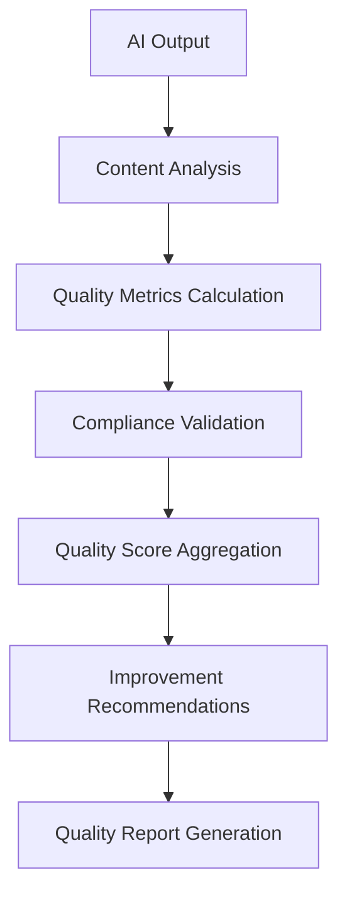

# 🎯 Quality Evaluation Guide - Enterprise AI Quality Assurance

## **Navigation**
- [Home](../../README.md) · [Service README](../README.md) · [Summarization Guide](./SUMMARIZATION.md) · [Multi-Model Guide](./MULTI_MODEL.md) · [Content Intelligence](./CONTENT_INTELLIGENCE.md)

---

## 🎯 **Executive Summary**

The **Quality Evaluation Engine** provides comprehensive AI output assessment with multi-dimensional quality scoring, automated quality improvement, and enterprise-grade validation supporting real-time quality monitoring and continuous optimization.

### **🚀 Key Capabilities**
- **Multi-Dimensional Quality Scoring**: Comprehensive evaluation across 15+ quality metrics
- **Automated Quality Improvement**: Self-learning systems that enhance output quality over time
- **Real-Time Quality Validation**: Continuous assessment with configurable quality thresholds
- **Enterprise Compliance Validation**: Regulatory and business rule compliance checking

---

## 🔍 **Quality Evaluation Architecture**

### **Quality Assessment Pipeline**



### **Quality Evaluation Dimensions**

| Dimension | Metrics | Weight | Purpose |
|-----------|---------|--------|---------|
| **Content Quality** | Completeness, Accuracy, Relevance | 35% | Information quality assessment |
| **Structural Quality** | Coherence, Flow, Organization | 25% | Output structure and logic |
| **Linguistic Quality** | Grammar, Clarity, Readability | 20% | Language and communication quality |
| **Compliance Quality** | Regulatory, Business Rules | 20% | Compliance and policy adherence |

---

## 📊 **Quality Metrics Framework**

### **1. Content Quality Metrics**

#### **Completeness Assessment**
**Evaluates coverage of key information and requirements**
```python
def assess_completeness(generated_output: str, requirements: List[str], source_content: str) -> float:
    """Assess how completely the output addresses requirements."""
    coverage_scores = []

    for requirement in requirements:
        # Check if requirement is addressed in output
        if requirement.lower() in generated_output.lower():
            coverage_scores.append(1.0)
        else:
            # Check semantic similarity
            similarity = calculate_semantic_similarity(requirement, generated_output)
            coverage_scores.append(min(similarity * 2, 1.0))  # Scale similarity to 0-1

    return sum(coverage_scores) / len(coverage_scores) if coverage_scores else 0.0
```

#### **Accuracy Validation**
**Verifies factual correctness and source alignment**
```python
def validate_accuracy(output: str, source_content: str, domain: str) -> Dict[str, float]:
    """Validate factual accuracy against source content."""
    return {
        "factual_accuracy": calculate_factual_accuracy(output, source_content),
        "source_alignment": calculate_source_alignment(output, source_content),
        "domain_consistency": validate_domain_consistency(output, domain),
        "logical_consistency": assess_logical_consistency(output)
    }
```

#### **Relevance Scoring**
**Measures focus on target audience and objectives**
```python
def score_relevance(output: str, target_audience: str, objectives: List[str]) -> float:
    """Score how relevant the output is to target audience and objectives."""
    audience_alignment = calculate_audience_alignment(output, target_audience)
    objective_coverage = calculate_objective_coverage(output, objectives)

    return (audience_alignment + objective_coverage) / 2
```

### **2. Structural Quality Metrics**

#### **Coherence Analysis**
**Evaluates logical flow and connectivity between ideas**
```python
def analyze_coherence(text: str) -> Dict[str, float]:
    """Analyze coherence and logical flow in text."""
    sentences = split_into_sentences(text)

    if len(sentences) < 2:
        return {"coherence_score": 1.0, "flow_score": 1.0}

    # Calculate sentence-to-sentence coherence
    coherence_scores = []
    for i in range(len(sentences) - 1):
        coherence = calculate_sentence_coherence(sentences[i], sentences[i + 1])
        coherence_scores.append(coherence)

    return {
        "coherence_score": sum(coherence_scores) / len(coherence_scores),
        "flow_score": calculate_overall_flow(sentences)
    }
```

#### **Organization Assessment**
**Evaluates structure and hierarchical organization**
```python
def assess_organization(text: str, expected_structure: Dict[str, Any]) -> float:
    """Assess how well the text is organized according to expected structure."""
    structure_score = 0.0
    total_criteria = 0

    # Check for expected sections
    if "sections" in expected_structure:
        for section in expected_structure["sections"]:
            if section.lower() in text.lower():
                structure_score += 1
            total_criteria += 1

    # Check for transitions and connectivity
    transitions = count_transition_words(text)
    structure_score += min(transitions / 10, 1)  # Normalize transition score
    total_criteria += 1

    # Check for hierarchical organization
    if detect_hierarchical_structure(text):
        structure_score += 1
    total_criteria += 1

    return structure_score / total_criteria if total_criteria > 0 else 0.0
```

### **3. Linguistic Quality Metrics**

#### **Readability Assessment**
**Evaluates text complexity and accessibility**
```python
def assess_readability(text: str, target_audience: str) -> Dict[str, float]:
    """Assess readability and text complexity."""
    return {
        "flesch_score": calculate_flesch_reading_ease(text),
        "audience_appropriateness": check_audience_appropriateness(text, target_audience),
        "complexity_score": calculate_text_complexity(text),
        "accessibility_score": assess_accessibility(text)
    }
```

#### **Grammar and Style Validation**
**Checks grammatical correctness and style consistency**
```python
def validate_grammar_and_style(text: str, style_guide: str) -> Dict[str, float]:
    """Validate grammar and style compliance."""
    return {
        "grammar_score": check_grammar_correctness(text),
        "style_consistency": validate_style_consistency(text, style_guide),
        "terminology_accuracy": validate_terminology_usage(text),
        "tone_appropriateness": assess_tone_appropriateness(text, style_guide)
    }
```

### **4. Compliance Quality Metrics**

#### **Regulatory Compliance**
**Validates adherence to regulatory requirements**
```python
def validate_regulatory_compliance(text: str, regulations: List[str]) -> Dict[str, Any]:
    """Validate compliance with regulatory requirements."""
    violations = []
    compliance_score = 1.0

    for regulation in regulations:
        if regulation == "PII":
            pii_detected = detect_pii_content(text)
            if pii_detected:
                violations.append("PII content detected")
                compliance_score *= 0.5
        elif regulation == "GDPR":
            consent_mentions = check_consent_mentions(text)
            if not consent_mentions:
                violations.append("Missing consent references")
                compliance_score *= 0.8

    return {
        "compliance_score": compliance_score,
        "violations": violations,
        "recommendations": generate_compliance_recommendations(violations)
    }
```

#### **Business Rule Validation**
**Ensures adherence to organizational policies**
```python
def validate_business_rules(text: str, business_rules: Dict[str, Any]) -> float:
    """Validate compliance with business rules."""
    rule_compliance = []

    for rule_name, rule_config in business_rules.items():
        if rule_name == "brand_voice":
            compliance = check_brand_voice_compliance(text, rule_config)
        elif rule_name == "content_length":
            compliance = check_length_compliance(text, rule_config)
        elif rule_name == "required_elements":
            compliance = check_required_elements(text, rule_config)
        else:
            compliance = 1.0  # Default compliance

        rule_compliance.append(compliance)

    return sum(rule_compliance) / len(rule_compliance) if rule_compliance else 1.0
```

---

## 🧮 **Quality Scoring Engine**

### **Composite Quality Score Calculation**

#### **Weighted Quality Aggregation**
```python
class QualityScorer:
    """Calculate comprehensive quality scores for AI outputs."""

    def __init__(self):
        self.dimension_weights = {
            "content_quality": 0.35,
            "structural_quality": 0.25,
            "linguistic_quality": 0.20,
            "compliance_quality": 0.20
        }

    def calculate_overall_quality_score(self, quality_metrics: Dict[str, Any]) -> Dict[str, Any]:
        """Calculate overall quality score from individual metrics."""
        dimension_scores = {}

        # Calculate dimension scores
        dimension_scores["content_quality"] = self._calculate_content_score(
            quality_metrics.get("content_metrics", {})
        )
        dimension_scores["structural_quality"] = self._calculate_structural_score(
            quality_metrics.get("structural_metrics", {})
        )
        dimension_scores["linguistic_quality"] = self._calculate_linguistic_score(
            quality_metrics.get("linguistic_metrics", {})
        )
        dimension_scores["compliance_quality"] = self._calculate_compliance_score(
            quality_metrics.get("compliance_metrics", {})
        )

        # Calculate weighted overall score
        overall_score = sum(
            score * self.dimension_weights[dimension]
            for dimension, score in dimension_scores.items()
        )

        return {
            "overall_score": overall_score,
            "dimension_scores": dimension_scores,
            "quality_grade": self._assign_quality_grade(overall_score),
            "recommendations": self._generate_improvement_recommendations(dimension_scores)
        }

    def _calculate_content_score(self, metrics: Dict[str, float]) -> float:
        """Calculate content quality dimension score."""
        completeness = metrics.get("completeness", 0.5)
        accuracy = metrics.get("accuracy", 0.5)
        relevance = metrics.get("relevance", 0.5)

        return (completeness + accuracy + relevance) / 3

    def _calculate_structural_score(self, metrics: Dict[str, float]) -> float:
        """Calculate structural quality dimension score."""
        coherence = metrics.get("coherence", 0.5)
        organization = metrics.get("organization", 0.5)
        flow = metrics.get("flow", 0.5)

        return (coherence + organization + flow) / 3

    def _calculate_linguistic_score(self, metrics: Dict[str, float]) -> float:
        """Calculate linguistic quality dimension score."""
        readability = metrics.get("readability", 0.5)
        grammar = metrics.get("grammar", 0.5)
        style = metrics.get("style", 0.5)

        return (readability + grammar + style) / 3

    def _calculate_compliance_score(self, metrics: Dict[str, float]) -> float:
        """Calculate compliance quality dimension score."""
        regulatory = metrics.get("regulatory_compliance", 0.5)
        business_rules = metrics.get("business_rule_compliance", 0.5)

        return (regulatory + business_rules) / 2

    def _assign_quality_grade(self, score: float) -> str:
        """Assign quality grade based on score."""
        if score >= 0.9:
            return "A+"
        elif score >= 0.8:
            return "A"
        elif score >= 0.7:
            return "B"
        elif score >= 0.6:
            return "C"
        elif score >= 0.5:
            return "D"
        else:
            return "F"

    def _generate_improvement_recommendations(self, dimension_scores: Dict[str, float]) -> List[str]:
        """Generate improvement recommendations based on dimension scores."""
        recommendations = []

        for dimension, score in dimension_scores.items():
            if score < 0.7:  # Threshold for recommendations
                recommendations.extend(
                    self._get_dimension_recommendations(dimension, score)
                )

        return recommendations[:5]  # Limit to top 5 recommendations

    def _get_dimension_recommendations(self, dimension: str, score: float) -> List[str]:
        """Get specific recommendations for a dimension."""
        recommendations_map = {
            "content_quality": [
                "Improve completeness by addressing all key requirements",
                "Enhance accuracy through better source alignment",
                "Increase relevance by focusing on target audience needs"
            ],
            "structural_quality": [
                "Improve coherence by adding better transitions between ideas",
                "Enhance organization with clearer section structure",
                "Strengthen logical flow throughout the content"
            ],
            "linguistic_quality": [
                "Improve readability for target audience level",
                "Enhance grammatical correctness and clarity",
                "Ensure consistent style and tone throughout"
            ],
            "compliance_quality": [
                "Address regulatory compliance requirements",
                "Ensure adherence to business rules and policies",
                "Review content for compliance violations"
            ]
        }

        return recommendations_map.get(dimension, [])
```

### **Quality Threshold Management**

#### **Dynamic Threshold Configuration**
```yaml
quality_thresholds:
  executive_summary:
    overall_minimum: 0.85
    content_quality: 0.9
    structural_quality: 0.8
    linguistic_quality: 0.9
    compliance_quality: 0.95

  technical_documentation:
    overall_minimum: 0.8
    content_quality: 0.85
    structural_quality: 0.9
    linguistic_quality: 0.75
    compliance_quality: 0.9

  marketing_content:
    overall_minimum: 0.75
    content_quality: 0.8
    structural_quality: 0.7
    linguistic_quality: 0.9
    compliance_quality: 0.8
```

---

## 🔄 **Continuous Quality Improvement**

### **Quality Learning System**

#### **Feedback Integration**
```python
class QualityLearner:
    """Learn from quality feedback to improve future outputs."""

    def __init__(self):
        self.quality_history = {}
        self.improvement_patterns = {}

    def record_quality_feedback(self, output_id: str, quality_metrics: Dict[str, Any], user_feedback: Dict[str, Any]):
        """Record quality assessment and user feedback."""
        self.quality_history[output_id] = {
            "metrics": quality_metrics,
            "user_feedback": user_feedback,
            "timestamp": datetime.now().isoformat(),
            "improvement_opportunities": self._identify_improvement_areas(quality_metrics, user_feedback)
        }

    def generate_quality_improvements(self, content_type: str) -> Dict[str, Any]:
        """Generate quality improvement recommendations based on historical data."""
        relevant_history = [
            record for record in self.quality_history.values()
            if record.get("content_type") == content_type
        ]

        if len(relevant_history) < 10:  # Need minimum history
            return {"status": "insufficient_data"}

        # Analyze patterns in quality issues
        common_issues = self._analyze_common_issues(relevant_history)
        improvement_suggestions = self._generate_improvement_suggestions(common_issues)

        return {
            "common_issues": common_issues,
            "improvement_suggestions": improvement_suggestions,
            "expected_improvement": self._estimate_improvement_impact(improvement_suggestions)
        }

    def _identify_improvement_areas(self, metrics: Dict[str, Any], feedback: Dict[str, Any]) -> List[str]:
        """Identify specific areas for improvement."""
        improvement_areas = []

        # Analyze quality metrics
        if metrics.get("overall_score", 1.0) < 0.8:
            improvement_areas.append("overall_quality")

        for dimension, score in metrics.get("dimension_scores", {}).items():
            if score < 0.7:
                improvement_areas.append(f"{dimension}_improvement")

        # Analyze user feedback
        if feedback.get("too_verbose", False):
            improvement_areas.append("conciseness")
        if feedback.get("unclear", False):
            improvement_areas.append("clarity")
        if feedback.get("inaccurate", False):
            improvement_areas.append("accuracy")

        return improvement_areas

    def _analyze_common_issues(self, history: List[Dict[str, Any]]) -> Dict[str, int]:
        """Analyze most common quality issues."""
        issue_counts = {}

        for record in history:
            for issue in record.get("improvement_opportunities", []):
                issue_counts[issue] = issue_counts.get(issue, 0) + 1

        return dict(sorted(issue_counts.items(), key=lambda x: x[1], reverse=True))

    def _generate_improvement_suggestions(self, common_issues: Dict[str, int]) -> List[str]:
        """Generate actionable improvement suggestions."""
        suggestions = []

        if "overall_quality" in common_issues:
            suggestions.append("Implement comprehensive quality validation pipeline")

        if "content_quality_improvement" in common_issues:
            suggestions.append("Enhance content analysis and requirement coverage")

        if "structural_quality_improvement" in common_issues:
            suggestions.append("Improve content organization and logical flow")

        if "conciseness" in common_issues:
            suggestions.append("Implement automatic content condensation techniques")

        if "clarity" in common_issues:
            suggestions.append("Enhance language clarity and readability optimization")

        return suggestions
```

### **A/B Testing Framework**

#### **Quality Improvement Testing**
```python
class QualityTester:
    """A/B testing for quality improvement strategies."""

    def __init__(self):
        self.test_experiments = {}

    def create_quality_experiment(self, strategy_a: str, strategy_b: str, content_type: str) -> str:
        """Create A/B test for quality improvement strategies."""
        experiment_id = f"quality_exp_{len(self.test_experiments)}"

        self.test_experiments[experiment_id] = {
            "strategy_a": strategy_a,
            "strategy_b": strategy_b,
            "content_type": content_type,
            "results_a": [],
            "results_b": [],
            "start_time": datetime.now()
        }

        return experiment_id

    def record_experiment_result(self, experiment_id: str, strategy: str, quality_score: float, user_satisfaction: float):
        """Record result for quality experiment."""
        if experiment_id not in self.test_experiments:
            return

        result_data = {
            "quality_score": quality_score,
            "user_satisfaction": user_satisfaction,
            "timestamp": datetime.now()
        }

        experiment = self.test_experiments[experiment_id]
        if strategy == experiment["strategy_a"]:
            experiment["results_a"].append(result_data)
        elif strategy == experiment["strategy_b"]:
            experiment["results_b"].append(result_data)

    def get_experiment_winner(self, experiment_id: str) -> Dict[str, Any]:
        """Determine winning quality improvement strategy."""
        if experiment_id not in self.test_experiments:
            return {"error": "experiment_not_found"}

        experiment = self.test_experiments[experiment_id]
        results_a = experiment["results_a"]
        results_b = experiment["results_b"]

        if len(results_a) < 20 or len(results_b) < 20:  # Need sufficient sample size
            return {"status": "insufficient_data"}

        # Calculate composite scores (quality + user satisfaction)
        score_a = sum((r["quality_score"] + r["user_satisfaction"]) / 2 for r in results_a) / len(results_a)
        score_b = sum((r["quality_score"] + r["user_satisfaction"]) / 2 for r in results_b) / len(results_b)

        winner = experiment["strategy_a"] if score_a > score_b else experiment["strategy_b"]
        margin = abs(score_a - score_b)

        return {
            "winner": winner,
            "score_a": score_a,
            "score_b": score_b,
            "margin": margin,
            "confidence": "high" if margin > 0.1 else "medium" if margin > 0.05 else "low"
        }
```

---

## 📊 **Quality Analytics & Reporting**

### **Quality Dashboard Metrics**

#### **Real-Time Quality Monitoring**
- **Quality Score Trends**: Rolling averages over time periods
- **Dimension Performance**: Individual quality dimension tracking
- **Failure Rate Analysis**: Quality failures by category and cause
- **Improvement Velocity**: Rate of quality score improvement over time

#### **Quality Report Generation**
```python
def generate_quality_report(assessment_results: List[Dict[str, Any]], time_period: str) -> Dict[str, Any]:
    """Generate comprehensive quality assessment report."""
    total_assessments = len(assessment_results)

    # Aggregate metrics
    avg_overall_score = sum(r["overall_score"] for r in assessment_results) / total_assessments
    dimension_avgs = {}

    for dimension in ["content_quality", "structural_quality", "linguistic_quality", "compliance_quality"]:
        dimension_scores = [r["dimension_scores"][dimension] for r in assessment_results if dimension in r.get("dimension_scores", {})]
        dimension_avgs[dimension] = sum(dimension_scores) / len(dimension_scores) if dimension_scores else 0

    # Quality distribution
    quality_distribution = {
        "excellent": len([r for r in assessment_results if r["overall_score"] >= 0.9]),
        "good": len([r for r in assessment_results if 0.8 <= r["overall_score"] < 0.9]),
        "acceptable": len([r for r in assessment_results if 0.7 <= r["overall_score"] < 0.8]),
        "needs_improvement": len([r for r in assessment_results if r["overall_score"] < 0.7])
    }

    # Top issues analysis
    all_issues = []
    for result in assessment_results:
        all_issues.extend(result.get("issues", []))

    top_issues = {}
    for issue in set(all_issues):
        top_issues[issue] = all_issues.count(issue)

    top_issues = dict(sorted(top_issues.items(), key=lambda x: x[1], reverse=True)[:10])

    return {
        "time_period": time_period,
        "total_assessments": total_assessments,
        "average_scores": {
            "overall": avg_overall_score,
            **dimension_avgs
        },
        "quality_distribution": quality_distribution,
        "top_issues": top_issues,
        "trends": calculate_quality_trends(assessment_results),
        "recommendations": generate_quality_recommendations(avg_overall_score, dimension_avgs, top_issues)
    }
```

### **Predictive Quality Analytics**

#### **Quality Forecasting**
```python
class QualityForecaster:
    """Predict future quality trends and issues."""

    def __init__(self):
        self.quality_history = []
        self.trend_model = None

    def forecast_quality_trends(self, days_ahead: int = 30) -> Dict[str, Any]:
        """Forecast quality trends for upcoming period."""
        if len(self.quality_history) < 30:  # Need minimum history
            return {"status": "insufficient_data"}

        # Analyze historical trends
        recent_scores = [record["overall_score"] for record in self.quality_history[-30:]]
        trend_direction = self.calculate_trend_direction(recent_scores)

        # Predict future quality
        predicted_scores = self.predict_future_scores(recent_scores, days_ahead)

        # Identify potential issues
        potential_issues = self.identify_potential_issues(predicted_scores)

        return {
            "trend_direction": trend_direction,
            "predicted_scores": predicted_scores,
            "potential_issues": potential_issues,
            "confidence_level": self.calculate_prediction_confidence(recent_scores),
            "recommendations": self.generate_preventive_recommendations(potential_issues)
        }
```

---

## 🧪 **Quality Validation Testing**

### **Automated Quality Testing**

#### **Regression Testing**
```python
async def run_quality_regression_tests(test_cases: List[Dict[str, Any]]) -> Dict[str, Any]:
    """Run quality regression tests against baseline expectations."""
    test_results = {}

    for test_case in test_cases:
        content = test_case["content"]
        expected_quality = test_case["expected_quality"]
        quality_thresholds = test_case["quality_thresholds"]

        # Generate output (in real implementation, this would use the actual summarizer)
        output = await generate_test_output(content, test_case.get("parameters", {}))

        # Assess quality
        quality_assessment = await assess_output_quality(output, expected_quality)

        # Validate against thresholds
        validation_result = validate_quality_thresholds(quality_assessment, quality_thresholds)

        test_results[test_case["name"]] = {
            "passed": validation_result["passed"],
            "quality_score": quality_assessment["overall_score"],
            "thresholds_met": validation_result["thresholds_met"],
            "failures": validation_result["failures"]
        }

    # Calculate regression metrics
    passed_tests = sum(1 for r in test_results.values() if r["passed"])
    total_tests = len(test_results)

    return {
        "overall_pass_rate": passed_tests / total_tests,
        "test_results": test_results,
        "regression_detected": detect_quality_regression(test_results),
        "recommendations": generate_regression_recommendations(test_results)
    }
```

#### **Quality Benchmarking**
```python
async def run_quality_benchmarks(benchmark_configs: List[Dict[str, Any]]) -> Dict[str, Any]:
    """Run quality benchmarks against industry standards."""
    benchmark_results = {}

    for config in benchmark_configs:
        content_set = config["content_set"]
        benchmark_standard = config["benchmark_standard"]

        results = []
        for content in content_set:
            output = await generate_benchmark_output(content, config.get("parameters", {}))
            quality_score = await calculate_benchmark_score(output, benchmark_standard)
            results.append(quality_score)

        avg_score = sum(results) / len(results)
        percentile_rank = calculate_percentile_rank(avg_score, benchmark_standard)

        benchmark_results[config["name"]] = {
            "average_score": avg_score,
            "percentile_rank": percentile_rank,
            "benchmark_standard": benchmark_standard,
            "individual_scores": results
        }

    return {
        "benchmark_results": benchmark_results,
        "industry_comparison": compare_to_industry_standards(benchmark_results),
        "improvement_areas": identify_benchmark_gaps(benchmark_results)
    }
```

---

## 🚀 **Best Practices**

### **Quality Assurance Implementation**

1. **Define Clear Quality Standards**: Establish measurable quality criteria for different content types
2. **Implement Automated Validation**: Use automated quality checks as part of the generation pipeline
3. **Collect User Feedback**: Integrate user feedback mechanisms for continuous quality improvement
4. **Monitor Quality Trends**: Track quality metrics over time to identify improvement opportunities

### **Quality Threshold Management**

1. **Context-Appropriate Thresholds**: Set different quality thresholds for different use cases and content types
2. **Progressive Quality Levels**: Implement tiered quality requirements based on business criticality
3. **Dynamic Threshold Adjustment**: Adjust quality thresholds based on performance data and user needs
4. **Quality Escalation Procedures**: Define procedures for handling quality failures

### **Continuous Quality Improvement**

1. **Regular Quality Assessments**: Conduct periodic quality assessments of AI outputs
2. **Feedback Loop Integration**: Incorporate user feedback and quality assessments into improvement cycles
3. **A/B Testing Programs**: Run controlled experiments to test quality improvement strategies
4. **Performance Benchmarking**: Compare quality metrics against industry standards and competitors

---

## 📚 **API Reference**

### **Quality Assessment Methods**

#### **Comprehensive Quality Evaluation**
```python
response = await client.evaluate_quality(
    content="AI generated content to evaluate...",
    content_type="summary",
    quality_criteria={
        "completeness": 0.8,
        "accuracy": 0.9,
        "readability": 0.7
    },
    include_recommendations=True
)
```

#### **Quality Score Calculation**
```python
quality_score = await client.calculate_quality_score(
    generated_output="Generated content...",
    source_content="Original source material...",
    evaluation_criteria=["completeness", "accuracy", "coherence"],
    detailed_breakdown=True
)
```

#### **Quality Improvement Suggestions**
```python
improvements = await client.get_quality_improvements(
    content="Content to improve...",
    quality_assessment={"overall_score": 0.75, "issues": ["completeness", "clarity"]},
    target_quality_level=0.9,
    max_suggestions=5
)
```

#### **Quality Benchmarking**
```python
benchmark = await client.run_quality_benchmark(
    content_set=["content1", "content2", "content3"],
    benchmark_standard="industry_average",
    include_detailed_analysis=True
)
```

---

**🎯 The Quality Evaluation Guide provides comprehensive documentation for implementing enterprise-grade quality assurance for the Summarizer Hub service.**
