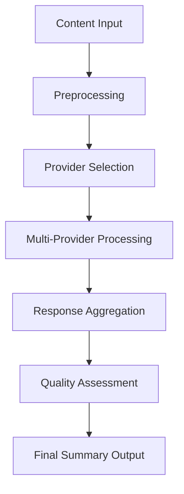

# 🔮 Summarization Guide - Enterprise AI Content Processing

## **Navigation**
- [Home](../../README.md) · [Service README](../README.md) · [Multi-Model Guide](./MULTI_MODEL.md) · [Quality Evaluation](./QUALITY_EVALUATION.md) · [Content Intelligence](./CONTENT_INTELLIGENCE.md)

---

## 🎯 **Executive Summary**

The **Summarization Engine** provides enterprise-grade AI-powered content processing with advanced summarization capabilities, supporting 20+ AI providers, adaptive summarization strategies, and real-time quality assessment.

### **🚀 Key Capabilities**
- **Multi-Format Summarization**: Executive, technical, narrative, and custom formats
- **Adaptive Length Control**: Dynamic summary length based on content complexity
- **Real-Time Quality Scoring**: Continuous quality monitoring and improvement
- **Contextual Understanding**: Deep comprehension of domain and technical complexity

---

## 🔮 **Summarization Engine Architecture**

### **Core Processing Pipeline**



### **Adaptive Summarization Strategies**

| Strategy | Use Case | Length Control | Quality Focus |
|----------|----------|----------------|----------------|
| **Extractive** | Factual content, key points | Fixed ratio (20-30%) | Accuracy |
| **Abstractive** | Complex topics, explanations | Variable length | Clarity |
| **Hybrid** | Technical docs, mixed content | Adaptive scaling | Balance |
| **Executive** | Business reports, decisions | Concise (100-200 words) | Impact |

---

## 📝 **Summarization Types & Formats**

### **1. Executive Summaries**
**Purpose**: High-level overview for decision-makers and executives

**Characteristics**:
- Concise length (100-200 words)
- Focus on key decisions, impacts, and recommendations
- Business-oriented language
- Actionable insights

**Example Request**:
```json
{
  "text": "Long business report content...",
  "type": "executive",
  "focus": ["decisions", "financial_impact", "recommendations"],
  "length": "concise"
}
```

### **2. Technical Summaries**
**Purpose**: Detailed technical analysis for engineers and architects

**Characteristics**:
- Technical depth preservation
- Architecture and implementation details
- Code snippets and technical specifications
- Technical accuracy maintained

**Example Request**:
```json
{
  "text": "Complex technical documentation...",
  "type": "technical",
  "focus": ["architecture", "implementation", "api_details"],
  "include_code": true
}
```

### **3. Narrative Summaries**
**Purpose**: Story-like summaries for general audiences

**Characteristics**:
- Natural language flow
- Contextual relationships
- Engaging presentation
- Accessible explanations

### **4. Custom Format Summaries**
**Purpose**: Specialized summaries for specific business needs

**Custom Templates**:
- **Meeting Minutes**: Action items, decisions, follow-ups
- **Research Abstracts**: Methodology, findings, implications
- **Product Reviews**: Features, pros/cons, recommendations
- **Compliance Reports**: Requirements, violations, remediation

---

## 🎯 **Adaptive Summarization Intelligence**

### **Content Analysis Engine**

#### **Complexity Assessment**
```python
def assess_content_complexity(text: str) -> Dict[str, Any]:
    """Analyze content for summarization strategy selection."""
    return {
        "technical_score": calculate_technical_density(text),
        "domain_complexity": identify_domain_complexity(text),
        "readability_level": assess_readability(text),
        "key_points_density": count_key_information(text),
        "recommended_strategy": select_optimal_strategy(scores)
    }
```

#### **Dynamic Length Optimization**
- **Simple Content**: 20-30% of original length
- **Medium Complexity**: 15-25% of original length
- **High Complexity**: 10-20% of original length
- **Executive Focus**: Fixed concise length (100-200 words)

### **Context Preservation**
- **Semantic Relationships**: Maintains logical connections between ideas
- **Temporal Sequences**: Preserves chronological and causal relationships
- **Hierarchical Structure**: Maintains importance levels and dependencies
- **Domain Context**: Preserves industry-specific terminology and concepts

---

## ⚙️ **Configuration & Customization**

### **Summarization Profiles**

#### **Business Profile**
```yaml
business_summary:
  style: "executive"
  length: "concise"
  focus: ["decisions", "impact", "recommendations"]
  tone: "professional"
  language: "business_english"
```

#### **Technical Profile**
```yaml
technical_summary:
  style: "detailed"
  length: "comprehensive"
  focus: ["architecture", "implementation", "specifications"]
  tone: "technical"
  include_code: true
```

#### **Academic Profile**
```yaml
academic_summary:
  style: "analytical"
  length: "detailed"
  focus: ["methodology", "findings", "implications"]
  tone: "formal"
  citations: true
```

### **Custom Templates**

#### **Template Definition**
```yaml
custom_template:
  name: "meeting_minutes"
  structure:
    - section: "decisions"
      required: true
      max_length: 100
    - section: "action_items"
      required: true
      format: "bullet_points"
    - section: "follow_ups"
      required: false
      max_length: 50
```

---

## 🔍 **Advanced Summarization Features**

### **Multi-Perspective Summarization**

#### **Stakeholder-Specific Summaries**
- **Executive**: Strategic focus, business impact
- **Technical**: Implementation details, architecture
- **User**: Practical usage, benefits
- **Compliance**: Regulatory requirements, risks

#### **Example Multi-Perspective Request**
```json
{
  "text": "Product requirements document...",
  "perspectives": [
    {
      "audience": "executive",
      "focus": ["business_value", "timeline", "budget"]
    },
    {
      "audience": "technical",
      "focus": ["architecture", "integration", "scalability"]
    },
    {
      "audience": "user",
      "focus": ["features", "usability", "benefits"]
    }
  ]
}
```

### **Progressive Summarization**

#### **Hierarchical Summary Levels**
1. **Level 1**: High-level overview (10% of original)
2. **Level 2**: Key points and details (25% of original)
3. **Level 3**: Comprehensive summary (40% of original)

#### **Interactive Expansion**
- Start with concise summary
- Allow user to expand sections of interest
- Progressive detail revelation based on user engagement

### **Contextual Enhancement**

#### **Domain-Specific Processing**
- **Legal Documents**: Preserve contractual language, obligations
- **Technical Specs**: Maintain technical accuracy, specifications
- **Research Papers**: Preserve methodology, findings, citations
- **Business Reports**: Focus on KPIs, trends, recommendations

#### **Cross-Reference Integration**
- Link related documents and sections
- Maintain internal consistency
- Preserve referential integrity

---

## 📊 **Performance Optimization**

### **Caching Strategies**

#### **Content-Based Caching**
```python
# Cache summaries based on content hash
content_hash = hashlib.sha256(text.encode()).hexdigest()
cache_key = f"summary:{content_hash}:{summary_config_hash}"
```

#### **Semantic Similarity Caching**
- Cache similar content summaries
- Reuse summaries for minor content variations
- Intelligent cache invalidation based on content changes

### **Parallel Processing**

#### **Batch Summarization**
```python
async def batch_summarize(documents: List[str]) -> List[str]:
    """Process multiple documents in parallel."""
    tasks = [summarize_single(doc) for doc in documents]
    return await asyncio.gather(*tasks)
```

#### **Provider Parallelization**
- Distribute summarization across multiple AI providers
- Aggregate results for ensemble analysis
- Optimize for both speed and quality

### **Resource Management**

#### **Adaptive Resource Allocation**
- Scale compute resources based on content complexity
- Optimize provider selection for cost vs. speed trade-offs
- Intelligent load balancing across available providers

---

## 🧪 **Quality Assurance**

### **Automated Quality Checks**

#### **Summary Quality Metrics**
- **Completeness**: Coverage of key information
- **Coherence**: Logical flow and readability
- **Conciseness**: Optimal length without redundancy
- **Accuracy**: Factual correctness and fidelity to source

#### **Content Fidelity Validation**
```python
def validate_summary_fidelity(original: str, summary: str) -> float:
    """Validate that summary accurately represents original content."""
    key_points_original = extract_key_points(original)
    key_points_summary = extract_key_points(summary)
    return calculate_overlap_score(key_points_original, key_points_summary)
```

### **Continuous Improvement**

#### **Quality Feedback Loop**
1. Generate summary
2. Assess quality metrics
3. Compare with user preferences
4. Update summarization parameters
5. Learn from successful patterns

#### **A/B Testing Framework**
- Test different summarization strategies
- Measure user engagement and satisfaction
- Continuously optimize based on feedback

---

## 🔗 **Integration Examples**

### **Document Processing Pipeline**

```python
from summarizer_hub import SummarizerClient

async def process_document_pipeline(doc_path: str) -> Dict[str, Any]:
    """Complete document processing pipeline with summarization."""

    # Initialize client
    client = SummarizerClient()

    # Load document
    with open(doc_path, 'r') as f:
        content = f.read()

    # Generate multiple summary types
    results = await client.summarize_multi_format(
        text=content,
        formats=["executive", "technical", "narrative"],
        quality_threshold=0.8
    )

    # Categorize document
    category = await client.categorize_document(content)

    return {
        "summaries": results,
        "category": category,
        "processing_time": time.time() - start_time
    }
```

### **Real-Time Summarization Service**

```python
class RealTimeSummarizer:
    """Real-time document summarization service."""

    def __init__(self):
        self.client = SummarizerClient()
        self.cache = {}

    async def summarize_stream(self, content_stream) -> AsyncGenerator[str, None]:
        """Provide real-time summarization as content arrives."""

        buffer = ""
        async for chunk in content_stream:
            buffer += chunk

            # Generate progressive summaries
            if len(buffer) > 1000:  # Minimum content threshold
                summary = await self.client.summarize_incremental(buffer)
                yield summary

                # Update buffer for next iteration
                buffer = buffer[-500:]  # Keep some context
```

---

## 📈 **Monitoring & Analytics**

### **Summarization Metrics**

#### **Performance Metrics**
- **Processing Time**: Average, p95, p99 response times
- **Throughput**: Summaries per second, per minute
- **Resource Usage**: CPU, memory, network utilization
- **Cache Hit Rate**: Percentage of cache hits vs. misses

#### **Quality Metrics**
- **User Satisfaction**: Rating-based feedback
- **Content Fidelity**: Accuracy of summary vs. original
- **Readability Scores**: Flesch-Kincaid, SMOG indices
- **Completeness Score**: Coverage of key information

### **Operational Dashboards**

#### **Real-Time Monitoring**
- Current processing queue depth
- Provider health status
- Quality metric trends
- Error rates and recovery times

#### **Historical Analytics**
- Usage patterns over time
- Quality improvement trends
- Cost optimization insights
- Performance regression detection

---

## 🚀 **Best Practices**

### **Content Preparation**
1. **Clean Input**: Remove noise, normalize formatting
2. **Metadata Enrichment**: Add context, domain information
3. **Length Optimization**: Break very long documents into sections
4. **Language Detection**: Ensure proper language handling

### **Summary Optimization**
1. **Audience Analysis**: Tailor summary style to target audience
2. **Purpose Definition**: Clearly define summary objectives
3. **Quality Thresholds**: Set appropriate quality expectations
4. **Iterative Refinement**: Use feedback to improve summaries

### **Performance Tuning**
1. **Provider Selection**: Choose providers based on content type
2. **Caching Strategy**: Implement appropriate caching layers
3. **Batch Processing**: Use batch operations for efficiency
4. **Resource Monitoring**: Monitor and optimize resource usage

---

## 🔧 **Troubleshooting**

### **Common Issues**

#### **Low Quality Summaries**
- **Cause**: Incorrect provider selection or insufficient context
- **Solution**: Adjust provider weights, add domain context, increase quality thresholds

#### **Slow Processing**
- **Cause**: High-complexity content or overloaded providers
- **Solution**: Use simpler models, implement chunking, add load balancing

#### **Inconsistent Results**
- **Cause**: Provider variability or insufficient ensemble consensus
- **Solution**: Increase consensus threshold, use more providers, implement quality gates

### **Performance Tuning**

#### **Optimization Strategies**
1. **Provider Optimization**: Route content to best-suited providers
2. **Caching Enhancement**: Implement semantic similarity caching
3. **Parallel Processing**: Maximize concurrent processing capacity
4. **Resource Scaling**: Auto-scale based on demand patterns

---

## 📚 **API Reference**

### **Core Summarization Methods**

#### **Single Document Summarization**
```python
response = await client.summarize(
    text="Document content...",
    summary_type="executive",
    max_length=200,
    quality_threshold=0.8
)
```

#### **Batch Summarization**
```python
responses = await client.summarize_batch(
    documents=[doc1, doc2, doc3],
    summary_type="technical",
    parallel_processing=True
)
```

#### **Progressive Summarization**
```python
async for summary in client.summarize_progressive(
    content_stream,
    levels=["brief", "detailed", "comprehensive"]
):
    print(f"Progressive summary: {summary}")
```

---

**🎯 The Summarization Guide provides comprehensive documentation for leveraging the enterprise AI summarization capabilities of the Summarizer Hub service.**
